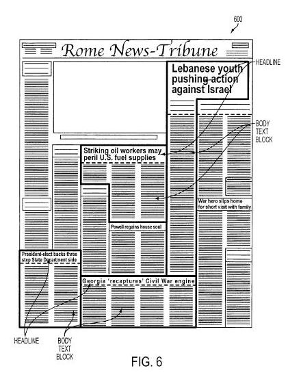
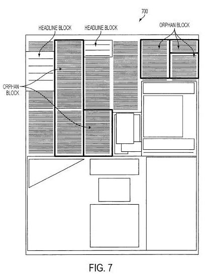

Optical Character Recognition, or OCR, is a technology that can enable a computer to look at pictures that include text, and translate those visual representations of text into actual text. If you have words within images on your web pages, there’s a good chance that search engines are ignoring those words, when it comes to indexing your pages.

But that might change sometime in the future.

While OCR has been around for a while, search engines haven’t been using the technology when crawling and indexing the content of Web pages. Google’s [webmaster guidelines](https://support.google.com/webmasters/answer/35769?hl=en) tell us:

> Try to use text instead of images to display important names, content, or links. The Google crawler doesn’t recognize text contained in images. If you must use images for textual content, consider using the “ALT” attribute to include a few words of descriptive text.

Yahoo’s page, [How to Improve the Position of Your Website in Yahoo! Search Results](https://help.yahoo.com/kb/search/SLN2216.html?impressions=true) provides the following tip:

> Keep relevant text and links in HTML. Encoding your text in graphics or image maps can prevent search engines from finding the text or following links to your website’s other pages.

The Bing Webmaster Central pages gives this warning:

> Don’t put the text that you want indexed within images. For example, if you want your company name or address to be indexed, make sure it isn’t displayed only inside an image of your company logo.

While search engines may not use OCR for indexing the content of web pages now, that doesn’t mean that they might not in the future, and there are some indications that the search engines are developing a much greater proficiency in the use of optical character recognition.

For example, The [Google Books Library Project](http://books.google.com/googlebooks/library/index.html) involves the scanning of a very large number of printed books and periodicals, and the development of [Scanning technology](https://www.seobythesea.com/2009/11/patent-shows-google-book-scanning-a-musical-process/) to undertake a project of that magnitude. A Google patent filing from a few years ago hints that Google might use OCR to look at the text in some images on web pages to [reject some advertisements](https://www.seobythesea.com/2007/06/how-google-rejects-annoying-advertisements-and-pages/). Another Google patent filing describes how the search engine might use OCR with StreetViews videos to [improve business address location information](https://www.seobythesea.com/2007/06/better-business-location-search-using-ocr-with-street-views/).

One limitation of using OCR in indexing information is that it works best with fairly simple documents and printed materials, and less well with documents that have complex formatting, such as newspapers. Newspapers often include multiple columns of text, headlines, images with captions, varieties of font sizes and types, and other challenges that can make indexing that kind of content.

Articles in newspapers are also often continued on other pages, and those storylines may be continued in orphan text blocks which may need to be associated with the earlier pages.

A Google patent filing from February describes how they might meet some of the challenges involved in understanding the layouts of complex documents like newspapers when using OCR to “read” those documents.

The patent application is:

[Segmenting Printed Media Pages Into Articles](http://appft.uspto.gov/netacgi/nph-Parser?Sect1=PTO2&Sect2=HITOFF&u=%2Fnetahtml%2FPTO%2Fsearch-adv.html&r=1&p=1&f=G&l=50&d=PG01&S1=20100040287.PGNR.&OS=dn/20100040287&RS=DN/20100040287)
Invented by Ankur Jain, Vivek Sahasranaman, Shobhit Saxena, and Krishnendu Chaudhury
Assigned to Google Inc.
US Patent Application 20100040287
Published February 18, 2010
Filed: August 13, 2008

Abstract

> Methods and systems for segmenting printed media pages into individual articles quickly and efficiently. A printed media based image that may include a variety of columns, headlines, images, and text is input into the system which comprises a block segmenter and a article segmenter system.
>
> The block segmenter identifies and produces blocks of textual content from a printed media image while the article segmenter system determines which blocks of textual content belong to one or more articles in the printed media image based on a classifier algorithm.
>
> A method for segmenting printed media pages into individual articles is also presented.

While this patent application focuses upon using OCR for printed documents such as newspapers that have been scanned, that is only one example of how the processes described might be used. The patent does go into a fair amount of detail on how the different features and aspects of a newspaper page might be interpreted, looking at things such as;

- Headlines,
- Gutters alongside columns and above and below rows,
- Separating lines,
- Headline paragraphs and bodytext paragraphs,
- Associating headlines with blocks of paragraphs,
- Determining all blocks/paragraphs that fit into an article

**Conclusion**

What’s interesting about this patent filing isn’t so much the ability of the search engine to translate text within images into actual text, but rather how the search engine might handle complex pages which may contain many different articles and images, with some articles even continued on other pages, associate headings with body text, and segment those different articles so that they can be indexed separately.

Search engines might start reading and indexing text within images on Web pages sometime in the future, and it will likely run into complex images when it does so. The steps that search engines may take to be able to do so go beyond recognizing characters within images accurately, and a process like the one described in this patent filing brings them another step closer.
