Without any doubt, [Technorati](https://www.synacor.com/) is one of the top blog search sites on the web, and I enjoy using it, but there are things about it that confuse me.

Chief amongst those might be some odd behavior I see at the Technorati Top 100 Blogs. I’m trying to get a grasp on how the Technorati Top 100 works.

Except that I’m seeing sites listed that:

– Aren’t Blogs
– Aren’t all in the Top 100

What am I missing?

According to the heading above the rankings, the items in the top 100 are:

> The biggest blogs in the blogosphere, as measured by unique links in the last six months.

Though a number of these are some of my favorite sites on the Web, they aren’t all blogs.

Not blogs:

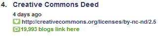

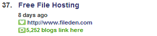

[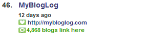](http://web.archive.org/web/20070210010548/http://www.mybloglog.com/)

[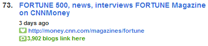](https://fortune.com/)

[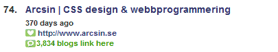](https://arcsin.se/)

[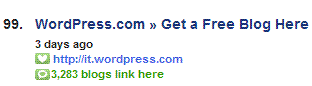](https://it.wordpress.com/)

The other point of confusion is that the ranks in the top 100 don’t match the Technorati ranks.

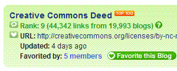

A deed page from the wonderful Creative Commons is listed as the number 4 blog in the Technorati top 100 Blogs, yet it’s showing a rank of 9th. Of course, there are a lot of blogs linking to this license, but it doesn’t belong on this list. And, what happened to the other five?

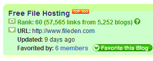

I haven’t used fileden, but I expect that it has a lot of links not for its content, but rather because it is hosting content. It’s at number 37 in Technorati’s top 100, but showing a rank of 60th in Technorati overall. 23 sites are missing at this point.

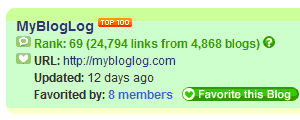

MyBlogLog kicked up a storm of popularity over the past year, and it has a blog of its own, but it isn’t the blog that’s ranking here. It’s at 46 in the top 100 blogs, yet 69th in the overall Technorati rankings.

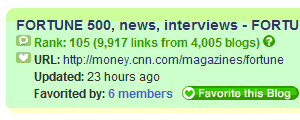

I suspect that Fortune has a blog or two, but this link goes to the front page of the Magazine’s site. At 73 in the Technorati top 100, it’s actually past the 100 mark as the 105th ranked site. 32 sites are missing at this point.

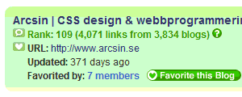

I don’t know if I’ve ever been to the Arcsin pages before, and it’s showing the last update time of 371 days. It’s not being linked to because it’s a blog. At 74 in the Technorati top 100 and just below Fortune, its actual rank in Technorati is 109th. There are 4 missing here between Fortune and Arcsin.

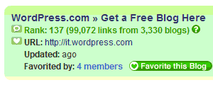

I’m happy to see WordPress listed in the top 100 of anything, but it’s blogging software and not a blog. The WordPress blog is also in the top 100, but this one scores a 99th ranking as a top blog? Its Technorati rank is 137.

OK, these differences in Top Blog ranks and Technorati overall ranks have me wondering if some sites aren’t counted because they aren’t blogs (even though the ones I’m looking at aren’t blogs, too). Yet, I see a blog ([Consumerist](https://consumerist.com/)) ranked as 94th in Technorati that isn’t in the Technorati Top 100:

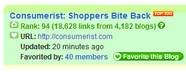

I don’t know if someone like Technorati’s David Sifry could explain this to me, but I don’t quite get it.

There is a Technorati assigned patent which appears to cover some of how Technorati works – [Ecosystem method of aggregation and search and related techniques](http://appft1.uspto.gov/netacgi/nph-Parser?Sect1=PTO1&Sect2=HITOFF&d=PG01&p=1&u=%2Fnetahtml%2FPTO%2Fsrchnum.html&r=1&f=G&l=50&s1=%2220060004691%22.PGNR.&OS=DN/20060004691&RS=DN/20060004691). But, it doesn’t provide any insight into the Top 100 Blogs listed.
