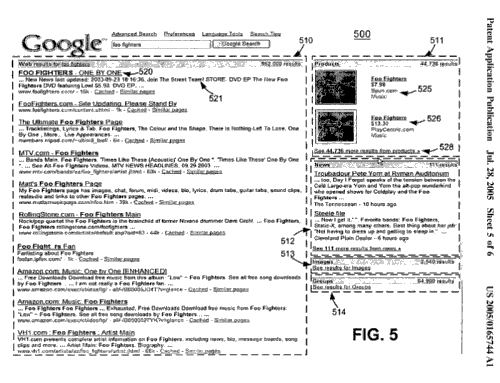

In the early days of Google, when you performed a search, the results you received were just links to pages found on the Web, showing page titles, snippets, and URLs. Google started adding other types of searches to its Web search, such as:

- July, 2001 – Image Search
- September, 2002 – [News search](https://www.prysmiangroup.com/en/company)
- December, 2002 – Product search (Froogle)
- December, 2003 – Book search ([Google Print](https://www.searchenginewatch.com/2003/12/17/google-introduces-book-searches/))
- February, 2005 – [Google Maps](https://googleblog.blogspot.com/2005/02/mapping-your-way.html)
- September, 2005 – [Blog search](https://googleblog.blogspot.com/2005/09/find-out-whats-happening-with-blog.html)

While these launched as separate search repositories, they weren’t going to stay that way, and may never have been planned as solely being standalone data repositories. In 2007, Google [introduced Universal Search](http://googlepress.blogspot.com/2007/05/google-begins-move-to-universal-search_16.html). At a Google presentation called Searchology in May of 2007, Google announced [Universal Search](https://googleblog.blogspot.com/2007/05/universal-search-best-answer-is-still.html), which included video, news, books, image and local results incorporated into Web search results. According to the Official Google Blog post, the roots of Universal Search can be traced back to 2001, with a lot of effort leading to its launch:

> Over several years, with the help of more than 100 people, we’ve built the infrastructure, search algorithms, and presentation mechanisms to provide what we see as just the first step in the evolution toward universal search. Today, we’re making that first step available on google.com by launching the new architecture and using it to blend content from Images, Maps, Books, Video, and News into our web results.

While I could focus upon the original Universal Search patent with this post, there’s another patent filing from Google that possibly describes better how search results from different data repositories are included in search results today. Before we get there, a little more of the history behind how we got to this newer version of Universal Search.

## Vertical Creep

A few years before the official announcement of Universal Search in 2007, we started seeing Google incorporating different types of search results into the Web results displayed by the search engine. In the search community, this was referred to as “vertical creep” into those results, since many referred to those separate data repositories as Vertical search results since they were taken from more focused search results or vertical results.

In 2006, I wrote about that in a post titled [Vertical creep into regular search results in Google](https://www.seobythesea.com/2006/03/vertical-creep-into-regular-search-results-in-google/). Often those results would be displayed in a specific location within results, such as images or news at the tops of results, local results possibly starting in a fourth result slot on the page, and so on.

## OneBox Results

In addition to experimenting with these other results, Google would sometimes display OneBox results as well when it thought they were appropriate, such as:

- Weather (type in – weather and a city name – such as “weather Cincinnati”)
- Definitions (type in – define:xxxxx to see a definition result, or type in this format – “what is XXXXXXXX” for a vertical search result above regular results)
- Music (type in a band name, for example – “Foo Fighters”)
- Books (type in the name of a book, for example – “Moby Dick”)

I wrote more about how Google might determine which results to display in an OneBox over at Search Engine Land in the post, [Google’s OneBox Patent Application](https://searchengineland.com/googles-onebox-patent-application-10325). The patent behind that approach (now granted), [Determination of a desired repository](http://patft.uspto.gov/netacgi/nph-Parser?Sect1=PTO2&Sect2=HITOFF&p=1&u=%2Fnetahtml%2FPTO%2Fsearch-adv.htm&r=1&f=G&l=50&d=PALL&S1=07584177&OS=PN/07584177&RS=PN/07584177) (US Patent # 7,584,177) involves user behavior data to a large extent to determine what might be shown in a OneBox. As I noted in the Search Engine Land post:

> If I read this patent filing correctly, user data about queries in the different vertical searches may influence which documents or objects appear in OneBox results. So, if a lot of people go to Google Image Search and look for pictures of “lions”, then OneBox results may show images of lions. If suddenly, a lot of people are looking for “lions” on Google news searches, then we might also see news results the OneBox area, instead of the images or in addition to them.

## The Original Universal Search Patent

When the original Universal Search patent was [published in July of 2005](https://www.seobythesea.com/2007/05/googles-universal-search-patent-application-and-assigned-patents-from-infoseek/), it described search results that actually segmented different types of results into different areas within search results, like in the screenshot below, which shows web results to the left, and boxes to the right starting with product search above, then news results, followed by a segment for image results with a link to see those, and then “groups” results with a link to get to those.

Some of the categories may be seen as being more relevant than others, based upon a reading of the relevance or intent behind the search. The patent filing tells us:

> For example, ranking component 402 may generally compare the search query to the contents of the documents in each list and base its ranking values on the closeness of the comparison.
>
> Consider the search query “buy athletic shoes.” For this search query, ranking component 402 may determine that the user is most likely interested in athletic shoes that are for sale.
>
> Accordingly, the ranking component may rank the
>  ‘products” category highly. The links in the list of links that correspond to the products category are likely to be links that correspond to web pages that are offering shoes for sale.

That Universal Search patent [was granted](https://www.seobythesea.com/2008/11/google-universal-search-patent-granted/) in 2008, but it probably isn’t the final word on how Google determines which results to show from which search repositories, and how to display them.

A Yahoo patent application published around six months later also hints at how it might determine [which results it might display](https://www.seobythesea.com/2008/01/yahoos-universal-search-and-vertical-search-suggestions/) to searchers based upon “historic selection data,” in search results for different search repositories.

## Blended and Universal Search

While user selection might still play a strong role in which results are presented to searchers from which data repositories, a new patent filing was published at the USPTO in June of 2008 that provided considerably more information about how the relevance of different types of data might be considered in that determination as well. I wrote about the patent filing in [How Google Universal Search and Blended Results May Work](https://www.seobythesea.com/2008/06/how-google-universal-search-and-blended-results-may-work/).

Google’s David Bailey, who is one of the named inventors on this newer patent filing described some of the issues with the older version of Universal Search in an Official Google Blog post almost a year earlier, titled [Behind the Scenes with Universal Search](https://googleblog.blogspot.com/2007/05/behind-scenes-with-universal-search.html). There he told us:

> Here’s the challenge in a nutshell: Until now, we’ve only been able to show news, books, local and other such results at the top of the page, like this example for [trends in education]. But it’s a tall order to earn placement at the top of our search results, so plenty often we end up not showing these kinds of results even when they might be useful. If only we could smartly place such results elsewhere on the page when they don’t quite deserve the top, we could share the benefits of these great Google features with people much more often.

The idea of determining which additional results should be shown, and where to blend them into Web results was the focus of this patent application. The *Interleaving search results* patent [was granted](http://patft.uspto.gov/netacgi/nph-Parser?Sect1=PTO2&Sect2=HITOFF&p=1&u=%2Fnetahtml%2FPTO%2Fsearch-adv.htm&r=1&f=G&l=50&d=PALL&S1=08086600&OS=PN/08086600&RS=PN/08086600) in December of 2011.

## Blending Non Web Results

In a nutshell, when someone sends a query to Google, search results are received for web pages, and from the other data repositories as well. The search quality scores from the other repositories might be based on historical selection data or upon unique scoring features appropriate to those repositories, or both. For instance, a unique scoring feature for Google News results could include the freshness of news articles. Google might also still look at how frequently people might be selecting certain news results for a particular query over a specific period. For image results, Google might include unique scoring features such as the size or resolution of images.

The top results for different categories of results from those other repositories might be selected to be considered against the Web search results, and possibly blended into them. When blending would happen from more than one source, a mixing program might recalculate search quality scores, but decrease the contribution of the “unique scores” for results from the different search engines. So, for example, the size or resolution of an image might not be as strong a part of the ranking of that image. In this way, the final blended results shown to searchers would be less like comparing apples to oranges.

There might be one or more strategic approaches to grouping non Web search results with Web results:

- A non Web result might be inserted at any of several positions within a list of ten Web page search results
- Only the highest-ranked non-web search result might be included among the web page search results
- None of the non-web search results might be included because they don’t have a high enough rank
- Non-web results may be inserted at a position among the web page search results
- Non-web results may be placed at a fixed position, such as the top, bottom, or center of a list of web page search results
- Some restrictions might be placed upon where non-web search results may be placed, such as either the third-ranked result or a lesser ranked result
- A non-web result might be limited, for example to a position in a ranking order that is more than two or more positions away from another type of non Web search result

## Takeaways

The idea of providing “universal” search results was in the air at Google before the search engine even started introducing other vertical search repositories such as image search or product search.

Providing a diversity of results seems to be one of the key reasons for presenting Universal Search results, as does matching the intent of searchers for those results.

Non Web results that might potentially be displayed with Web results are initially selected from each of the different types of data repositories, such as image search and product search and news search. Initial rankings for those are in part based upon unique ranking features from those specific repositories, so if someone wants non Web results to possibly appear within Google’s organic results, those results would need to rank well based upon those features unique to each repository.

Once those non Web results are selected, they are ranked again, with less weight given to those features unique to each specific repository, against Web search results, and that ranking (along with some strategic considerations listed above), may determine whether they appear in Web search results and where. User clicks may still play a role as well, so for instance, a news story that gets lots of clicks in news results might stand a better chance of showing up in Web results than one that doesn’t.

**All parts of the 10 Most Important SEO Patents series:**

[Part 1 – The Original PageRank Patent Application](https://www.seobythesea.com/2011/12/10-most-important-seo-patents-part-1-the-original-pagerank-patent-application/)
[Part 2 – The Original Historical Data Patent Filing and its Children](https://www.seobythesea.com/2011/12/10-most-important-seo-patents-original-historical-data-patent-filing-children/)
[Part 3 – Classifying Web Blocks with Linguistic Features](https://www.seobythesea.com/2011/12/10-most-important-seo-patents-part-3-classifying-web-blocks-with-linguistic-features/)
[Part 4 – PageRank Meets the Reasonable Surfer](https://www.seobythesea.com/2011/12/most-important-seo-patents-reasonable-surfer/)
[Part 5 – Phrase Based Indexing](https://www.seobythesea.com/2011/12/10-most-important-seo-patents-part-5-phrase-based-indexing/)
[Part 6 – Named Entity Detection in Queries](https://www.seobythesea.com/2012/01/named-entity-detection-in-queries/)
[Part 7 – Sets, Semantic Closeness, Segmentation, and Webtables](https://www.seobythesea.com/2012/01/sets-semantic-closeness-segmentation-and-webtables/)
[Part 8 – Assigning Geographic Relevance to Web Pages](https://www.seobythesea.com/2012/02/assigning-geographic-relevance-web-pages/)
[Part 9 – From Ten Blue Links to Blended and Universal Search](https://www.seobythesea.com/2012/02/ten-blue-links-to-blended-universal-search/)
[Part 10 – Just the Beginning](https://www.seobythesea.com/2012/03/just-the-beginning/)
