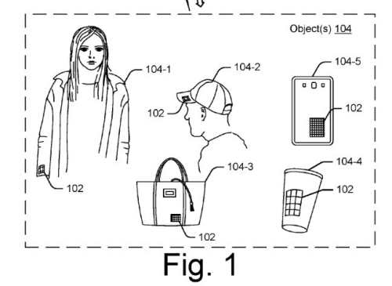
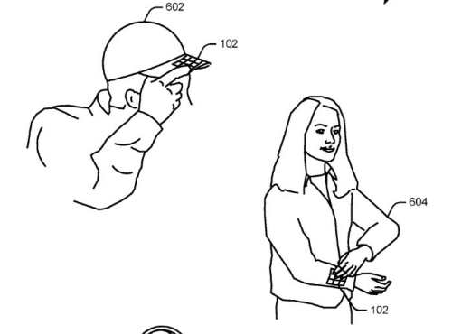
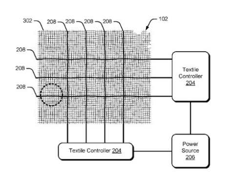
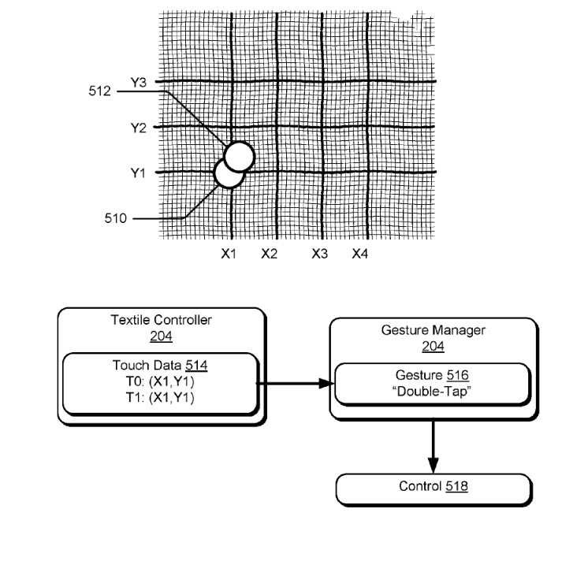
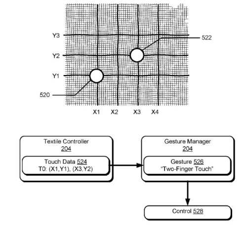
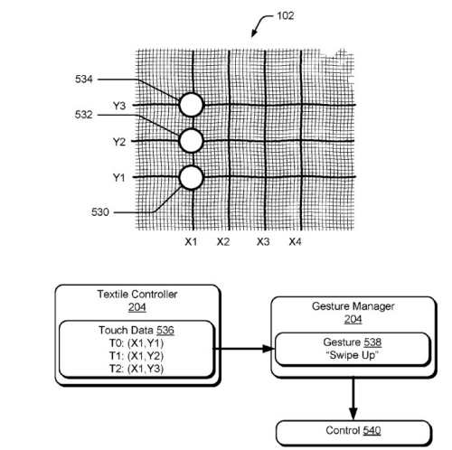
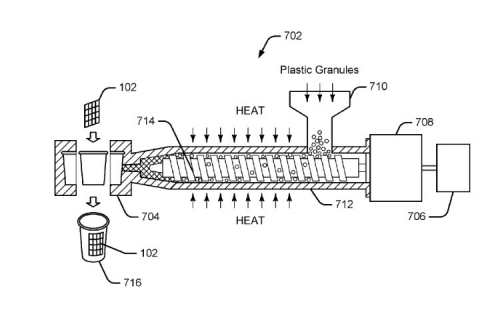
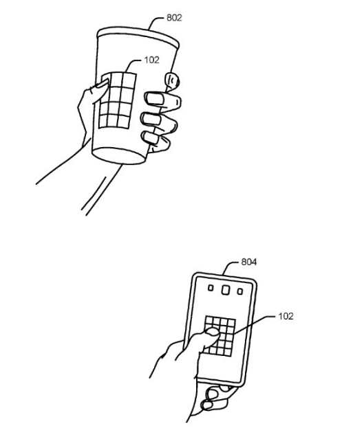

I remember my father building some innovative plastic blow molding machines where he added a central processing control device to the machines to change all adjustable controls from one place. He would have loved seeing what is going on at Google these days and the hardware they are working on developing, focusing on building controls into textiles and plastics.

Outside of search efforts from Google, but it is interesting seeing what else they may get involved in since that is beginning to cover a wider and wider range of things, from self-driving cars to glucose analyzing contact lenses. I was surprised to see a web page from Levi’s showing a joint project from Google and Levis on their Project Jacquard.

This morning I tweeted an article I saw in the Sun, from the UK that was kind of interesting: [Seating Plan Google’s creating touch-sensitive car seats that will switch on air-con, sat-nav and change music with a BUM WIGGLE](https://www.thesun.co.uk/motors/4464108/googles-creating-touch-sensitive-car-seats-that-will-switch-on-air-con-sat-nav-and-change-music-with-a-bum-wiggle/)

I was curious to find patents related to Google’s Project Jacquard, so I went to the USPTO website and searched, and a couple came up.

[Attaching Electronic Components to Interactive Textiles](http://appft.uspto.gov/netacgi/nph-Parser?Sect1=PTO1&Sect2=HITOFF&d=PG01&p=1&u=%2Fnetahtml%2FPTO%2Fsrchnum.html&r=1&f=G&l=50&s1=%2220170232538%22.PGNR.&OS=DN/20170232538&RS=DN/20170232538)
Inventors: Karen Elizabeth Robinson, Nan-Wei Gong, Mustafa Emre Karagozler, Ivan Poupyrev
Assignee: Google
US Patent Application: 20170232538
Granted: August 17, 2017
Filed: May 3, 2017

Abstract

> This document describes techniques and apparatuses for attaching electronic components to interactive textiles. In various implementations, an interactive textile that includes conductive thread woven into the interactive textile is received. The conductive thread includes a conductive wire (e.g., a copper wire) that that is twisted, braided, or wrapped with one or more flexible threads (e.g., polyester or cotton threads).
>
> A fabric stripping process is applied to the interactive textile to strip away the interactive textile and the flexible threads to expose the conductive wire in a window of the interactive textile. After exposing the conductive wires in the window of the interactive textile, an electronic component (e.g., a flexible circuit board) is attached to the exposed conductive wire of the conductive thread in the window of the interactive textile.

[Interactive Textiles](http://appft.uspto.gov/netacgi/nph-Parser?Sect1=PTO1&Sect2=HITOFF&d=PG01&p=1&u=%2Fnetahtml%2FPTO%2Fsrchnum.html&r=1&f=G&l=50&s1=%2220170115777%22.PGNR.&OS=DN/20170115777&RS=DN/20170115777)
Inventors: Ivan Poupyrev
Assignee: Google Inc.
US Patent Application: 20170115777
Granted: April 27, 2017
Filed: January 4, 2017

Abstract

> This document describes interactive textiles. An interactive textile includes a grid of conductive thread woven into the interactive textile to form a capacitive touch sensor configured to detect touch input. The interactive textile can process the touch-input to generate touch data to control various remote devices. For example, the interactive textiles may aid users in controlling volume on a stereo, pausing a movie playing on a television, or selecting a web page on a desktop computer.
>
> Due to the flexibility of textiles, the interactive textile may be easily integrated within flexible objects, such as clothing, handbags, fabric casings, hats, and so forth. In one or more implementations, the interactive textiles may be integrated within various hard objects, such as by injection molding the interactive textile into a plastic cup, a hard casing of a smartphone, and so forth.

The drawings that accompanied this Project Jacquard patent were interesting because they showed off how gestures used on controls might be used:

_Here is a look at the textile controller._

_A double tap on the controller is possible._

_A two finger touch on the controller is also possible in Project Jacquard._

_You can swipe up on textile controllers with Project Jacquard_

_An Extruder showing plastics materials being heated up to send to a mold_

_The patent shows off plastic molder devices with controls built into them._

My father would have gotten a kick out of seeing a plastics extruder in a Google Patent (I know I did.)

It will be interesting seeing textile and plastics controls come out as described in these patents.

*Added 9/25/2017:* Saw this news this morning: [This Levi’s jacket with a smart sleeve is finally going on sale for $350](https://www.theverge.com/2017/9/25/16354712/google-project-jacquard-levis-commuter-trucker-jacket-price-release-date)
