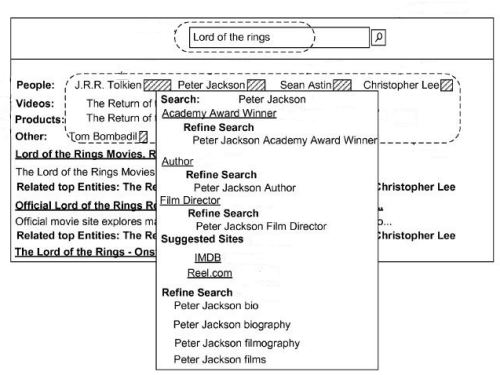

When you perform a search at a search engine, you usually see a list of links to web pages in response to your search.

Over the past few years, search engine have started showing a mix of other types of results, including images, links to related news stories or blog posts, videos, book and music search results, listings of reviews, maps and business location information, related search queries and query suggestions, stock charts, weather forecasts, and other non-web page listings.

This richer mixture of choices presented by search engines in response to searchers’ queries provides an often colorful and often useful set of options to someone searching for information or to fulfill some kind of task.

The query suggestions and refinements that searchers are offered are intended to help searchers with suggestions of other searches that might yield them more information. The mix of non-web page results are often referred to by search engines as blended or universal search results.

When Google officially launched their mix of blended search results in 2007, they issued a press released titled [Google Begins Move to Universal Search](http://googlepress.blogspot.com/2007/05/google-begins-move-to-universal-search_16.html), and they told us that:

> Google’s vision for universal search is to ultimately search across all its content sources, compare and rank all the information in real time, and deliver a single, integrated set of search results that offers users precisely what they are looking for.
>
> Beginning today, the company will incorporate information from a variety of previously separate sources – including videos, images, news, maps, books, and websites – into a single set of results. At first, universal search results may be subtle. Over time users will recognize additional types of content integrated into their search results as the company advances toward delivering a truly comprehensive search experience.

I wrote about one of the patents behind Google’s approach in [Google Universal Search Patent Granted](https://www.seobythesea.com/2008/11/google-universal-search-patent-granted/) in November of 2008.

Both Yahoo and Microsoft’s Bing also provide a mix of results from different sources in search results.

**Search Results Becoming Portals?**

A web portal has typically been a place where you could visit and find a wealth of information on different topics. One of the most popular these days is Yahoo, where you’re greeted with popular news stories as well as links to a wide variety of services and information resources. They also offer a search engine, but it’s only one of a number of services provided by the site. In start contrast is the home page of Google, where you see a search box on their home page, and little else. The front page of Microsoft’s Bing has evolved from its days as a more portal-like MSN to a more search oriented site like Google.

But, beyond the front pages of Google and Bing, we see a movement as I noted above, to a presentation of search results that include images, news, recent blog posts, and more that are much richer than a sparse listing of links to web pages. Some search results may only provide links to web sites, but others often give so many options that it can be hard to decide what to try to look at first.

A patent application published by Microsoft at the end of 2009 hinted at an evolution in search results that goes beyond blending into those results a mix of information from other types of search results. The document describes something referred to as “query portals.”

The patent application is:

[Query-Driven Web Portals](http://appft.uspto.gov/netacgi/nph-Parser?Sect1=PTO2&Sect2=HITOFF&u=%2Fnetahtml%2FPTO%2Fsearch-adv.html&r=1&p=1&f=G&l=50&d=PG01&S1=20090327223.PGNR.&OS=dn/20090327223&RS=DN/20090327223)
Invented by Kaushik Chakrabarti, Surajit Chaudhuri, Venkatesh Ganti, Dong Xin, Sanjay Agrawal, and Arnd Christian Konig
Assigned to Microsoft
US Patent Application 20090327223
Published December 31, 2009
Filed: June 26, 2008

Abstract:

> The described implementations relate to query portals. One technique analyzes search results generated by a web search engine responsive to a user search query. The technique also dynamically generates a query portal that lists the search results as well as entities identified from the search results.

In addition to providing search results for a specific query, we’re told that the search engine will also include “complementary information derived from the search results.”

For instance, someone searching for “Lord of the Rings” might be presented with a number of related topics in a way that makes it easy for that searcher to drill down upon areas that might interest them the most.

In the following screenshot from the patent, we’re shown a list of topics related to the “Lord of the Rings” at the top of the search results that include people such as the author J.R.R. Tolkien, the producer of the movies Peter Jackson, as well as actors from the movie. We’re also provided with categories of related topics including videos, products, and another topic that lists characters from the book.

In the image above, categories and specific topics within those categories, related to the original search query “Lord of the Rings,” are taken from the search results, and presented in a way so that when you hover over one of the topics you are presented with search refinement options and suggested pages relevant to those topics.

The patent filing goes into some depth in describing how categories and topics from search results might be extracted, ranked, and presented. It’s worth drilling into and spending some time with if you’re concerned about what the search engine might present if and possibly when it may add a feature like this to the search results that we see.

What’s most interesting to me is the idea of search results evolving from a set of links and results from other types of search repositories such as local search, image search, and so on, into a type of portal based upon a query typed in by a searcher.

The search results that we see are becoming more portal-like every day. Regardless of how sparse the front page of a site like Google or Bing might be, search results are becoming more complex and interesting, with an increasing number of options to draw the eyes and attention of viewers.

What might this mean to searchers and site owners?

If you’re a searcher, you might regret the loss of simplicity of search results. Interestingly, recent commercials from Microsoft call Bing a “decision engine” and show how too much information can cause “search overload.” The irony here is that this is Microsoft’s patent filing, and it has the potential to increase the number of options that a searcher is faced with dramatically. On the positive side, it may make it easier for searchers to find the information that they want to find.

If you’re a site owner, the process in this patent filing may mean that there are potentially more ways for a searcher to find your site if you fill information needs that your audience may have.

While this patent application is from Microsoft, I think it’s fair to say that we will continue to see search results from all of the major search engines become more portal-like in the future.
