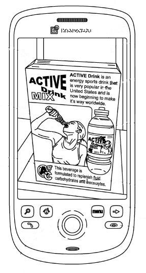
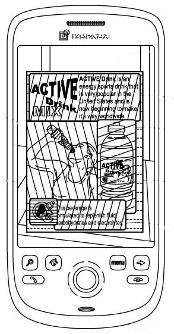
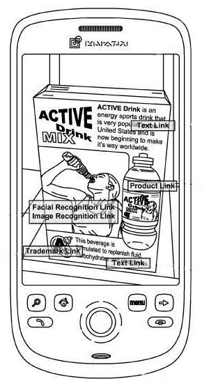
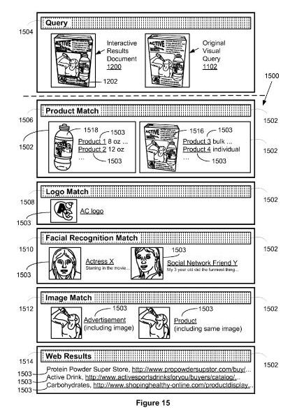

Google Goggles lets you search by taking a picture of landmarks, books, business cards, artwork, product labels, logos, and text. It can use Optical Character Recognition to transform text in an image to searchable text on the Web, reads barcodes, finds similar images in databases of artwork and landmarks and other databases. But, we only see the surface of the capabilities that a phone-based visual search can offer with Google Goggles.

A Google patent application published this week shows us what Google’s visual Search for phones might evolve into. For example, when you take a picture of a city street, your picture may include buildings, street signs, people’s faces, cars, and many other objects. If you send that picture as a query, the search engine might break the image into parts and search for many of the objects in the image, and give you a mix of search results based upon all of those parts.

The patent filing is:

[User Interface for Presenting Search Results for Multiple Regions of a Visual Query](http://appft.uspto.gov/netacgi/nph-Parser?Sect1=PTO2&Sect2=HITOFF&u=%2Fnetahtml%2FPTO%2Fsearch-adv.html&r=1&p=1&f=G&l=50&d=PG01&S1=20110035406.PGNR.&OS=dn/20110035406&RS=DN/20110035406)
Invented by David Petrou and Theodore Power
US Patent Application 20110035406
Published February 10, 2011
Filed: August 4, 2010

Abstract

> A visual query such as a photograph, screenshot, scanned image, or video frame is submitted to a visual query search system from a client system. The search system processes the visual query by sending it to a plurality of parallel search systems, each implementing a distinct visual query search process.
>
> A plurality of results is received from the parallel search systems. Utilizing the search results, an interactive results document is created and sent to the client system. The interactive results document has at least one visual identifier for a sub-portion of the visual query with a selectable link to at least one search result for that sub-portion.
>
> The visual identifier may be a bounding box around the respective sub-portion, or a semi-transparent label over the respective sub-portion. Optionally, the bounding box or label is color-coded by type of result.

The different kinds of searches that might be performed simultaneously could include:

- A facial recognition search
- An OCR search for text in the image
- An image-to-terms search system, which may use object recognition
- A product recognition search, which could recognize two dimensional images such as book covers and CDs,and three dimensional images such as furniture
- A bar code recognition search
- A named entity recognition search, which could provide information about specific people, places, and things
- A landmark recognition search, recognizing actual landmarks and possibly images advertised on billboards
- A place recognition search that might be aided by geo-location information provided by something like a GPS receiver
- A color recognition search, and
- A similar image search, which looks for images similar to the one that you’ve used as a query

Results that could be returned from a visual search could include links to web pages, product search results, images, videos, Google Map results, and place pages and Streetview scenes, and many more.

A person searching could isolate certain parts of a picture to search upon, and even annotate those selections before searching.

The patent goes into considerable detail on how this system might work together, but the images from the patent provide a great illustration of how this system would work.

Someone takes a picture of a sports drink box, and the image includes some text describing the drink, a celebrity drinking out of a bottle, a larger image of the bottle, and a logo for the product.

The visual search system breaks the box down into different segments to search upon:

Results appear on the image itself as text links, facial and object recognition links, product links, and trademark links.

A mix of the different types of results could be shown to a searcher, broken down into categories such as product match, logo match, facial recognition match, image match, and web results. Interestingly, in the section of Google’s visual search under thefacial recognition match, one of the results shown is a “Social Network Friend” presumably matched up with a profile picture or avatar.

If you’ve used Goggle’s search, you have an idea of what Google’s Visual Phone search can do. This patent filing shows how the individual types of searches available there might be joined together.

Will we start seeing search consultants being hired in the future for the design of product boxes, billboards, and other outdoor signs?
