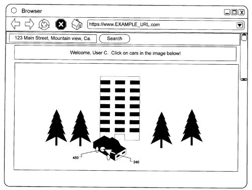

When a search engine indexes an image on the Web, it often has to rely upon the words that it finds associated with that picture. Those words could include the file name, alt text for the image, a caption, as well as other text on the same page.

Those words can be misleading, however, and search engines are trying other approaches to identifying the actual content contained within images. One of the approaches that Google has taken to index images is to have people play each other in a game to label those images. There’s a possibility that Google may add another image game, like the one seen in the screen shot below:

The new game from Google is described in a patent filing published this week, incorporating a way to identify objects within images. The patent application is:

[Object Identification in Images](http://appft.uspto.gov/netacgi/nph-Parser?Sect1=PTO2&Sect2=HITOFF&u=%2Fnetahtml%2FPTO%2Fsearch-adv.html&r=1&p=1&f=G&l=50&d=PG01&S1=20100034466.PGNR.&OS=dn/20100034466&RS=DN/20100034466)
Invented by Yushi Jing, Michael Fink, Michele Covell, Shumeet Baluja
Assigned to Google
US Patent Application 20100034466
Published February 11, 2010
Filed: August 10, 2009

Google is doing more than using games to understand images, and has started using automated ways to compare images to each other to identify different features contained within those images. A couple of years ago, we saw a Google paper come out titled [PageRank for Product Image Search](http://www.esprockets.com/papers/www2008-jing-baluja.pdf), which described how Google might use that technology. You can see that [image technology](https://ai.googleblog.com/2009/11/explore-images-with-google-image-swirl.html) in action in [Google Image Swirl](http://web.archive.org/web/20110902051106/http://image-swirl.googlelabs.com:80/), which came out in Google Labs in November of last year.

Interestingly, a couple of the writers listed on that paper are also listed as inventors of this patent application.

The patent tells us about the possibility of Google releasing an “image treasure hunt” game, where players look through images to identify a particular object within a particular image:

> In one example, a particular image including a dog is selected as the target of the “image treasure hunt,” and users who are playing the game are told that the target is a dog. Users then proceed to search through images to find the particular image of the dog, which is the target of the “image treasure hunt.”
>
> Each time a user identifies an image with the dog, the user indicates the location of the dog in the image to see whether that dog in the image is the target of the “image treasure hunt.” As users identify dogs in various images, the locations of dogs in various images is stored to enable retrieval later of each image based on a dog being included in the image. As such, the “image treasure hunt” helps catalog the types of objects included in images.

A person finding an object might be asked to click upon it, or trace its outline. It’s also possible that they would be asked to provide more details about the object. For instance, if the object searched for is a dog, a person finding it might indicate that it’s a particular breed of dog, or that it might be in a certain setting or performing some kind of activity, such as a German Shepherd playing Frisbee at the beach.

It’s possible that once an object has been identified in an image that future displays of that image might show a clickable region around the image that links to more information about the object within that image.

The patent also describes how this game might use incentives to encourage people to play, such as having contests that may or may not include prizes.

The images that might be used in this game could include photos, map images, and pictures from video. So it’s possible that Google could use this method of identifying objects within images to improve their image search, video search, and Google Maps.

Why would Google spend so much effort setting up a game to identify objects within images?

The inventor of the Google Image Labeler game, Luis von Ahn, has an interesting presentation that was given as a Google Tech Talk in 2006, titled Human Computation, where he describes the ability of humans to perform some tasks that are relatively easy for people and hard for computers.

Google Maps has a new feature this morning. If you go to [Google Maps](https://www.google.com/maps), and click on the green flask in the top right corner, you’ll see a new window open in the middle of your screen labeled Google Maps Labs. Amongst the features presently in the lab are:

- Drag ‘n’ Zoom
- Aerial Imagery
- Back to Beta
- Where in the World Game
- Rotatable Maps
- What’s Around Here?
- LatLng Tooltip
- LatLng Marker
- Smart Zoom

Kind of interesting that at least one of those is a game. Since the image treasure hunt could potentially be used with images associated with maps, it’s possible that we might see it appear within the Google Maps Labs applications. Since it could also be used to help improve image search and video search by having people identify objects in images and videos, it might spring up over at [Google Labs](https://web.archive.org/web/20090426064424/http://www.googlelabs.com/).
