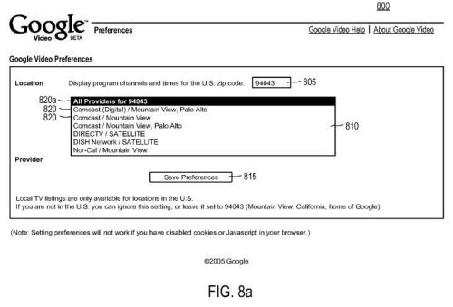

Back in 2005, Google filed a patent application on [Ranking video articles](http://patft.uspto.gov/netacgi/nph-Parser?Sect1=PTO2&Sect2=HITOFF&u=%2Fnetahtml%2FPTO%2Fsearch-adv.htm&r=1&p=1&f=G&l=50&d=PTXT&S1=7,933,338.PN.&OS=pn/7,933,338&RS=PN/7,933,338) which gives some insights into Google’s future plans for what they might do with video, and some of the possible ranking algorithms they would consider using.

Google Video search went live in January of 2005. Its focus was on helping people find videos on the Web and on television, and providing a place for people to upload videos that could be watched from the service or embedded on other sites. The patent shows a screen that would allow you to enter your local TV provider:

When the patent was filed, it appears that Google Video would be the central hub of all things video-related for Google. But those plans seem to have changed with the acquisition of YouTube, the development of Google TV, and the growth of Android.

Google [acquired YouTube](http://googlepress.blogspot.com/2006/10/google-to-acquire-youtube-for-165_09.html) in October of 2006, and only recently announced that they would be stopping the uploading and playback of videos at Google Video. Within a week, they rescinded that move (playbacks from Google Video will continue). Still, they announced that they would make it easier for people to [migrate their videos](https://youtube.googleblog.com/2011/04/update-on-google-video-finding-easier.html) from Google Video to YouTube.

If you watch movies on your phone or surf the Web on your TV, the chances are that you’ve seen something about Google TV or Google Android. Google has been focusing upon an android powered device that can make it easier for people to find television programming they want to watch, and visit websites on their televisions. Both [Google TV](https://www.android.com/tv/) and [Google Apps for Android](https://play.google.com/store/apps/dev?id=5700313618786177705) contemplate a much larger role for video on both TVs and telephones.

If you want to develop and optimize web content for television and for television applications on mobile devices, Google has provided some [optimization advice](https://www.android.com/tv/) for televisions, and will be sharing information in the future about building Android applications for Google TV.

**Video Rankings**

Back in February, I wrote about [How a Search Engine Might Rank Videos Based Upon Video Content](https://www.seobythesea.com/2011/02/how-a-search-engine-might-rank-videos-based-upon-video-content/), describing a recently published Google patent application telling us that the search engine might capture many frames from videos and use a “similar image algorithm” to tag frames in those videos with relevant keywords.

The approach in the patent filing also included a sound fingerprinting technique that would capture sounds as electronic images and match those sounds from the videos with known sounds from other sources to tag those with keywords as well.

The keywords association with images and sounds from videos could be used in association with text and metadata about the videos to index the content of those videos.

This older granted patent from Google anticipates the use of similarity algorithms like that and a wide range of other signals that might be used together to rank videos in a video search.

The video search would include videos found across the Web, videos hosted by Google Video, and videos that might be presented on television.

Queries used in a video search might be text-based, with searchers entering keywords in a search box.

Queries could also be image-based, with searches of videos based upon an image that a searcher might upload.

A video search might also be started by someone selecting content associated with another video, such as highlighting text from closed captioning data to use as a query to find other videos.

In the Google Video help page, one page titled How are videos ranked in the Google Video search results? tells us that:

> Our technology examines dozens of aspects of the video’s content (including the number of hits and rating) to determine if it’s a good match for your query.

So just what kinds of things might Google Video be looking at to rank videos?

The patent provides some clues:

[Ranking video articles](http://patft.uspto.gov/netacgi/nph-Parser?Sect1=PTO2&Sect2=HITOFF&u=%2Fnetahtml%2FPTO%2Fsearch-adv.htm&r=1&p=1&f=G&l=50&d=PTXT&S1=7,933,338.PN.&OS=pn/7,933,338&RS=PN/7,933,338)
Invented by Shahid Choudhry, John Piscitello, Christopher Richard Uhlik, Monika Hildegard Henzinger, Matthew Vosburgh, Aaron Lee, David Marwood, Peter Chane, and Steve Okamoto
Assigned to Google
US Patent 7,933,338
Granted April 26, 2011
Filed: November 10, 2005

Abstract

> An information retrieval system is provided for processing queries for video content. A server receives a query for video content and returns video articles, as received from broadcast systems or other content providers. Queries are formulated using text, video images, and/or visual content associated with a video article.
>
> Various video-oriented characteristics associated with the results of the queries are determined, and a rank score is calculated for each. The ranked video articles are displayed in a representation to the user, from which the user can play the video article either within the representation or independent of it.

If you have uploaded a video to the Web in the hopes that people find it, and view it, it doesn’t hurt to think about how the different ranking signals listed in this patent might influence how easy it is to find that video. Keep in mind that some of the videos that might have been found through Google Video were intended to be viewable only on television, and some of the ranking signals included are aimed specifically at that content.

**Video Ranking Signals**

Here are a number of the signals that Google might consider in ranking videos for a video search.

- PageRank based upon links pointing to the video or the page that it is hosted upon.
- A title associated with the video
- A title for a program associated with the video
- The size of the video
- The date that the video was aired
- A category associated with the video
- A snippet (which may be a portion of the dialog relating to a thumbnail image)
- Broadcast source associated with a video
- Broadcast time period data associated with a video
- Related links
- Program guide information
- Key terms and words from audio in a video
- Closed captioning text
- Key terms or words associated with the video
- Key terms or words associated with a matching or similar image previously stored in a database
- Third-party ratings data associated with the video
- Third-party audience viewing data for a particular video
- User data associated with a video
- Textual data associated with the video
- A name associated with a video
- A name associated with a content provider
- Number of times the video has been broadcast
- Number of content providers that broadcast a particular video in a defined time period
- Particular time period a video article has been broadcast
- Particular date a video article has been broadcast
- Particular geographical location a video article has been broadcast
- Number of times other users have selected a particular video article in response to different queries
- Number of times other users have selected a particular video article in response to the same query
- Clickthrough data associated with a video
- Queries associated with a video
- Nielsen ratings data
- Thumbs up viewer data
- Thumbs down viewer data
- Replay viewer data
- Record viewer data
- Fast forward viewer data
- Review viewer data
- Production costs associated with a video
- Advertising costs associated with a video
- Advertising production costs associated with the video
- Speech-to-text conversion of dialogue associated with the video article
- Text associated with articles referencing the video
- Text associated with other videos referencing the video
- Text associated with documents referencing the video
- Length of the video article (e.g., longer equals better rank score)
- Quality of the video article (e.g., higher quality is higher ranked)
- Sound quality (e.g., higher quality is higher ranked)
- The type of video article
- Time period (e.g., time of day, or day of the week)
- User location (e.g., to more heavily weight video articles broadcast in close proximity to the user)
- Selection of the video article by previous users (e.g., users querying for the same or similar terms)
- Whether the video article is available for playback (e.g., video articles available for playback are weighted more heavily)

As I mentioned above, a number of these signals are more appropriate for a search of broadcast TV (or Cable TV) content than for videos uploaded to web pages, and could potentially be included in a search for programming through Google TV. It’s possible that many of these may or could be included in the search function at YouTube and at Google Video.

It shouldn’t be a surprise that Google is looking at the text associated with a video, such as titles or descriptions, as well as user data, such as the number of plays and ratings. The signals that may be used for television-based content such as Nielsen Ratings or broadcast source or broadcast time (prime time or daylight shows or Sunday morning news) likely won’t play much of a role in the ranking of web-based videos.

But one thing I found interesting was that pages or other documents that reference a video might also be included as a ranking signal for that video.

We aren’t given much in the way of details on how these different factors might be weighted against each other, and it’s possible that in the five years since this patent was originally filed, other signals might have been considered as well. But if you’re considering how Videos might be ranked presently and in the future by Google, this isn’t a bad list to start with.
