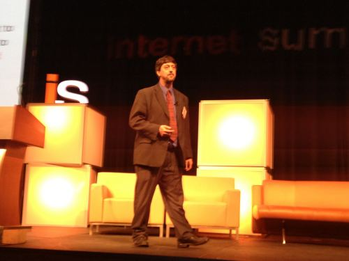

I gave a presentation on SEO and Social Media at the [Internet Summit 2011](https://internetsummit.com/), in Raleigh NC yesterday, in an Advanced SEO session with Lindsay Wassell, Michael Marshall, and Markus Renstrom – head SEO of Yahoo! Daryl Hemeon has a nice write-up of the presentations at [Advanced SEO – Internet Summit Day 2 Notes](https://www.atlanticbt.com/insights/advanced-seo-internet-summit-day-2-notes/).

I included a number of links and references within the presentation that we didn’t visit or spend time on, for anyone who might want to visit those for more details. The basic premise behind my presentation was that Social Media has changed the expectations of searchers and the search engines have had no recourse but to change in response, and SEO likewise is evolving to meet those expectations.

**[Next Level SEO:Social Media Integration – Internet Summit- 2011 (Bill Slawski)](https://www.slideshare.net/billslawski/next-level-seo-internet-summitbill-slawski)**  View more [presentations](https://www.slideshare.net/) from [SEO by the Sea](https://www.slideshare.net/billslawski)Early in the presentation, I decided to include a number of the social media projects that Google has been involved in for a few reasons. One is that Google Plus isn’t their initial foray into social. Another is that they’ve embarked on a number of projects that might not have been successful, but they’ve had chances to learn from those. The third is that Google Plus is the first of their social efforts where the search engine is transforming search and integrating their social efforts into how results are displayed, and likely how they are ranked.

I really enjoyed the other presentations from Lindsay, Mike, and Markus and I believe the organizers noted that they would make the presentations from the convention available online. I’ll keep an eye out and link to those if and when they become available. Overall, the best part of the conference for me was a chance to have some conversations with some people who are very passionate about Internet Marketing including [Don Rhoades](http://donrhoades.com/) and [JP Sherman](http://donrhoades.com/2011/09/nc-seos-jp-sherman/), Phil Buckley, Diane Aull, Lindsay, and Mike.

Raleigh is a really nice City, and the technology scene there is alive and bursting at the seams. The crowd was enthusiastic, and the presentations that I had a chance to see were all definitely worth attending.

An image of me during the presentation courtesy of Phil Buckley:

(Thanks, Phil)

*Added* November 18th, 2011 – Kelly Duffort’s thoughts on the SEO presentations from Internet Summit 2011 – [My Search Engine Optimization (SEO) Takeaways from Internet Summit 2011](https://kellyduffort.wordpress.com/2011/11/18/my-search-engine-optimization-seo-takeaways-from-internet-summit-2011/)
