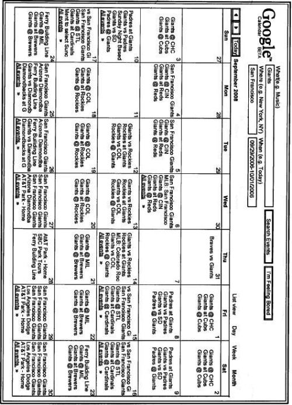

You may be familiar with the “I’m Feeling Lucky” button that appears under the search box on Google’s home page. Enter a search query into the search box, and click on the “I’m Feeling Lucky” button, and Google will deliver you to the top result for your query. That button has been on the front of Google since the very early days of the search engine.

A patent granted to Google this week would have added an “I’m Feeling Bored” button on Google Calendar. Instead of bringing you to a page that might be the top result like the “I’m feeling lucky” Button, it might deliver you to an event instead.

An image from the patent shows the button at the top of a page where you can perform an event search, specifying keywords, a geographical area, and a time. If you click the I’m feeling bored button without entering any of that information, the bored button event search might try to find events for you based upon your past query history.

Under the process described in the patent, when you search for an event, that event might be one that Google found when crawling the web, in a news article, through a syndicated feed, or from other sources. Events can cover a wide range of activities, including artistic performances, sporting events, lectures, and auctions.

[Event searching](http://patft.uspto.gov/netacgi/nph-Parser?Sect1=PTO2&Sect2=HITOFF&u=%2Fnetahtml%2FPTO%2Fsearch-adv.htm&r=1&p=1&f=G&l=50&d=PTXT&S1=7,647,353.PN.&OS=pn/7,647,353&RS=PN/7,647,353)
Invented by Nikhil Chandhok, Peter Solderitsch, Michael Gordon, Philo Juang
Assigned to Google
US Patent 7,647,353
Granted January 12, 2010
Filed: November 14, 2006

Abstract

> Events can be searched by identifying a query that includes a time interval and a search component, determining a time increment associated with the time interval, and partitioning the time interval into partitions based on the time increment.
>
> For each partition, the relevance of each event in a collection of events that occur at a time in the partition is determined based on the query. A pre-determined number of the relevant events are displayed.

The description shown for an event could include more than just a listing of the event and could have a detailed description, including non-textual information such as images, video, audio, and other multimedia.

When you list a location, such as “The Alamo,” the event search engine could be configured to “hierarchically recognize places,” so that it might be able to broaden your “The Alamo” search to include other places in San Antonio, Texas.

Since this I’m feeling bored button event search could be included in Google Calendar, it could present you with many different calendar views of events that you’ve searched for, such as this one for a particular month:

Looking for something to do, but not sure what? Under the patent description, you could have hit the “I’m feeling bored” button without entering any values in any of the fields. When the “I’m feeling bored” button is activated, a query would be automatically generated based on, e.g., past queries or randomly generated and submitted to the event search system.

**I’m Feeling Bored Button Conclusion**

There is no “I’m feeling bored” button on Google Calendars, but an Official Google Blog post from back in November of 2006 (around the time that this patent was filed), describes how you may have been able to [“Search Public Events in Google Calendar.”](https://googleblog.blogspot.com/2006/11/search-public-events-in-google.html):

> Today we launched a new feature of Google Calendar: “Search public events.” It lets you search over public events added by others using Calendar and also events we’ve added by working with partners to provide movie listings, concerts, and all sorts of other fun events.

It appears that the “search public events” search has disappeared sometime since that post was blogged. Google has noted on one the page where they mentioned that they were removing their search on public calendars ([Removing public calendar search and the public calendar gallery](https://web.archive.org/web/20090303124438/http://www.google.com/support/calendar/bin/answer.py?answer=139970)) that they might bring that feature back in the future.

Google does describe how you can [add a Google Calendar](https://support.google.com/calendar/answer/41207?hl=en&rd=1) to your web site, and have people share an event or events from your calendar. The [What’s new with Google Calendar](https://support.google.com/calendar/?hl=en&rd=2&topic=3417918#topic=3417969) page shows that Google has been actively adding other features to Google Calendar.

Will we see a return of a “search public events” application, and the introduction of an “I’m feeling bored” button? The “events search” described in the patent would include events from more places than public Google Calendars, which could lead to much greater usage.

With many new applications likely arriving for Google’s Android, a calendar program that could search for public events might be a tremendous addition. A public event search for mobile computing users might go over much better than one built for desktop users in 2006.
