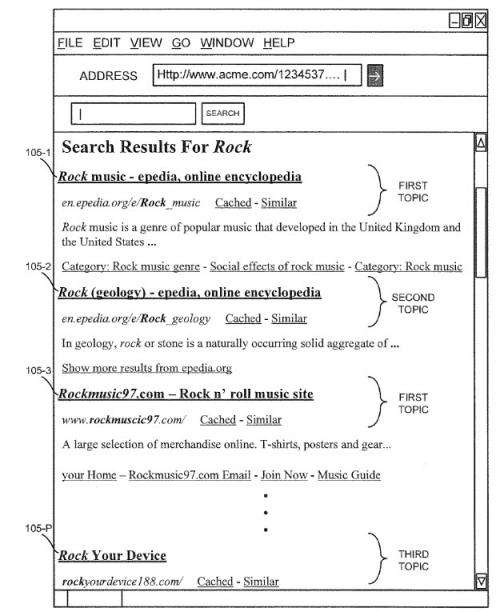
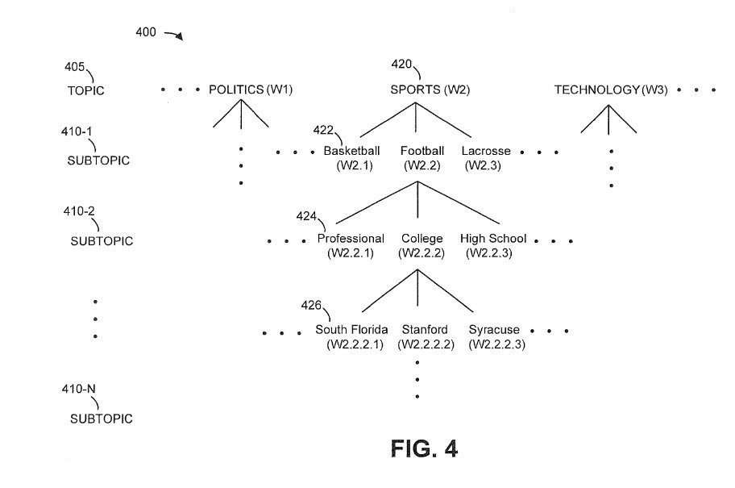

_The Oldest Pepper Tree in California_

At one point in time, search engines such as Google learned about topics on the Web from sources such as Yahoo! and the Open Directory Project, which provided categories of sites within directories that people could skim through to find something that they might be interested in.

Those categories included hierarchical topics and subtopics, but human beings managed them, and both directories have closed down.

In addition to learning about categories and topics from such places, search engines used such sources to do focused crawls of the web to make sure that they were indexing as wide a range of topics as possible.

It’s possible that we are seeing those sites replaced by sources such as Wikipedia and [Wikidata](https://www.wikidata.org/wiki/Wikidata:Introduction) and [Google’s Knowledge Graph](https://www.google.com/intl/bn/insidesearch/features/search/knowledge.html) and the Microsoft Concept Graph.

Google may start showing topical search results using breadcrumbs in the search results they return to queries to illustrate topics.

Last year, I wrote a post called, [Google Patents Context Vectors to Improve Search](https://www.seobythesea.com/2016/10/google-patents-context-vectors-improve-search/). It focused upon a Google patent titled [User-context-based search engine](https://patentscope.wipo.int/search/en/detail.jsf?docId=US177618724).

In that patent, we learned that Google was using information from knowledge bases (sources such as Yahoo Finance, IMDB, Wikipedia, and other data-rich and well-organized places) to learn about words that may have more than one meaning.

An example from that patent was that the word “horse” has different meanings in different contexts.

To an equestrian, a horse is an animal. To a carpenter, a horse is a work tool when they do carpentry. To a gymnast, a horse is a piece of equipment that they perform maneuvers upon during competitions with other gymnasts.

A context vector takes these different meanings from knowledge bases and the number of times they are mentioned in those places to catalog how often they are used in which context.

I thought that knowing about context vectors was useful for doing keyword research. Still, I was excited to see another patent from Google appear where the word “context” played a featured role in the patent. When you search for something such as a “horse,” the search results you receive will be mixed with horses of different types, depending upon the meaning. As this new patent tells us about topical search results:

> The ranked list of search results may include search results associated with a topic that the user does not find useful and/or did not intend to be included within the ranked list of search results.

If I was searching for a horse of the animal type, I might include another word in my query that identified the context of my search better. The inventors of this new patent seem to have a similar idea. The patent mentions

> In yet another possible implementation, a system may include one or more server devices to receive a search query and context information associated with a document identified by the client; obtain search results based on the search query, the search results identifying documents relevant to the search query; analyze the context information to identify content; and generate a group of first scores for a hierarchy of topics, each first score, of the group of first scores, corresponding to a respective measure of relevance of each topic, of the hierarchy of topics, to the content.

From the pictures that accompany the patent, it looks like this context information is in Headings that appear above each search result that identifies Context information that those results fit within, providing searchers with topical search results. For example, here’s a drawing from the patent showing off topical search results (showing rock/music and geology/rocks):

_Different types of ‘rock’ on a search for ‘rock’ at Google_

This Topical Search results patent does remind me of the context vector patent, and the two processes in these two patents look like they could work together. The patent also shows how topics may be organized.

This patent is:

[Context-based filtering of search results](http://patft.uspto.gov/netacgi/nph-Parser?Sect1=PTO1&Sect2=HITOFF&d=PALL&p=1&u=%2Fnetahtml%2FPTO%2Fsrchnum.htm&r=1&f=G&l=50&s1=9,779,139.PN.&OS=PN/9,779,139&RS=PN/9,779,139)
Inventors: Sarveshwar Duddu, Kuntal Loya, Minh Tue Vo Thanh, and Thorsten Brants
Assignee: Google Inc.
US Patent: 9,779,139
Granted: October 3, 2017
Filed: March 15, 2016

Abstract

> A server is configured to receive, from a client, a query and context information associated with a document; obtain search results, based on the query, that identifies documents relevant to the query; analyze the context information to identify content; generate first scores for a hierarchy of topics, that correspond to measures of the relevance of the topics to the content; select a topic that is most relevant to the context information when the topic is associated with a greatest first score; generate second scores for the search results that correspond to measures of relevance, of the search results, to the topic; select one or more of the search results as being most relevant to the topic when the search results are associated with one or more greatest second scores; generate a search result document that includes the selected search results; and send, to a client, the search result document.

It will be exciting to see topical search results start appearing at Google.
