I intended to write about a trio of patent filings involving Google Maps but ended up taking a detour. I might get to the patent applications before the end of this post, but I might run out of gas and not quite make it. The freshly published patent applications describe features Google may add to make Google Maps more interesting.

But if you haven’t been paying much attention, you may have missed many interesting features available already at Google Maps.

I started exploring Google Maps by looking at the journey between where I live and Washington, DC.

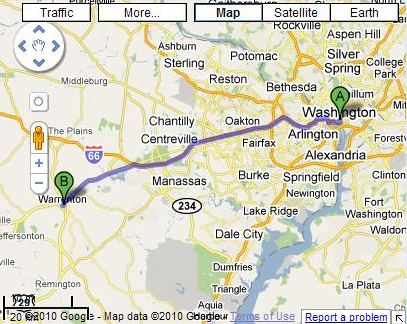

The fun thing about directions at Google Maps is that you can choose between driving a car, taking public transportation, riding a bike, or hoofing it on foot. Public Transport isn’t available where I’m at, but I checked the options to journey via foot and by bicycle. Each shows a slightly different path to DC, and includes estimations of the time for the journey.

If I drive, I’m shown three different routes, each taking a handful of minutes more than an hour. I can put in a departure time for public transit, but unfortunately, there doesn’t seem to be a combination of bus, train, and/or boat between here and there. If I walk, directions for a 45-mile journey show up, with an estimated 15 hours and three minutes (odd to include those minutes) from the first step to last. If I pedal, Google offers two options, each 10 miles longer than the walking path, but cutting the travel time down to 5 hours and 15 minutes.

Why is it that I have 10 miles less to travel if I walk rather than a bike? The bicycle map shows a lot less of a straight path:

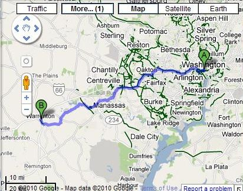

There is no horseback riding option for Google Maps, but one of the most famous journeys between Warrenton and Washington was a 1909 trip by President Teddy Roosevelt who leads an entourage by horseback from Washington to Warrenton for lunch, and back to Washington for dinner.

Driving sounds like the best option, and Google includes traffic information to help someone plan their journey. Not only can you see what traffic is like in real-time, but you can also insert a date and time for the trip and get estimated information about traffic for your journey.

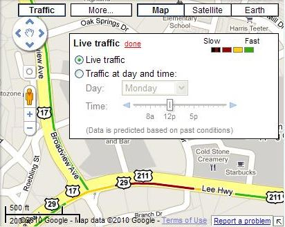

The map above does a good job of showing a section of a nearby road where a construction crew is funneling traffic into one lane while they widen a turn into two lanes. Chances are Google is grabbing mobile phone location and acceleration information from people driving down the road.

Like the information overlay that appears over that traffic estimation map that shows a Starbucks and a Cold Stone Creamery location? That’s described in a patent filing that I haven’t gotten to yet and isn’t one of the three I would write about. I need to finish that post and publish it…

I’m a big fan of landmarks and human-friendly driving directions. That’s part of why I like pictures in Google maps. Google will show you pictures from [Panoramio](http://www.panoramio.com/) on your Map if you select them as an option. Oddly, the image in the map below shows up in Google Maps and is labeled as being from Panoramio, but when I search Panoramio, I don’t see that picture.

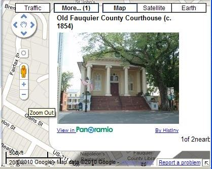

If photos aren’t enough, you can select the video option and see available videos along the route, like one that I found for the Library of Congress:

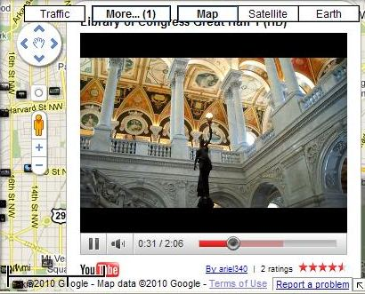

If photos and videos aren’t enough, and you want to read about some of the places you’ll travel through from start to finish, you could go to Wikipedia and try to search for that information, but you’d probably miss some interesting places. The Wikipedia option in Google Maps lets you see locations associated with those Wikipedia entries in a manner that makes it much easier to find them.

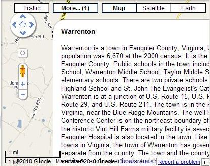

At this point, you might be thinking that there may be too many features in Google Maps, but I’m not quite sure. Another available choice is the option of seeing webcams that might show some of the places you may see, which can give you an idea of things like weather conditions at your destination. It looked somewhat cloudy and overcast today in the District of Columbia:

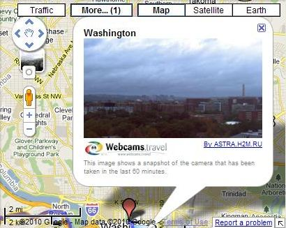

Spokespeople from Google have been mentioning lately that they are seeking new ways to insert social media into as many aspects of Google as they can, so a Google Buzz feature isn’t a surprise. You might find a relevant tweet or buzz as your traveling.

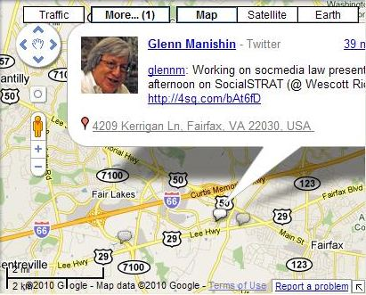

If you decide to travel by bicycle, the topography feature in Google Maps can give you an idea of whether your ride will be mostly uphill or downhill:

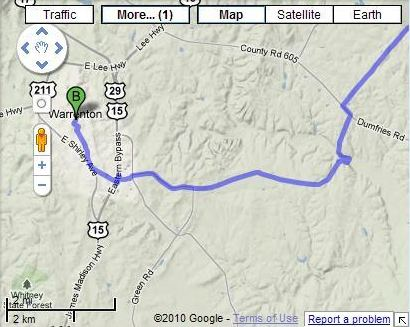

A bicycling feature (different from the “biking route option” in directions), shows specially designated bike paths. The one shown below is a greenway in Warrenton.

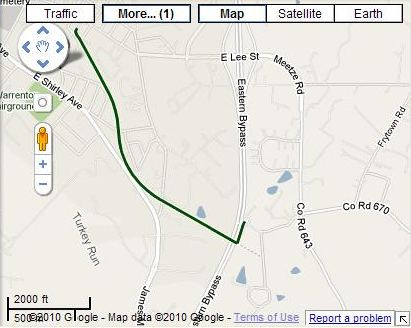

It’s not an unusual trip, Warrenton to Washington – many people who live in the area commute into Washington daily. Some nice homes in the area as well, which you can see from the “real estate” feature in Google Maps.

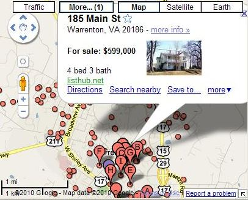

I wouldn’t say I like that Google Maps doesn’t include much in the way of public transit information in the area, including the Metro surrounding Washington DC. I’m showing a map from Manhattan instead of the Washington Metroline, wishing to show the Metro stations instead.

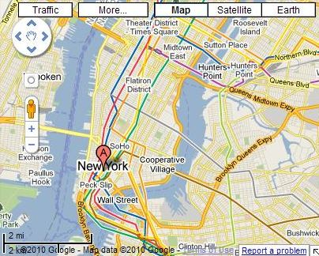

I can get some good views of monuments in Washington, DC, on the Google Satellite view:

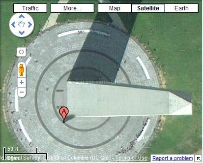

And an even more interesting look using a Google Earth view:

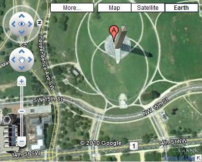

But I have to switch back to showing something from NYC, like the image below of the Empire State Building, when it comes to Google Streetview – it isn’t available in DC. Wonder why.

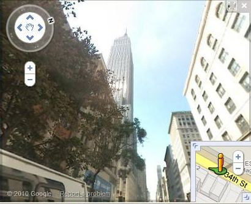

The patent filings are going to have to wait until another day.

How useful do you find all the features available on Google Maps?
