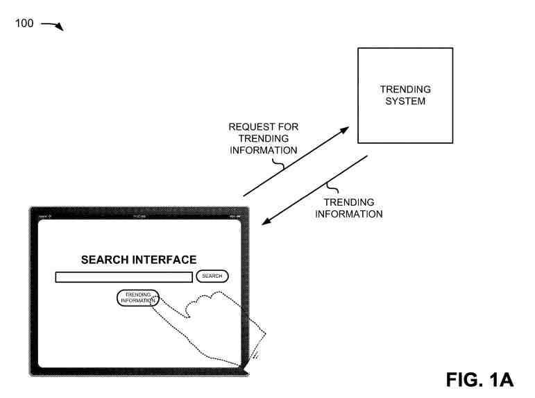
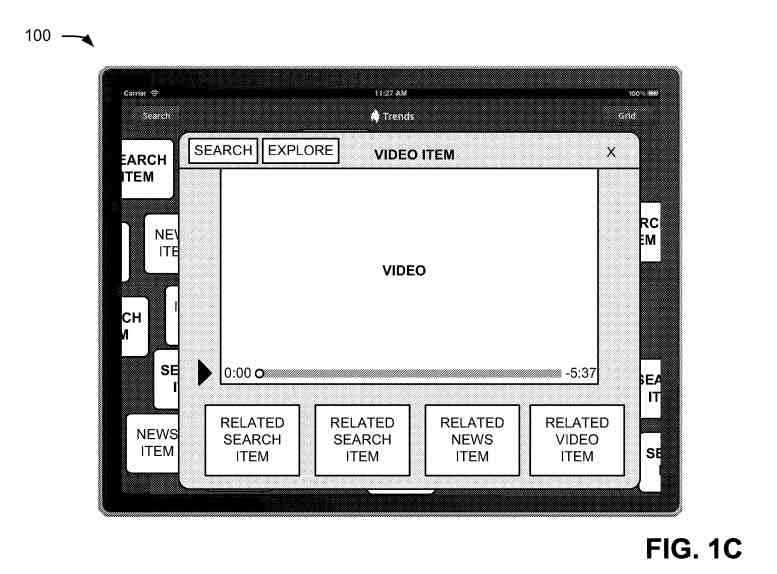
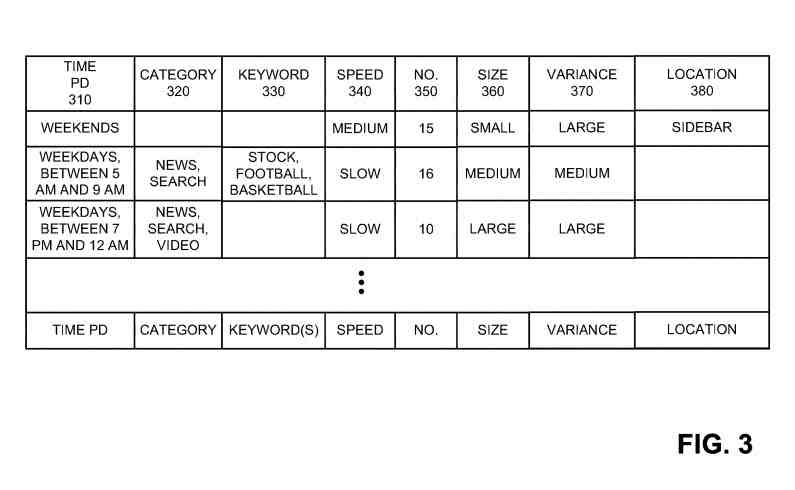
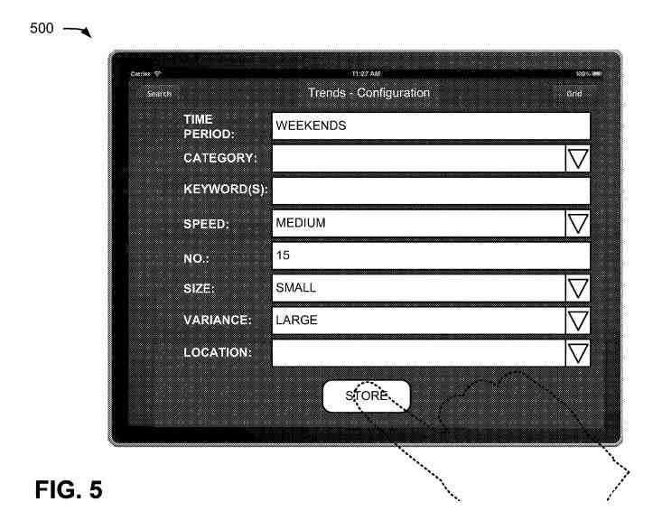
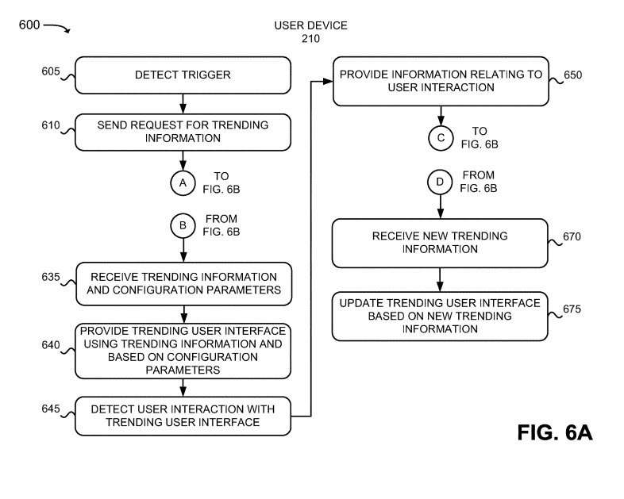
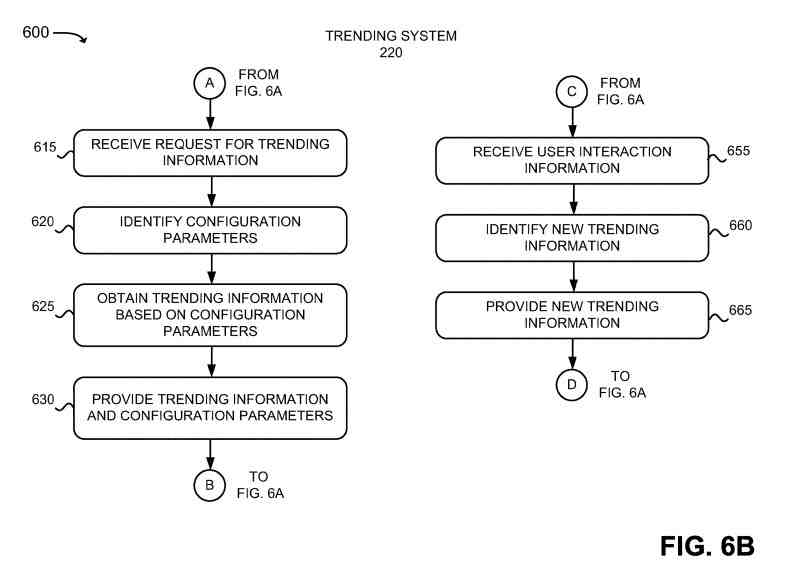
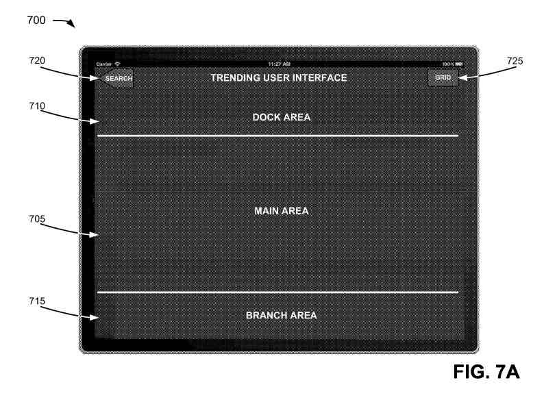
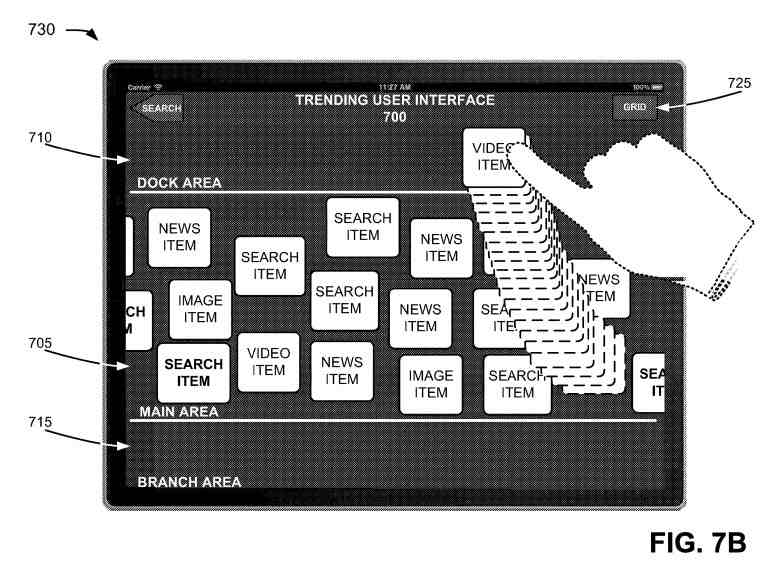
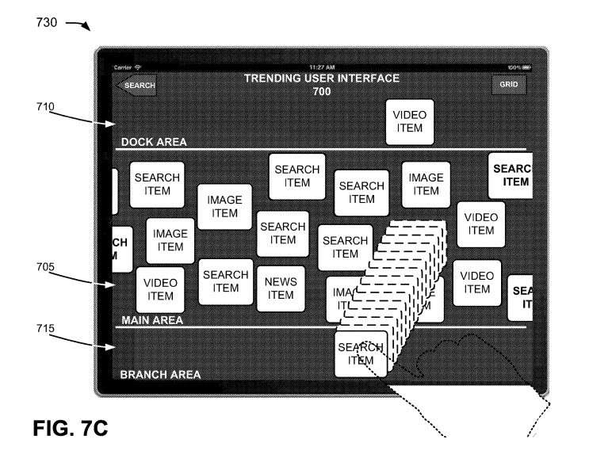
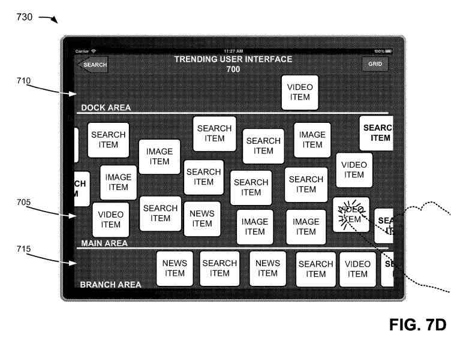

## Finding Trending Information Through Google

Many techniques are available to searchers to find information on the Web. Searchers often use browsers and search engines to find information of interest. The knowledge of interest may include currently popular documents among a group of searchers, such as videos that are presently popular from a video provisioning service.

One beneficial source of information that an SEO can use while researching Keywords is [Google Trends](https://trends.google.com/trends/?geo=US), which shows information about searchers interests in certain keywords. It can show entity information for queries that contain entities (See: [Image Search and Trends in Google Search Using Freebase Entity Numbers](https://www.seobythesea.com/2016/01/image-search-trends-freebase-entity-numbers/).)

It appears that Google has found trending information to be beneficial to site owners and SEOs and is considering another way of sharing trending information, which they have shared in a patent. This process is not yet available but seems to be worth watching for. To make Google Trends more beneficial for you, check out this Google Page: [FAQ about Google Trends data](https://support.google.com/trends/answer/4365533?hl=en)

## A Newly Granted Patented Approach To Trending Information

So what would this new patented approach cover?

The patent shows an example interface for tracking Trending Information, rather than just the interest of searchers in trending information. This process appears to be an exciting way to track trends over time.

One method includes providing, by processors of a device and via a searcher interface, information identifying Trending:

- Search-related news
- Video-related information
- Image-related information
- News-related information

This is where the trending search-related information includes information remembering:

- Searches currently popular through a search-related service
- The trending video-related information comprises information identifying videos that are presently popular through a video-related service
- The trending image-related information includes information identifying images that are currently popular through an image-related service
- And, tThe trending news-related information comprises information identifying news items that are presently popular through a news-related service

## Graphical Items Distinguished On A Searcher Interface Showing Trending Information

Presented as graphical items that get distinguished on the searcher interface:

- The t trending search-related information
- Trending video-related information
- The trending image-related information
- And, the trending news-related information

This is where each graphic item gets identified as relating to T the trending:

- Search-related information
- Video-related information
- Image-related information
- News-related information

## Other Graphic Items Shown For Trending Information

The searcher interface presents many graphical items simultaneously.

The trending information method further includes:

- Detecting, by processors and, over time, searcher interaction with graphical items of the many graphic items presented on the searcher interface
- Selecting a visual object on the searcher interface
- Removing a visual item from the searcher interface
- Adjusting, by the processors, a later group of graphical items presented on the searcher interface based on detecting the searcher interaction with the graphic objects over time

The searcher interface includes a first area and a second area. The first area presents the information identifying t the trending search-related information, the trending video-related information, the trending image-related information, or the trending news-related information.

The method further includes detecting a movement of a first graphical item, of the many graphical objects, from the first area to the second area; and presenting, based on the campaign:

- Other trending search-related information
- Another trending video-related information
- Trending image-related news
- Trending news-related information, where the other trending search-related information, or video-related information or image-related information, or news-related trending information related to the first graphical item

## Picking Up on Trending Information

According to some possible implementations, the searcher interface includes a first area and a second area. The first area presents the information identifying t the trending search-related information, the trending video-related information, the trending image-related information, or the trending news-related information.

The trending information method further includes:

- Detecting a movement of a first graphical item, of the many graphic things, from the first area to the second area
- Storing information relating to the first visual item based on the movement, where the storing makes the information about the first graphical item available when the searcher interface gets accessed via different searcher devices

And, the searcher interface presents the many graphical items as a grid.

Providing the:

- T the trending search-related news
- The trending video-related information
- The trending image-related information
- Trending news-related information

Includes causing the many graphical items to move across the searcher interface and get removed from the searcher interface, where more graphical objects get presented, via the searcher interface, as visual items, of the many graphic things, get removed from the searcher interface.

Causing the many graphical items to move across the searcher interface includes:

- Generating a first graphic item, of the many visual items, to get presented in a first manner, where it gets based on a measure of quality associated with the first graphical item
- Causing a second graphical item, of the many graphical items, to get presented in a second manner, where it gets based on a measure of quality associated with the second graphical item

The second manner is different than the first manner. The first manner and the second manner relate to at least one of the speeds at which the first graphical item and the second graphical item move across the searcher interface, size of the first graphic item and the second visual item, or positions of the first graphic item and the second graphical item on the searcher interface.

The trending information method further includes:

- Detecting a selection of a first graphical item, of the many visual things
- Creating a new searcher interface to get provided based on seeing the passage of the first graphic item, where the new searcher interface includes t image-related information relating to a topic of the first graphical item, video-related information relating to the topic of the first graphical item, news-related information relating to the topic of the first graphical item, or search-related information relating to the topic of the first graphical item

Each graphical item can get associated with the first time of day. The method further includes detecting a scrolling of the searcher interface in a left-to-right direction. The scrolling causes a different group of graphical items to get displayed that gets associated with a second, earlier time of day.

## Trending Information is Currently Popular Information

A system includes processors to provide, via a searcher interface, information identifying:

- T trending search-related news
- Trending video-related information
- Trending image-related information
- Trending news-related information

The trending search-related information includes information remembering searches that are currently popular through a search-related service, the trending video-related information comprises information identifying videos that are presently popular through a video-related service, the trending image-related information includes information identifying images that are currently popular through an image-related service, the trending news-related information comprises information identifying news items that are presently popular through a news-related service.

The processor is further to receive information identifying a topic and provide, based on the information identifying the issue, the next group of graphical items, on the searcher interface, where the latter group of visual items relates to the topic.

The searcher interface includes a first area and a second area. The first area presents the information identifying the t trending search-related information, the trending video-related information, the trending image-related information, or the trending news-related information.

The processors are further to detect a movement of a first graphical item, of the many visual things, from the first area to the second area, and present, based on the campaign, another trending search-related information, another trending video-related information, another trending image-related information, or another trending news-related information, where the other trending search-related information, another trending video-related information, another trending image-related information, or another trending news-related information relate to the first graphical item.

The graphical items are images.

When providing, via the searcher interface, the information identifying t the trending search-related news, the trending video-related information, the trending image-related information, or the trending news-related information, the processors are to cause the many graphical items to move across the searcher interface and gets removed from the searcher interface, where more graphical objects get presented, via the searcher interface, as graphic items, of the many visual things, get removed from the searcher interface.

When causing the many graphical items to move across the searcher interface, the processors are to generate a first visual item, of the many graphic items, to get presented in a first manner, where the first manner gets based on a measure of quality associated with the first graphical item; and cause a second graphic item, of the many visual things, to get presented in a dual manner, where the second manner gets based on a measure of quality associated with the second graphical item.

The second manner is different than the first manner.

The first manner and the second manner relate to at least one of the speeds at which the first graphical item and the second graphictem move across the searcher interface, sizes of the first grvisualtem and the second graphical item, or positions of the first graphical item and the second graphical item on the searcher interface.

The processors are further to detect a selection of a first graphical item, of the many graphical items, and cause a new searcher interface to get provided based on detecting the selection of the first graphical item, where the new searcher interface includes t image-related information relating to a topic of the first graphical item, video-related information relating to the topic of the first graphical item, news-related information relating to the topic of the first graphical item, or search-related information relating to the topic of the first graphical item.

And each graphical item, of the many graphical items, gets associated with the first time of day. The processors are further to detect a scrolling of the searcher interface in a left-to-right direction, where the scrolling causes a different group of graphical items to get displayed that get associated with a second, earlier time of day.

A computer-readable medium stores instructions. The instructions cause the processors to receive information identifying a topic; get based on receiving the information identifying the topic, information identifying t trending search-related information, trending video-related information, trending image-related information, or trending news-related information, where the trending search-related information includes information identifying searches that are currently popular through a search-related service, the trending video-related information includes information identifying videos that are currently popular through a video-related service.

The trending image-related information includes information identifying images that are currently popular through an image-related service, or the trending news-related information includes information identifying news items that are currently popular through a news-related service. The t trending search-related information, the trending video-related information, the trending image-related information, or the trending news-related information relate to the topic.

## The Trending Information Patent

[Providing trending information to searchers](https://patft.uspto.gov/netacgi/nph-Parser?Sect1=PTO1&Sect2=HITOFF&d=PALL&p=1&u=%2Fnetahtml%2FPTO%2Fsrchnum.htm&r=1&f=G&l=50&s1=11,144,174.PN.&OS=PN/11,144,174&RS=PN/11,144,174Z)
Inventors: Gregory Harris Plesur, Noah Levin, Arthur Edmond Blume, and Peter Michael Gast
Assignee: GOOGLE LLC
US Patent: 11,144,174
Granted: October 12, 2021
Filed: April 20, 2018

Abstract

> A system may provide, via a searcher interface, information identifying t trending search-related information, trending video-related information, trending image-related information, or trending news-related information.
>
> The t trending search-related information, the trending video-related information, the trending image-related information, or the trending news-related information are presented as graphical items. Each graphical item, of the graphical items, gets identified as corresponding to the trending search-related information, the trending video-related information, the trending image-related information, or the trending news-related information. The searcher interface presents many graphical items simultaneously.
>
> The system may further receive information identifying a topic, and provide, based on receiving the information identifying the topic, a latter group of graphical items, on the searcher interface. The next group of graphical items relates to the topic.

## A Searcher Interface That Presents Different Categories Of Trending Information

The trending information may include, for example, trending search queries, trending images, trending videos, trending news documents, and other categories of information that may currently be popular among a group of searchers. The searcher interface may present the trending information as images that allow the searcher to quickly review and identify trending information of interest across all the different categories of trending information.

Moreover, the searcher may interact with the searcher interface to alter the trending information that gets provided. For example, the searcher may provide a topic and the trending information may get adjusted based on the topic. Besides, the searcher’s interaction with the searcher interface, such as selecting or removing trending information, may cause the trending information that gets presented via the searcher interface to change.

Trending information is broadly interpreted as the information that is currently popular among a group of searchers. For example, trending search-related information may include information identifying searches that are currently popular through a search-related service.

Trending video-related information may include information identifying videos that are currently popular through a video-related service. Trending image-related information may include information identifying images that are currently popular through an image-related service. Trending news-related information may include information identifying news topics that are currently popular through a news-related service. A trending searcher interface may broadly get interpreted as a searcher interface that provides trending information.

A document, as the term gets used herein, is broadly interpreted to include any machine-readable and machine-storable work product. A document may include, for example, an e-mail, a file, a combination of files, files with embedded links to other files, a news article, a blog, a discussion group forum, etc. In the context of the Internet, a common document is a web page. Web pages often include textual information and may include embedded information, such as meta information, images, hyperlinks, etc., and embedded instructions, such as Javascript.

In situations in which systems and methods, as described herein, collect personal information about searchers, or make use of personal information, the searchers may get provided with an opportunity to control whether programs or features collect searcher information. Such as information about a searcher’s social network, social actions or activities, profession, a searcher’s preferences, a searcher’s current location, etc. Also to control whether and how to receive content more relevant to the searcher.

Besides, certain data may get treated in ways before the data gets stored and used so that personally identifiable information gets removed. For example, a searcher’s identity may get treated so that no personally identifiable information can get determined for the searcher, or a searcher’s geographic location may become generalized where location information gets obtained. Such as a city, ZIP code, or state level, so that a particular location of a searcher cannot get determined. Thus, the searcher may have control over how information gets collected and used.

While the following description focuses on providing different categories of trending information, systems and methods, as described herein, are not so limited. Systems and methods, as described herein, may provide different categories of information that relate to a particular topic, such as a search query, a document, etc.

## Diagrams Illustrating An Overview Of An Example Implementation

Assume a searcher, of a searcher device, gets interested in obtaining trending information. To get the trending information, assume that the searcher selects a TRENDING INFORMATION element on a search interface. In response, the searcher device may send a request, to a trending system, for the trending information.

The trending system may get the trending information and provide the trending information, to the searcher device, for a display to the searcher. The trending information may include different categories of information, such as trending search-related information, trending video-related information, trending image-related information, and trending news-related information.

The searcher device may display the trending information in a trending searcher interface. The trending information may get displayed as a group of images, where each image is visually identified as relating to the trending search-related information, the trending video-related information, the trending image-related information, or the trending news-related information.

In this way, the searcher may identify information of interest. When the searcher identifies an item of interest, the searcher may select the item to get more information. The searcher has selected a particular video item. Based on the selection, the searcher device may get the video and present the video to the searcher. Thus, the searcher device may present the trending information, to the searcher, in an appealing manner, which allows the searcher to identify and get information of interest.

## A Server Capable of Presenting Trending Information

The environment may include a group of searcher devices, a trending system, many servers

The searcher device may include a device or a collection of devices, that is capable of presenting trending information. (Would this be an option like Google Now, which presents predictive results. but capable of showing trending results?) Examples of searcher devices may include a smartphone, a personal digital assistant, a laptop, a tablet computer, a personal computer, and another type of device with the ability to present tending information. Searcher devices may include a browser via which a trending searcher interface may get presented on a display associated with the searcher device.

The trending systems may include a server device or a collection of server devices that are co-located or remotely located. A trending system may identify many different types of trending information, such as trending searches, trending videos, trending images, trending news documents, and other types of trending information. Trending systems may provide, to a trending searcher interface of searcher device, different types of trending information. Besides, a trending system may provide searcher interfaces, to searcher device, to allow a searcher, of searcher device, to configure the trending searcher interface.

The server may include a server device or a collection of server devices that are co-located or remotely located. Any t servers may get implemented within a single, common server device or a single, common collection of server devices. servers may store trending information.

For example, one of the servers may store search queries that have been provided to a search-related service and a number of times that the search queries have gotten provided. Another one of servers may store information identifying videos and many times that the videos have gotten accessed. Still another one of the servers stores information identifying images and many times the images have gotten accessed. Another one of the servers may store information identifying news documents and many times the news documents have gotten accessed.

The network may include any type of network, such as a local area network (“LAN”), a wide area network (“WAN”), a telephone network, such as the Public Switched Telephone Network (“PSTN”) or a cellular network, an intranet, the Internet, or a combination of these or other types of networks. searcher device, trending system, and servers may connect to the network via wired and wireless connections. In other words, any one of the searcher devices, trending system, and servers may connect to the network via a wired connection, a wireless connection, or a combination of a wired connection and a wireless connection.

The environment may include more components, fewer components, different components, or differently arranged components. Alternatively, components of the Environment may perform tasks described as gotten performed by other components of the Environment.

## Configuration Parameters Used To Find Trending Information

The data structure may get associated with a searcher device. The data structure may get associated with another device, such as a trending system.

As illustrated, the data structure may maintain a group of entries in the data the following example fields: **a time (PD) field, a category field, a keyword field, a speed field, a number (NO.) field, a size field, a variance field, and a location field.** The data structure may get associated with a particular searcher. The data structure may get associated with a particular searcher device of a particular searcher. Thus, assuming that the searcher has a smartphone and a tablet computer, the data structure may store information relating to a first manner in which the trending searcher interface is to get presented on the searcher’s smartphone and a second, different manner in which the trending searcher interface is presented on the searcher’s tablet computer.

The **Time field** may store information identifying a time for which a particular set of configuration parameters get used. The time may include, for example, a date, a date range, days of a week, a time range, and some other quantity of time. The time is searcher-specified. If no time gets provided in the time field, the same configuration parameters may get used in all situations.

The **Category field** may store information identifying categories of information. Example categories may include a search-related category, a video-related category, an image-related category, a news-related category, and other types of categories.

The **search-related category** may specify that trending search-related items. Such as currently popular search queries. These would get provided to the searcher interface.

The **video-related category** may specify that trending video-related items. Such as currently popular videos. Those would get provided to the searcher interface.

The **image-related category** may specify that trending image-related items. Such as currently popular images. They would get provided to the searcher interface.

The **news-related category** may specify that trending news-related items. Such as currently popular news documents. They would get provided to the searcher interface. All available categories may get considered when no category gets specified in the category field. The category or categories identified in the category field is searcher-specified.

The **Keyword field** may store keywords that may get used to identify items to get provided in a searcher interface. When categories get identified in the category field, the keywords, identified in the keyword field, may get used to getting items in the identified categories. By way of example, assume that the category field stores information identifying video-related information and the keyword field stores the keyword “football.”

In this example, **trending videos** relating to football may get provided to the searcher interface. In those situations where no category gets identified in the category field, the keywords, identified in the keyword field, may get used to obtaining items in all available categories. The keywords are searcher-specified.

The **Speed field** may store information indicating a speed at which items are to move across the trending searcher interface before getting removed. The speed may get specified, for example, as a slow, medium, or fast. The speed may get specified using a value, from a range of permissible values. Other ways of specifying a speed may get used. The speed, specified in the speed field, may, for example, correspond to the smallest speed, an average speed, or the greatest speed. The speed is searcher-specified.

The **Number field** may store information indicating the number of items simultaneously provided on the trending searcher interface. For example, a set of configuration parameters may specify that 15 items are simultaneously provided. The number of simultaneous items to get provided on the trending searcher interface is searcher-specified. A default quantity of simultaneous items may get provided to the trending searcher interface when no quantity of simultaneous items is specified by the searcher.

The **Size field** may store information indicating a size at which the items are graphically displayed on the trending searcher interface. The size may get specified, for example, as a small, medium, or large. The size may get specified using a value, from a range of permissible values. Other ways of specifying a size may get used. The size, specified in the size field, may, for example, correspond to a minimum size, an average size, or a maximum size. The size is searcher-specified.

The **Variance field** may store information indicating an amount of variance that is to get used to identifying items to get provided on the trending searcher interface. For example, when a keyword gets specified in the keyword field, the variance field may specify how closely items should relate to the specified keyword. When no keyword gets specified in the keyword field, the variance field may specify, for example, how wide a variety of trending information is to get provided to the trending searcher interface.

The variance may get specified, for example, as a small, medium, or large. The variance may get specified using a value, from a range of permissible values. Other ways of specifying a variance may get used. The variance is searcher-specified.

The **Location field** may store information identifying a location, on a display of searcher device, at which the trending searcher interface gets presented. Example locations may include a sidebar, a footer bar, a header bar, or another location. Other example locations may include presenting the trending searcher interface as a screensaver or a desktop wallpaper. The location may get specified on a per device or per-application basis. For example, location field may store first information, identifying a first location for the trending searcher interface, when searcher device corresponds to the first type of device (e.g., a tablet computer) and second information, identifying a second, different location for the trending interface when searcher device corresponds to a second, different type of device (e.g., a personal computer or laptop).

Similarly, the location field may store first information, identifying a first location for the trending searcher interface, when searcher device is executing a first application and second information, identifying a second, different location for the trending interface, when searcher device is executing a second, different application. The location field may also store information indicating whether the trending searcher interface is to get presented at the specified location. The location is searcher-specified.

As one example of a set of configuration parameters for a trending searcher interface, a searcher specified that during the weekends, items are to get captured from all of the available categories, the items are to move across the trending searcher interface at a medium speed, 15 items are simultaneously provided on the trending searcher interface, the items are to be graphically displayed in a small size, and that a large amount of variance is to get used in identifying the items.

Moreover, the searcher has specified that the trending searcher interface is to get presented as a sidebar. As another example, the searcher has specified that during weekdays, between the hours of 5 AM and 9 AM, news-related items and search-related items are to get identified based on the keywords “stock,” “football,” and “basketball,” the identified items are to move across the trending searcher interface at a slow speed, 16 items are to be simultaneously provided on the trending searcher interface, the items are graphically displayed in a medium-size, and that a medium amount of variance is in identifying the items.

As one more example, the searcher has specified that during weekdays, between the hours of 7 PM and 12 AM, news-related items, search-related items, and video-related items are to get identified, the identified items are to move across the trending searcher interface at a slow speed, 10 items are simultaneously provided the trending searcher interface, the items are graphically displayed in a large size, and that a large amount of variance is to get used in identifying the items.

The data structure may include more fields, different fields, or fewer fields. For example, the data structure may also store information identifying a language in which the trending information is to get provided on the trending searcher interface. Moreover, the data structure may also store information identifying a position, on the trending searcher interface, at which higher quality items are to get placed. For example, the configuration parameter may specify that higher quality items are to get located in the middle of the trending searcher interface and lower quality items are to get located above and below the higher quality items.

## Setting Configuration Parameters For a Trending Searcher Interface

The process may get performed by a trending system. Some or all the blocks described below may get performed by a different device or group of devices, including or excluding the trending system.

The process may include receiving configuration parameters and information identifying the searcher. For example, the ending system may receive configuration parameters from a searcher.

The configuration parameters may include parameters relating to identifying items that are to get provided on the trending searcher interface and a manner in which the items are to get provided.

Such as the speed at which the items are to move across the trending searcher interface, a number of items simultaneously provided, a size at which the items are graphically displayed, a variance with which the items are to get identified, a position, on the trending searcher interface, at which higher quality items are to get provided, and other parameters relating to the manner in which the items get provided).

The trending system may provide a searcher interface to a browser of the searcher device, to allow the searcher to specify the configuration parameters. Searcher devices may download an application associated with obtaining trending information. In these implementations, the searcher device may provide the searcher interface via the application. In any event, the searcher may specify the configuration parameters, via the searcher interface, and may cause the configuration parameters to get sent to the trending system.

## When A Trending System Receives Positive Signals

Also, the trending system may receive configuration parameters, from the searcher device, based on the searcher interacting with the trending searcher interface. For example, a trending system may receive positive signals, from the searcher device, based on the searcher selecting an item on the trending searcher interface, saving an item from the trending searcher interface for later review, obtaining more items relating to an item, or otherwise expressing an interest in an item.

The positive signals may include information identifying the category with which the selected item gets related, keywords associated with the selected item, etc. Additionally, the trending system may receive negative signals, from the searcher device, based on the searcher discarding an item from the trending searcher interface or otherwise expressing disinterest in an item. The negative signals may include information identifying the category with which the discarded item gets related, keywords associated with the discarded item, etc.

And, the trending system may also receive information identifying the searcher and searcher device. For example, a trending system may provide a searcher interface to the searcher device to allow the searcher to specify the identification information. The trending system may receive the identification information via a log-in process. Where the searcher device downloads an application associated with obtaining trending information, the searcher device may send the identification information using the application.

The process may include associating the configuration parameters with the information identifying the searcher. For example, a trending system may store the configuration parameters in a data structure, such as a data structure. Trending systems may associate the data structure (or that portion of the data structure that stores the configuration parameters) with the information identifying the searcher and searcher device.

The patent also says that a trending system may determine whether a time specified in the received set of configuration parameters conflicts (e.g., matches or overlaps) with an already stored time associated with a different set of configuration parameters. If the new time conflicts with an already stored time, the trending system may request that the searcher provide a priority to the two sets of configuration parameters.

The process may include fewer blocks, more blocks, or a different arrangement of blocks. Additionally, some of the blocks may get performed in parallel.

## Searcher Interface Used In The Trending Searcher Interface

Assume that a searcher has requested to configure a set of configuration parameters for the trending searcher interface. In response to the request, the searcher device may provide a searcher interface that allows the searcher to enter a set of configuration parameters.

Searcher interface may allow the searcher to specify any or all the following example parameters: time periods, categories, keywords, a speed at which items are to move across the trending searcher interface, a number of items simultaneously provided on the trending searcher interface, a size at which the items are to be graphically displayed on the trending searcher interface, a quantity of variance that is to get used in identifying items to provide via the trending searcher interface, and a location at which the trending searcher interface is to get provided. The searcher has specified that during weekends, items are to get provided based on all the available categories.

The searcher has further specified that the items are to move across the trending searcher interface at a medium speed and that the items are graphically displayed in a small size. Moreover, the searcher specified that a large amount of variance is to get used in identifying the items that get provided via the trending searcher interface.

## Storing the Configuration Parameters For Use with the Trending System

By selecting the STORE button on the searcher interface, the searcher device may cause the received set of configuration parameters to get transmitted to the trending system. A trending system may receive the set of configuration parameters and store the set of configuration parameters in, for example, a data structure, such as a data structure. Additionally, the searcher device may store the set of configuration parameters in local memory.

Searcher interface may include additional fields, different fields, fewer fields, or differently arranged fields.

An example process for providing trending information. While FIG. shows a process as including a particular sequence of blocks getting performed by searcher device and trending system, some of the blocks of the process may get performed by a different device or group of devices, including or excluding searcher device and trending system.

## Triggering a Request For a Trending Searcher Interface

The process may include detecting a trigger. For example, a searcher device may detect a trigger that signals a request for a trending searcher interface. The searcher device may generate the trigger based on a searcher’s action. For example, a searcher device may generate the trigger based on detecting a searcher’s selection of an element that gets displayed by a searcher device. The element may include, for example, a button, a link, a menu item, an icon, etc.

The element may get located on a search interface, such as a search engine home page. The element may get located on a document that provides search results. The element may get associated with an application that provides trending information. The element may get located on a desktop of a searcher device or in a list of applications available to a searcher device. The element may get located in other areas of a document, desktop, menu, etc.

The Searcher device or trending system may alter the appearance of the element, such as in those situations where an event occurred that causes a particular topic to show a strong upward trend in popularity.

## Example Of a Tragedy Becoming Quickly Popular

(This reminds me of a blog that became extremely popular in the mid 2000s after a Tsunami hurt people in the Pacific, because it included ways to help people who were hurt.)

As an example, if a particular tragedy occurs, topics relating to the tragedy may suddenly become particularly popular. The searcher device or trending system may alter the appearance of the element. For example, a searcher device or trending system may alter the color, size, or shape of the element or may cause the element to flash. Other ways of alerting the searcher of the particular topic or topics showing a strong upward trend in popularity may get used. In any event, the searcher device may generate a trigger based on detecting the selection of the element.

The searcher device may generate the trigger based on receiving a particular command from the searcher. For example, the launching of the trending searcher interface may get associated with a particular audible and textual command. When the searcher device receives the particular command, the searcher device may generate the trigger.

The searcher device may generate the trigger based on detecting a particular gesture getting made on a display of the searcher device. The gesture may include touch, swipe, and another motion on the display of the searcher device. The gesture may include swiping a currently displayed document to the left. When the searcher device detects a particular gesture, the searcher device may generate the trigger.

And, the searcher device may generate the trigger without searcher interaction. For example, in a situation where the trending searcher interface gets provided as a screensaver or as desktop wallpaper, the searcher device may generate the trigger without searcher interaction. Instead, the searcher device may generate the trigger based on the searcher device being powered up, the searcher device entering a power savings mode, and in response to another event.

## Process May Further Include Sending A Request For Trending Information

The request may include configuration parameters relating to items to get provided and relating to a manner in which the items are to get provided on the trending searcher interface.

This process may include receiving the request for trending information. For example, a trending system may receive the request for trending information from a searcher device.

## Trending Configuration Parameters

The process may include identifying configuration parameters.

For example, the trending system may identify configuration parameters that state the trending information to provide, to the searcher device, and the manner in which the trending information is to get provided to the searcher device.

Example configuration parameters may include categories of information, such as a search-related category, a video-related category, an image-related category, a news-related category, and other types of categories.

These are to get provided to the searcher device:

- keywords that are to get used to getting trending information
- Speed at which items are to move across the trending searcher interface
- Number of items provided on the trending searcher interface
- Size at which the items are to be displayed on the trending searcher interface
- Quantity of variance that is to get used in identifying items to provide via the trending searcher interface
- Location, on a display of searcher device, at which the trending searcher interface is to get provided

The trending system may identify the configuration parameters based on information in the request.

For example, a trending system may identify the request using configuration parameters. For example, the request may include information identifying categories of information:

- A search-related category
- A video-related category
- An image-related category
- A news-related category
- Other types of categories

Those may get provided to a searcher device:

- Keywords that are used, to obtain trending information
- Information identifying a speed at which items are to move across the trending searcher interface
- Information identifying a number of items simultaneously provided on the trending searcher interface
- Information identifying a size at which the items are graphically displayed on the trending searcher interface
- Information identifying a quantity of variance that is to get used in identifying items to provide via the trending searcher interface
- Information identifying a location at which the trending searcher interface gets provided

The trending system may parse the request to identify the configuration parameters.

And, the trending system may obtain a date and time associated with the request. The date and time may correspond to a date/time that the request gets sent or received. The trending system may use the date and time to identify configuration parameters. For example, a trending system may use the date and time to obtain the configuration parameters from a data structure, such as data structure.

## Trending Systems May Identify Default Configuration Parameters

Also, trending systems may identify default configuration parameters. For example, when the request is not associated with information that allows for a set of configuration parameters to get identified, the trending system may identify a default set of configuration parameters.

The default set of configuration parameters may identify the configuration parameters discussed above.

The process may further include obtaining trending information based on the configuration parameters. For example, a trending system may use configuration parameters to obtain trending information. The trending information may include items, such as search-related items, video-related items, image-related items, news-related items, and other types of items.

Meanwhile, the trending system may use the configuration parameters to identify items. For example, when the configuration parameters include information identifying categories of information, the trending system may obtain items in the identified categories.

## When Configuration Information includes Keywords, The Trending System May Use the Keywords to Get Ideals

When the configuration information includes keywords, the trending system may use the keywords to obtain items. For example, a trending system may compare the keywords to entries in an index of trending information to identify items relating to the keywords. When the configuration parameters include information identifying an amount of variance that is to get used in identifying items to provide via the trending searcher interface, the trending system may use the identified amount of variance to identify the items.

And, the trending system may generate a score for each item based on the configuration parameters and use the scores to determine which items are to get provided to the searcher device. A trending system may modify the score, of an item, based on factors. For example, the ending system may modify the score, of an item, based on the popularity score of the item.

## Popularity Score of An Item May Be Based on Searcher Behavior Data Associated With The Item

The popularity score of an item may get generated based on searcher behavior data associated with the item, such as how many searchers expressed disinterest in the popularity score of an item may get generated using factors instead of, or in addition to, the searcher behavior data, such as an age of the item, a prior ranking or score of the item, or the like.

## The Personalization Score of An Item May Get Generated Based On Searcher Activity Data

We are told that the trending system may modify the score, of an item, based on a personalization score of the item. The personalization score of an item may get generated based on searcher activity data, associated with a searcher of a particular searcher device, with regard to the item, such as whether the searcher has expressed disinterest in the item by, for example, removing the item from the trending searcher interface and whether the searcher expressed interest in the item by, for example, selecting the item when the item gets presented on the trending searcher interface. The personalization score of an item may get generated using factors instead of or in addition to, the searcher activity data, such as whether the searcher has recommended the item to one of the searcher’s social contacts.

## The Trending Score of An Item May Be Based On The Social Score Of the Item

Also, The trending system may modify the score, of an item, based on a social score of the item. The social score of an item may get generated based on friend activity data, associated with social contacts of the searcher of a particular searcher device, with regard to the item. The searcher’s social contacts may become identified based on the searcher’s communications, the searcher’s address book, and the searcher’s account on social networks.

## Friend Activity Data May Get Associated With An Item

Examples of friend activity data, associated with an item, including whether the searcher’s social contacts have expressed disinterest in the item by, for example, removing the item from a trending searcher interface and whether the searcher’s social contacts expressed interest in the item by, for example, selecting the item on a trending searcher interface that got presented to the social contacts’ searcher devices. The social score of an item may get generated using factors instead of, or in addition to, the friend activity data, such as whether the social contacts have recommended the item to others.

And, the trending system may generate a total score for an item based on a combination of the score, the popularity score, the personalization score, and the social score. A trending system may generate a total score for an item based on a weighted combination of the score, the popularity score, the personalization score, and the social score. For example, a trending system may assign a weight value to the score, the popularity score, the personalization score, and the social score.

The weight values may differ–in other words, the amount that each of the score, the popularity score, the personalization score, and the social score contributes to the total score may vary. The trending system may combine the weighted score, the weighted popularity score, the weighted personalization score, and the weighted social score to generate the total score. The total score, for an item, may reflect a measure of the quality of the item.

Besides, The trending system may select a set of items, to get provided to the searcher device, based on their scores. For example, a trending system may rank the items based on their scores and select the top-scoring X items (X>1). The number of items, in the selected set of items, based on the configuration parameters (e.g., based on a speed at which items are to move across the trending searcher interface, a number of items simultaneously provided on the trending searcher interface and size at which the items are graphically displayed on the trending searcher interface).

The process may include providing trending information and configuration parameters. For example, a trending system may provide the obtained trending information and configuration parameters to the searcher device. The trending information may include a ranked list of items. Each item may, for example, get associated with information identifying the category with which the item gets associated (e.g., search, video, image, news, etc.), information identifying the item, an image associated with the item, a date/time associated with the item, and other types of information.

The configuration parameters may include information relating to the manner in which the provided items are to get displayed by the trending searcher interface at the searcher device. For example, the configuration parameters may include information relating to a speed at which items are to move across the trending searcher interface, a number of items simultaneously provided on the trending searcher interface, a size at which the items are to be graphically displayed in the trending searcher interface, and a location at which the trending searcher interface is to get displayed.

A different speed may get specified for different items in the set of items. For example, the speed specified is based on the score of the item. The speed of a higher scoring item may be set to be slower than the speed of a lower scoring item. A different size may get specified for different items in the set of items. For example, the size may get specified based on the score of the item. The size of a higher scoring item set is bigger than the size of a lower scoring item. The searcher device may store the configuration parameters. In these implementations, the trending system may not provide the configuration parameters.

The process may include receiving the trending information and the configuration parameters. For example, searcher devices may receive the trending information and the configuration parameters from the trending system.

And, the process may include providing a trending searcher interface using the trending information and based on the configuration parameters. For example, based on receiving the trending information, the searcher device may cause a trending searcher interface to get provided on a display of the searcher device. searcher device may cause the received items to get presented in a manner consistent with the configuration parameters. Further details about an example trending searcher interface.

## Negative And Positive Searcher Interaction Relating To An Item

The searcher interaction may include a negative searcher interaction relating to an item and a positive searcher interaction relating to an item. Negative searcher interaction may include the searcher physically removing an item from the trending searcher interface (e.g., by dragging the item to a particular location), the searcher allowing an item to move across the trending searcher interface and get removed without selecting the item (e.g., searcher inactivity with respect to the item), and other similar types of searcher activity.

Positive searcher interaction may include the searcher physically moving an item to a particular location on the trending searcher interface, which indicates an interest in the item (e.g., by dragging the item to the particular location), the searcher saving an item for later consideration, the searcher requesting additional items relating to an item, the searcher selecting an item on the trending searcher interface, and other similar types of searcher activity.

Also, the process may include providing information relating to the searcher interaction. For example, a searcher device may provide information relating to the searcher interaction to the trending system. The information may include information identifying the item and information relating to whether the searcher interaction is negative, e.g., indicating that the searcher is not interested in the item, or positive, e.g., indicating that the searcher gets interested in the item.

And, the process may include receiving the information relating to the searcher interaction. For example, the trending system may receive information relating to the searcher interaction from the searcher device. The trending system may store the information in a profile relating to the searcher of the searcher device.

## The System May Identifying New Trending Information

The process may include identifying new trending information. For example, a trending system may parse the received information to identify the item to which the searcher interaction relates and whether the searcher interaction was negative or positive.

The trending system may identify new items to provide to the searcher device based on the identified item and whether the searcher interaction was negative or positive. For example, when the searcher interaction is negative, the trending system may identify new items, to provide to the searcher device, that gets unrelated to the identified item. When the searcher interaction is positive, the trending system may identify new items, to provide to the searcher device, that gets related to the identified item.

The process may include providing the new trending information. For example, a trending system may provide new trending information to the searcher device. The new trending information may include a ranked list of new items. Each item may, for example, get associated with information identifying the category with which the item gets associated (e.g., search, video, image, news, etc.), information identifying the item, an image associated with the item, and other types of information.

We are also told that the process may include receiving the trending information and the configuration parameters. For example, the searcher device may receive new trending information from the trending system.

And, tThe process may include updating the trending searcher interface based on the new trending information. For example, the searcher device may cause new items to get presented on the trending searcher interface based on the new trending information. searcher device may cause the new items to get presented in a manner consistent with the configuration parameters.

The process may include fewer blocks, additional blocks, or a different arrangement of blocks. Additionally, or alternatively, some of the blocks may get performed in parallel.

## Trending Searcher Interface

Included in the main interface; a dock area, a branch area, a search element, and a display element.

The main area may include an area, of trending searcher interface, where items, received from the trending system, may appear. The searcher device may cause the items, in the main area, to move, as if in a stream of water, from the left side of the trending searcher interface to the right side of the trending searcher interface. Thus, additional items appear on the left side of the trending searcher interface and items get removed from the right side of the trending searcher interface. The searcher device may present the items in a static manner in the main area.

In either event, the searcher device may allow the searcher to move the items, displayed in the main area, in a left-to-right or right-to-left direction, which causes additional items to appear in main area and causes displayed items to get removed from the main area. Moving the items in a right-to-left direction may cause items, which were previously removed from the main area, to reappear. Thus, in this way, the searcher may recapture items that have gotten removed from the main area.

As items are continually moved in a left-to-right direction, the additional items that get displayed, in the main area, may become more diverse and speculative. Thus, if the items, displayed in the main area, get directed to a particular topic, as items are continually moved in a left-to-right direction, the additional items that get displayed in the main area may begin to diverge from the topic.

Items, displayed in the main area, may get configured automatically selected. For example, as an auto-selected item moves across the trending searcher interface, additional information, relating to the item, may appear, as if the searcher had selected the item. searcher device may determine which items are auto-selected based on a number of factors, including the searcher’s past interaction with the trending searcher interface.

Dock area may include an area, of trending searcher interface, where items may get placed which may interest the searcher of searcher device. For example, a searcher, of a searcher device, may move an item from the main area to the dock area in order to later review the item. To later review the item, the searcher may simply select the item, such as by touching or clicking on the item. When an item gets placed in the dock area, the item is available whenever the searcher accesses the trending searcher interface and regardless of the searcher device from which the searcher accesses the trending searcher interface. To remove the item from the dock area, the searcher may simply drag the item back to the main area or off the right or left side of the trending searcher interface.

Branch area may include an area, of trending searcher interface, where items may get placed of interest to the searcher of searcher device. When an item gets placed in the branch area, the searcher device may cause items, relating to the placed item, to appear in the branch area. For example, a searcher, of a searcher device, may move an item from the main area to the branch area. searcher device may detect that the item gets placed in branch area and may send a request, to the trending system, for additional trending information related to the item.

The request may include, for example, information identifying the item. The trending system may obtain items relating to the identified item and may provide those identified items to the searcher device. Other ways of identifying an item may alternatively get used. For example, a twisting gesture on a particular item, in the main area, may cause items, relating to the twisted item, to appear in the branch area. As another example, each item, displayed in the main area, may include an element that, if selected, causes items, related to the item that includes the element, to get displayed. Thus, the selection of an element on an item, in the main area, may cause items, relating to the item, to appear in the branch area.

The searcher device may cause the related items to get displayed in the branch area of the trending searcher interface. The searcher device may present the received items in a dynamic manner. For example, a searcher device may cause the received items to move, as if in a stream of water, from the left side of the trending searcher interface to the right side of the trending searcher interface. Thus, more items appear on the left side of the trending searcher interface and items get removed from the right side of the trending searcher interface.

The Searcher device may cause the received items to get displayed in, in-branch area, in a static manner. The searcher device may allow the searcher to move the items, displayed in the branch area, in a left-to-right or a right-to-left direction, which causes more items to appear in the branch area and causes displayed items to get removed from the branch area.

To remove the items from the branch area, the searcher may simply drag one of the received items back to math in the area or off the right or left side of the trending searcher interface. To change the items in the branch area, the searcher may simply drag a different item, from the main area to the branch area.

Instead of related items becoming displayed in the branch area, the related items may get displayed in the main area. An item that gets identified for branching (e.g., by detecting that the item has gotten moved to a particular location of trending searcher interface, that an element on the item has gotten selected, that a twisting gesture has gotten made in relation to the item, etc.) may remain stationary in the main area, as the related items move in a left-to-right direction across trending searcher interface.

If the searcher wishes to return to the previous items, the searcher may simply drag the stationery item to a particular location on or off the trending searcher interface. Other ways of returning to the previous items may get used.

Search element may include a button or another type of selectable element that causes the searcher device to provide an interface that allows the searcher to perform a search. When a search gets performed using the interface, the searcher device may cause items, relating to the search, to get displayed in the main area. For example, a searcher device may receive search terms in the interface and may send a request, to the trending system, for additional trending information.

The request may include, for example, information identifying the search terms. The trending system may get items relating to the search terms and may provide those identified items to the searcher device. searcher device may cause the received items to get displayed in the main area. When a search gets performed using the interface, the searcher device may perform a network search and provide a document that includes a ranked list of search results, relating to the search.

The Display element may include a button or another type of selectable element that causes the searcher device to change the manner in which items get provided in the main area. The display element may allow the searcher to choose between providing items, in the main area, in a static manner, or a dynamic manner. The static manner may include, for example, providing the items in a non-moving, grid pattern. The dynamic manner may include, for example, providing the items in moving, grid, or non-grid patterns. Other manners of providing items, in the main area, may get used.

Trending searcher interface may simply include the main area, and not include the dock area or the branch area.

Assume that a searcher has requested trending information. In response, assume that the searcher device has provided a trending searcher interface. Moreover, assume that the trending searcher interface displays many items, in the main area, that move in a left to the right direction. Further, assume that the searcher gets interested in a particular video-related item, but wants to review the video-related item at a later time.

The searcher may move the video-related item, from the main area to the dock area. Once moved to the dock area, the video-related item may remain on the trending searcher interface until removed. Thus, the searcher may select the video-related item at a later time.

Assume that, at some later point in time, the searcher gets interested in obtaining more items relating to a particular search-related item. The searcher may move the search-related item, from the main area to the branch area. Once moved to the branch area, the searcher device may cause additional items to get obtained, from the trending system, relating to the search-related item Thus, in this way, the searcher may obtain additional items relating to a particular item of interest in the main area.

Assume that the searcher gets interested in a particular video-related item in the main area. Thus, the searcher may select the video-related item. By selecting the video-related item, the searcher device may cause a searcher interface that provides more information relating to the particular video-related item. The searcher interface may provide a video associated with the video-related item. Besides, the searcher interface may provide more items that relate to the video. Assume, after watching all or a part of the video, that the searcher gets interested in the related search item.

Searcher interface may include, for example, an image section, a news section, a biography section, and a related search section. The image section may include a scrollable area that provides images relating to a topic of the related search item. The news section may include a scrollable area that provides links to news-related documents relating to the topic of the related search item.

The biography section may include an area that provides biography information relating to the topic of the related search item. The related search section may include a scrollable area that provides search items relating to the topic of the related search item. Although not shown, the searcher interface may also include a search results section that provides a scrollable area that includes search results for the topic of the related search item.

The searcher may select an item in the searcher interface to get another searcher interface with information relating to the topic of the selected item. In this way, the searcher may cause the searcher device to present many searcher interfaces that provide information relating to various topics of interest to the searcher.

If the searcher gets interested in returning to the searcher interface, the searcher may either close the searcher interface or swipe the searcher interface to the right to cause the searcher interface fully displayed in the trending searcher interface. If the searcher gets interested in returning to the main area, of the trending searcher interface, the searcher may close all overlaying searcher interfaces, touch the main area, or perform some other kind of act that signifies a desire to return to the main area.

Assume that the searcher wishes to display the items, in the main area, in a static manner. To do so, the searcher may select the display element. The searcher device may, in response to the searcher’s selection of display elements, cause the items to get displayed in the main area in a static manner.

The searcher may browse items, in this configuration, by moving the items, displayed in the main area, in a left-to-right or a right-to-left direction. For example, the searcher may make a right-to-left swiping motion (or another type of gesture) to move items on the right side of the trending searcher interface to the left side of the trending searcher interface.

The searcher may simply tilt the searcher device in the direction that the searcher wishes the items to get moved. For example, if the searcher tilts the searcher device to the left, the searcher device may cause items on the right side of the trending searcher interface to move toward the left side of the trending searcher interface.

As another example, if the searcher tilts the searcher device to the right, the searcher device may cause items on the left side of the trending searcher interface to move toward the right side of the trending searcher interface. The degree of tilt may directly correspond to the speed at which the items move across the trending searcher interface.

The items, displayed in the main area, may get associated with date/time information. For example, each item may get associated with the date and time at which the item was trending. The trending searcher interface may act as a graphical timeline, where the searcher may cause a trending searcher interface to provide items that were trending at an earlier point.

Assume that the trending searcher interface displays many items in the main area. Moreover, assume that the trending searcher interface displays time information relating to when the displayed items were trending. To view what items were trending at an earlier point in time, the searcher may scroll the main area in a left-to-right direction. Assume that the searcher scrolls the main area, of the trending searcher interface, to an earlier time.

In response, the trending searcher interface may display time information identifying the earlier point in time and display items that were trending at the earlier point in time. In this way, the trending searcher interface may provide the searcher with the ability to see how other searchers’ understanding and interest in a particular topic evolved in news documents, videos, search queries, images.
tc.

Figures are examples of locations at which the trending searcher interface may get provided on the searcher device. Trending searcher interface may get provided as a sidebar on searcher device. The trending searcher interface may get provided as a footer bar on the searcher device. Trending searcher interface may get provided as a screensaver on searcher device. Trending searcher interface may get provided in a different manner or location on searcher device. Trending searcher interface may get provided in a browser window of searcher device, as desktop wallpaper of searcher device, or as a part of a download application.

FIG. may get provided on the trending searcher interface. In essence, the item may include enough information to allow a searcher, of the trending searcher interface, to identify the topic and category to which item relates. As shown, items may include an image section, a category designation section, and a title section.

The image section may include an image relating to the item. For example, when the item is a search-related item, the image section may include an image relating to a term or terms to which the search-related item relates. When an item is a video-related item,

Also, the image section may include an image captured from the video provided when the video-related item is selected. When an image-related item, the image section may consist of the idea provided when the image-related item is selected. When an item is a news-related item, the image section may include an image obtained from a news document associated with the news-related item.

The category designation section may include information that identifies the category to which item relates. The category information may get provided in a graphical form. The category information may get provided textually or in some other manner.

The title section may include a title for the item. The title may get provided textually. The title may get provided in another manner. The location of the title may be different, depending on the category to which item relates. For example, when the item is news-related, the title section may overlay the image section. When the thing is image-related, the title section may get located below the image section.

Although FIG. shows an example configuration of the item, the item may include more sections, different sections, fewer sections, or differently arranged sections than those depicted

FIGS. are another example of the process described. Concerning FIG, assume a searcher named John Smith gets interested in obtaining trending information. The searcher may select “Trends” from a searcher interface to get the trending news. Upon selection of the element, the searcher device may send a request for trending information to the trending system. The trending system may identify trending items that are to get provided to the searcher device, for example, based on configuration parameters associated with the searcher, John Smith, and may provide information relating to the trending items to the searcher device.

Assume that the searcher device receives the information, from the trending system, and provides a trending searcher interface based on the information. As shown, the trending searcher interface may display a group of items, of various categories, in a static manner. To browse through the items, the searcher may move the group of items in a right-to-left direction or a left-to-right direction. In either event, items will get removed from the trending searcher interface and more items will become provided on the trending searcher interface. Assume that the searcher wishes to view more items and makes a right-to-left swiping motion across the trending searcher interface.

As a result, the searcher device may cause items on the right side of the trending searcher interface to move toward the left side of the trending searcher interface and may cause morel items to appear on the right side of the trending searcher interface.

## Example Item Of Interest As Trending Information

Assume the searcher has identified an item of interest. For example, assume that the searcher has found the search-related item, titled “Tony Lucca,” of interest. Thus, the searcher may select the search-related item to get more information relating to “Tony Lucca.”

The searcher device may, in response to the selection of the search-related item, cause a pop-up window to appear. The pop-up window may display search-related information relating to the topic of the selected search-related item. “Tony Lucca.” As shown, the pop-up window may include an image section that provides a scrollable list of images identified as relevant to the topic, “Tony Lucca,” a search results section that provides search results relating to “tony Lucca,” a biography section that provides biographical information relating to ”

Tony Lucca,” and a related search section that provides a scrollable list of search-related items for people that get determined relevant to “Tony Lucca.”

Assume that the searcher scrolls through the images, in the image section of the pop-up window, to identify an image of interest. Thus, the searcher may make a swiping or another kind of motion on an image in the image section of the pop-up window. Different images may get displayed in the image section of the pop-up window.

Assume further that the searcher did not find an image of interest in the image section, so instead, decides to scroll through the items in the related search section. Thus, the searcher may make a swiping or another kind of motion on an item in the related search section of the pop-up window. Different items may get displayed in the related search section of the pop-up window.

That the searcher gets interested in obtaining more information relating to an item in the related search section. Thus, the searcher may select the item by, for example, touching the item, clicking on the item, etc. searcher device based on detecting that the item has to get selected, move the existing pop-window to the left, and present a new pop-up window, relating to the topic of the item. The new pop-up window may get configured in a manner like the configuration of the existing pop-up window.

For example, the new pop-up window may include an image section that provides a scrollable list of images identified as relevant to the new topic, which gets shown as “Jc Chasez,” a search results section that provides search results relating to the new topic, a biography section that provides biographical information relating to the new topic, and a related search section that provides a scrollable list of search-related items for people that get determined relevant to the new topic.

Also, assume that the searcher gets interested in one of the search results in the search results section of the new pop-up window. Thus, the searcher may select the search result by, for example, touching the search result, clicking on the search result, etc. searcher the device based on detecting that the search result has gotten selected, obtaining a document relating to the search result. For example, a searcher device may retrieve a document that corresponds to the selected search result and cause that document to get presented to the searcher.

If the searcher wishes to return to the trending searcher interface, the searcher may cause the searcher device to close the existing document becoming presented or may provide a particular gesture on the trending searcher interface. The particular gesture is a swiping motion from left to right on the presented document. Other types of gestures may get used. Thus, if the searcher device detects the particular gesture, the searcher device may close the presented document, causing the trending searcher interface to get presented again.
