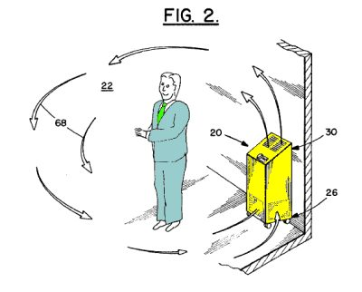

Since I spend a lot of time over at the web site of the US Patent and Trademark Office, looking for patent information, sometimes I get questions from someone about the goings-on over there.

Charlie Anzman noticed recently that both [Apple](https://www.apple.com/macbook-air/) and [Adobe](https://labs.adobe.com/technologies/flashruntimes/) (warning – audio and video start playing on arrival) were touting new products with the name AIR in them. Charlie made a post at his blog asking if it were possible to [Patent Air](http://anzman.blogspot.com/2008/01/can-you-patent-air.html), and called upon me to see if I could give him an answer:

> “Is it possible, one of these guys can get a patent on AIR?”

Here’s the response I sent back to Charlie:

Hi Charlie,

I think that you may have been asking about people trademarking the word “Air” rather than patenting it – since a patent needs an actual process to go along with it, like [air conditioning](https://patents.google.com/patent/US852823), or [air filtering](https://patents.google.com/patent/US366568), or something like that.

I took a look at the US Patent and Trademark Office, and performed a [trademark](https://www.uspto.gov/trademark) search on their Trademark Electronic Search System (TESS).

There are some limits to their search system. I received 13143 results while looking for “air,” but some of them were instances where “air” was part of some larger word, like “Crosstainer.”

But, there are also terms in there like:

Evolution in the Air,
Bionic Air,
Air Socks,
US Air Guitar,
Just Add Air, and
Fresh Squeezed Air.

More than one business can own a trademark to be used in commerce, based upon the classification of use. Going through the first 1,000 or so results, I found 5 uses of “Air” by itself, as a trademark

1) The [Compagne Des Arts del la Table](https://www.concrete-beton.com/) trademarked “Air” for non electric cutlery (forks and knives).

2) [Pepperl + Fuchs](https://www.pepperl-fuchs.com/usa/en/index.htm?selectcountry=1) GbmH trademarked “Air” all kinds of electric lighting devices and software that works with them.

3) Inke Pte, LTD. trademarked “Air” for printing ink cartridges, and machines to refill those cartridges.

4) Concept Attractions of Wisconsin, Inc., trademarked “Air” for entertainment services involving amusement parks

5) American IronHorse Motorcycle Company, Inc., trademarked “Air” for motorcycle services, apparel, and print publications.

So, it appears that you can trademark “air”.
