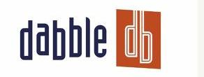

Twitter has been the focus of many acquisition talks over the past couple of years, usually as the target of an acquisition by a Google or Microsoft or Yahoo, or Facebook.

Twitter has made a few acquisitions of its own, and I was trying, without much success, to find a list of the companies that it purchased, either for the technology that they offered, or for the people that they employed.

Twitter has blogged about the majority of acquisitions it has made, though not all. There may be other companies that Twitter purchased that I couldn’t locate any information on. If you know about any, and you’re so inclined, please let me know about them.

Here are the Twitter Acquisitions that I was able to find:

Summize
July 14, 2008

Summize was a 5 member startup based in Northern Virginia, and began with a focus upon sentiment analysis for the Web. They had developed a way of searching and filtering Twitter results that provided [significant improvements](https://blog.twitter.com/official/en_us/a/2008/finding-a-perfect-match.html) to those features offered by Twitter itself.

Before Summize developed a way to search Twitter, their focus was upon providing sentiment analysis for reviews and blogs on products, people, videos, music, and more. I remember beta testing a blog widget for them back then.

The [purchase price](https://web.archive.org/web/20181130124446/https://www.businessinsider.com/2008/7/twitter-buys-summize-for-about-15m-stock-and-cash) for Summize was estimated to be around $15M in cash and Twitter stock

Abdur Chowdhury, who was a Co-founder and the Chief Scientist at Summize, is now the Chief Scientist at Twitter.

Values of n
November 24, 2008

When the Twitter blog was introduced [Rael Dornfest](https://blog.twitter.com/official/en_us/a/2008/meet-rael-dornfest.html) to the Twitter community, the focus was more upon what Rael would bring to Twitter than the products that Values of n had developed.

Before joining Twitter, he was O’Reilly’s Chief Technical Officer, and was the force behind Meercat, the first web-based feed aggregator.

Mixer Labs
December 23, 2009

The last post on Mixer Lab’s townme blog on October 15, 2009, introduced their [GeoAPI](http://blog.townme.com/2009/10/townme-geoapi-allows-new-types-of.html) which could be used to provide many location-based services. Finally, on December 23, 2009, the Twitter blog pointed out the introduction of their own Geotragging API a month earlier, and the [acquisition of Mixer Labs](https://blog.twitter.com/official/en_us/a/2009/mixing-it-up-at-795-folsom-st.html).

Atebits
April 9, 2010

I searched for, but didn’t see a mention of the Atebits acquisitions on the Twitter blog. Still, a New York Times blog post does a good job of describing [Twitter’s Acquisition of Atebits](https://bits.blogs.nytimes.com/2010/04/09/twitter-acquires-atebits-maker-of-tweetie/?_php=true&_type=blogs&_r=1), who was known at the time for the Tweetie apps for using Twitter on iPhones and Mac computers.

The last post on the Atebits blog from developer Loren Brichter, “An Amazing Ride,” made the official announcement of the acquisition.

One of the pieces that came along with this acquisition is the assignment of a patent to Twitter, [User Interface Mechanics](http://appft.uspto.gov/netacgi/nph-Parser?Sect1=PTO2&Sect2=HITOFF&u=%2Fnetahtml%2FPTO%2Fsearch-adv.html&r=1&p=1&f=G&l=50&d=PG01&S1=20100199180.PGNR.&OS=dn/20100199180&RS=DN/20100199180), which describes an infinite scrolling method like the one presently in use at Twitter.

Cloudhopper
April 23, 2010

Cloudhopper specialized in building scalable SMS systems, and the incorporation of their technology into Twitter enabled the company to spread across the globe much quicker. And much of that was during the 8 months before [Twitter acquiring Cloudhopper](https://blog.twitter.com/official/en_us/a/2010/cloudhopping.html).

Small thought Systems
June 10, 2010

Before Twitter acquired Smallthought Systems, they were a client of the company, using their Dabble DB online database to manage internal projects, and their tool [Trendly](http://web.archive.org/web/20110831112744/http://trendly.com/). In [More Than Dabbling](https://blog.twitter.com/official/en_us/a/2010/more-than-dabbling.html), Twitter introduces the Smallthought Systems team to the Twitter community.

Fluther team
December 21, 2010

Twitter didn’t acquire [Fluther](https://www.fluther.com/) outright, but rather hired the employees of the site. The Twitter blog introduces the Q&A community team members to Twitter in [Fluther Flocks to Twitter](https://blog.twitter.com/official/en_us/a/2010/fluther-flocks-to-twitter.html)

**Conclusion**

Will Twitter be acquired by one of the major search engines or social networks on the Web sometime in the future?

Will they continue to make acquisitions that improve the quality of the services that they offer, and the technical knowledge behind it?

I’ll try to keep an eye out for future acquisitions by Twitter. If you hear of any, please let me know. Thanks.
