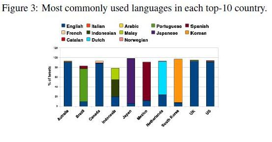

If you’ve never used Twitter before, it can be a little intimidating when you’re first starting out. You’re faced with a message on the front page of the site telling you to “Follow your interests,” and promising “instant updates from your friends, industry experts, favorite celebrities, and what’s happening around the world.”

Then you sign up, and you’re faced with an empty text box with a question above it asking you “What’s Happening?” You have no friends added yet, you’re not following any industry experts or favorite celebrities, and there’s no news about what’s happening around the world. But you might see tweets in more languages than just English, according to a whitepaper presented last month.

The site does have ways to help you search for and find people to follow and interact with, and will recommend people to follow in a few places, but trying to figure out exactly what to say in that box that asks “what’s happening,” isn’t that easy. I remember spending more than a couple of days trying to figure that out myself.

I began by adding some people I knew, and by watching how and what others tweeted. One aspect of Twitter I found and continue to find pretty interesting is when someone tweets something to me in a language other than English, and I have to use Google Translate to interpret what they are saying. Twitter really does enable you to find out what’s happening “around the world.”

I ran across an interesting paper this morning, presented at the 20th ACM Conference on Information and Knowledge Management (CIKM) in late October of this year, [Do All Birds Tweet the Same? Characterizing Twitter Around the World](http://www.ruthygarcia.com/papers/cikm2011.pdf).

The paper was authored by an cast of researchers working for Universities and Yahoo Research in Spain and Chile: Barbara Poblete, Ruth Garcia, Marcelo Mendoza, and Alejandro Jaimes.

The authors collected a years worth of data from the ten countries they found to be most active on twitter to understand and report upon “differences and similarities in terms of activity, sentiment, use of languages, and network structure.”

The abstract of the paper begins by telling us about some of the potential impacts and usages of international social networks like Twitter:

> Social media services have spread throughout the world in just a few years. They have become not only a new source of information, but also new mechanisms for societies world-wide to organize themselves and communicate. Therefore, social media has a very strong impact in many aspects – at personal level, in business, and in politics, among many others.
>
> In spite of its fast adoption, little is known about social media usage in different countries, and whether patterns of behavior remain the same or not.
>
> To provide deep understanding of differences between countries can be useful in many ways, e.g.: to improve the design of social media systems (which features work best for which country?), and influence marketing and political campaigns. Moreover, this type of analysis can provide relevant insight into how societies might differ.

The authors of the paper tell us that their research is the “largest study done to date on microblogging data, and the first one that specifically examines differences across different counties.”

So, what kind of data did they look at? It appears that they were interested in exploring things like:

- Numbers of tweets per users in different countries
- Languages used per country
- Happiness levels of tweets
- Content of tweets in terms of re-tweets, mentions, URLs, and hashtags

The data examined for this research came from 4,736,629 users and 5,270,609,213 tweets from the top-ten most active countries during all of 2010. 99.05 of those tweets were classified into 69 languages with English being the most popular language, appearing in nearly 53% of those tweets.

Some interesting findings when it comes to the content of tweets.

Indonesia ranked first in tweets, followed by Japan and then Brazil

Indonesia and South Korea had the highest percentage of mentions, and Japan had the lowest, amongst the ten countries compared.

The Netherlands was the country with the most hashtags per user.

The United States had the most mentions of URLs per user.

**Conclusions**

The paper is interesting on more than one level, such as the study of how social networks function as well as how people use social networks in different ways in different places. I’m hoping that more researchers will spend time with data like this in the future.

One addition I’ve been hoping to see in places like Twitter and Google Plus are easily accessible translation tools to make it easier to understand messages in other languages and improve communications across different international communities.
