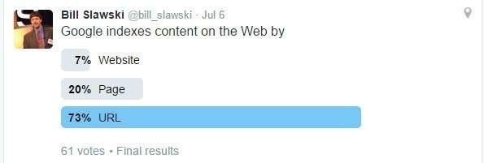

I thought this was an interesting question to ask people because I think it’s often misunderstood. Google treats content found at different URLs as if it is different content, even though it might be the same, such as in the following examples:

http://www.example.com
https://www.example.com
http://example.com
http://example.com/index.htm
http://example.com/Index.htm
http://example.com/default.asp

One of the most interesting papers I’ve come across on this topic is this one (One of the authors joined Google shortly after this was released – Ziv Bar-Yossef):

[Do Not Crawl in the DUST: Different URLs with Similar Text](https://static.googleusercontent.com/media/research.google.com/en//pubs/archive/35210.pdf)

What do you think?
