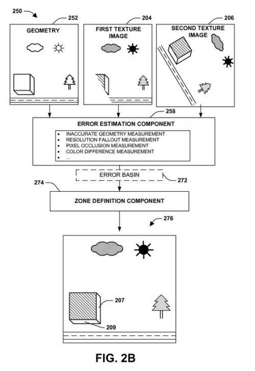
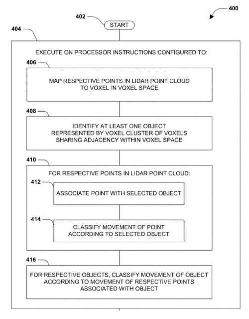
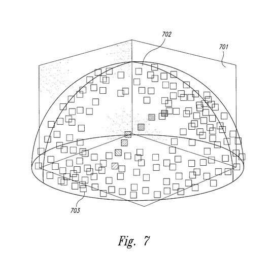
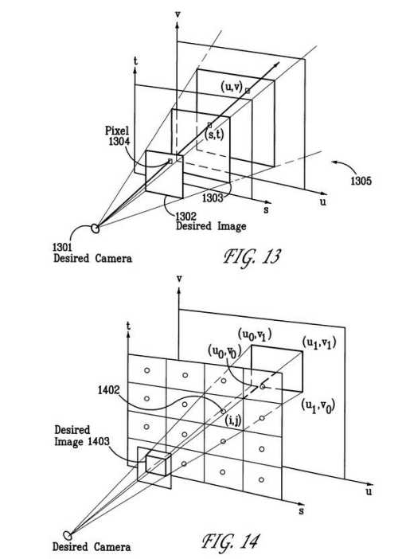
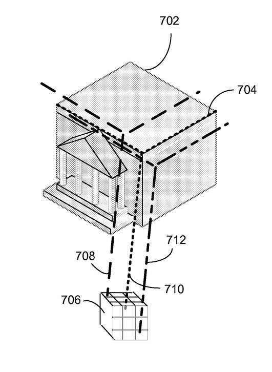
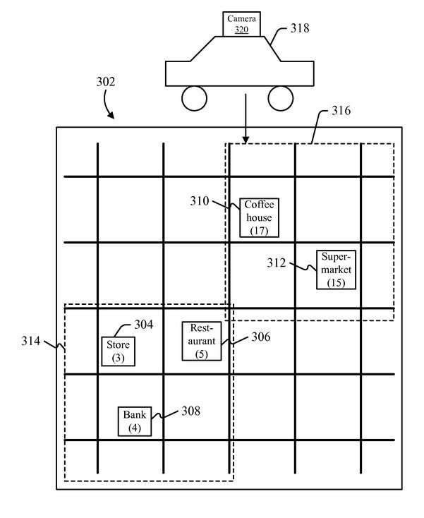
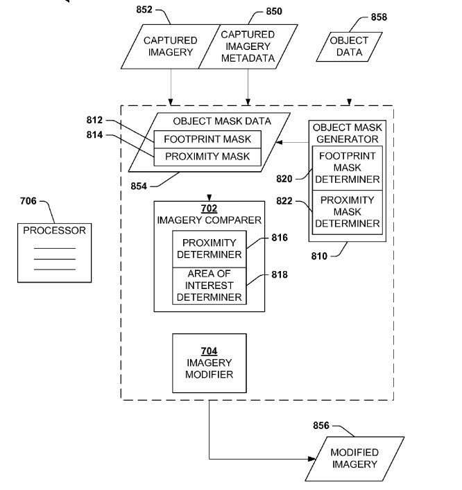

On June 23, 2015, Uber Technologies assigned 9 patents to Microsoft, in a transaction that was recorded at the United States Patent and Trademark Office (USPTO) on August 18, 2015.

These patents and their abstracts are listed below, and they link to full copies; all of them are related to Mapping, which was an area that Microsoft was supposedly going to be [outsourcing](https://www.information-age.com/what-will-happen-if-google-and-microsoft-leave-mapping-world-123459164/) to other companies, including Uber. I haven’t seen anything anywhere else that explains this transaction or says anything about the cost behind it.

I tried making sense of it by looking at articles about Uber and Microsoft, but they seemed to show a good relationship between the companies:

- June 29, 2015 – [Uber acquires mapping tech and talent from Microsoft](https://www.theverge.com/2015/6/29/8863687/uber-acquires-mapping-data-tech-and-talent-from-microsoft-bing)
- June 29, 2015 – [Uber grabs Microsoft mapping assets and employees](https://fortune.com/2015/06/29/uber-microsoft-maps/)
- June 31, 2015 – [Microsoft Said to Invest Big Sum in Uber](https://www.nytimes.com/2015/08/01/technology/microsoft-is-said-to-invest-in-uber.html?_r=1)
- July 6, 2015 – [Microsoft’s map sale to Uber sends all the wrong mobile messages](https://www.techrepublic.com/article/microsofts-map-sale-to-uber-sends-all-the-wrong-mobile-messages/)
- July 31, 2015 – [Microsoft’s Investment In Uber Is A Head Scratcher](https://www.forbes.com/sites/erikamorphy/2015/07/31/microsofts-investment-in-uber-is-a-head-scratcher/#7ab3d0344312)
- August 3, 2015 – [Microsoft: What Software Company Has to Gain From Reported Uber Investment](http://abcnews.go.com/Technology/microsoft-software-company-gain-reported-uber-investment/story?id=32852618")

The technologies involved in this transaction involve some complex digital mapping technologies, but it’s a little puzzling why Uber might be assigning these patents to Microsoft, where they seem to have originated. The patents were under the Microsoft Technology Licensing, LLC name when they were assigned over to Uber. They’ve been assigned to Microsoft Corporation with this assignment I’m not sure if that played a role in the transaction

[Translated view navigation for visualizations](https://patents.google.com/patent/US20140267343)
Inventors: Blaise Aguera y Arcas, Markus Unger, Donald A. Barnett, Sudipta Narayan Sinha, Eric Joel Stollnitz, Johannes Peter Kopf, Timo Pekka Pylvaenaeinen, Christopher Stephen Messer
Filed: March 14, 2013
Published: Sep 18, 2014

Abstract:

> Among other things, one or more techniques and/or systems are provided for defining transition zones for navigating a visualization. The visualization may be constructed from geometry of a scene and one or more texture images depicted the scene from various viewpoints. A transition zone may correspond to portions of the visualization that do not have a one-to-one correspondence with a single texture image, but are generated from textured geometry (e.g., a projection of texture imagery onto the geometry). Because a translated view may have visual error (e.g., a portion of the translated view is not correctly represented by the textured geometry), one or more transition zones, specifying translated view experiences (e.g., unrestricted view navigation, restricted view navigation, etc.), may be defined. For example, a snapback force may be applied when a current view corresponds to a transition zone having a relatively higher error.

[Lidar-based classification of object movement](https://patents.google.com/patent/US20140368807)
Invented by: Aaron Matthew Rogan
Filed: Jun 14, 2013
Published: Dec 18, 2014

Abstract:

> Within machine vision, object movement is often estimated by applying image evaluation techniques to visible light images, utilizing techniques such as perspective and parallax. However, the precision of such techniques may be limited due to visual distortions in the images, such as glare and shadows. Instead, lidar data may be available (e.g., for object avoidance in automated navigation), and may serve as a high-precision data source for such determinations. Respective lidar points of a lidar point cloud may be mapped to voxels of a three-dimensional voxel space, and voxel clusters may be identified as objects. The movement of the lidar points may be classified over time, and the respective objects may be classified as moving or stationary based on the classification of the lidar points associated with the object. This classification may yield precise results, because voxels in three-dimensional voxel space present clearly differentiable statuses when evaluated over time.

[Method and System for Digital Plenoptic Imaging](https://patents.google.com/patent/US6009188)
Invented by: Michael F. Cohen, Steven J. Gortler, Radek Grzeszczuk, Richard S. Szeliski
Filed: Mar 20, 1996
Granted: Dec 28, 1999

Abstract:

> A computer-based method and system for digital 3-dimensional imaging of an object which allows for viewing images of the object from arbitrary vantage points. The system, referred to as the Lumigraph system, collects a complete appearance of either a synthetic or real object (or a scene), stores a representation of the appearance, and uses the representation to render images of the object from any vantage point. The appearance of an object is a collection of light rays that emanate from the object in all directions. The system stores the representation of the appearance as a set of coefficients of a 4-dimensional function, referred to as the Lumigraph function. From the Lumigraph function with these coefficients, the Lumigraph system can generate 2-dimensional images of the object from any vantage point. The Lumigraph system generates an image by evaluating the Lumigraph function to identify the intensity values of light rays that would emanate from the object to form the image. The Lumigraph system then combines these intensity values to form the image.

[Method and system for tracking vantage points from which pictures of an object have been taken](https://patents.google.com/patent/US6222937?oq=08885251)
Inventors: Michael F. Cohen, Steven J. Gortler, Radek Grzeszczuk, Richard S. Szeliski
Filed: June 30, 1997
Granted: April 24, 2001

Abstract:

> A computer-based method and system for digital 3-dimensional imaging of an object which allows for viewing images of the object from arbitrary vantage points. The system, referred to as the Lumigraph system, collects a complete appearance of either a synthetic or real object (or a scene), stores a representation of the appearance, and uses the representation to render images of the object from any vantage point. The appearance of an object is a collection of light rays that emanate from the object in all directions. The system stores the representation of the appearance as a set of coefficients of a 4-dimensional function, referred to as the Lumigraph function. From the Lumigraph function with these coefficients, the Lumigraph system can generate 2-dimensional images of the object from any vantage point. The Lumigraph system generates an image by evaluating the Lumigraph function to identify the intensity values of light rays that would emanate from the object to form the image. The Lumigraph system then combines these intensity values to form the image.

[Method and system for digital plenoptic imaging](https://patents.google.com/patent/US6023523?oq=08885259)
Inventors: Michael F. Cohen, Steven J. Gortler, Radek Grzeszczuk, Richard S. Szeliski
Filed: June 30, 1997
Granted: February 8, 2000
Abstract:

> A computer-based method and system for digital 3-dimensional imaging of an object which allows for viewing images of the object from arbitrary vantage points. The system, referred to as the Lumigraph system, collects a complete appearance of either a synthetic or real object (or a scene), stores a representation of the appearance, and uses the representation to render images of the object from any vantage point. The appearance of an object is a collection of light rays that emanate from the object in all directions. The system stores the representation of the appearance as a set of coefficients of a 4-dimensional function, referred to as the Lumigraph function. From the Lumigraph function with these coefficients, the Lumigraph system can generate 2-dimensional images of the object from any vantage point. The Lumigraph system generates an image by evaluating the Lumigraph function to identify the intensity values of light rays that would emanate from the object to form the image. The Lumigraph system then combines these intensity values to form the image.

[Determining a vantage point of an image](https://patents.google.com/patent/US6028955?oq=09106812)
Inventors: Michael F. Cohen, Steven J. Gortler, Radek Grzeszczuk, Richard S. Szeliski
Filed: Jun 29, 1998
Granted: Feb 22, 2000
Abstract:

> A computer-based method and system for digital 3-dimensional imaging of an object which allows for viewing images of the object from arbitrary vantage points. The system, referred to as the Lumigraph system, collects a complete appearance of either a synthetic or real object (or a scene), stores a representation of the appearance, and uses the representation to render images of the object from any vantage point. The appearance of an object is a collection of light rays that emanate from the object in all directions. The system stores the representation of the appearance as a set of coefficients of a 4-dimensional function, referred to as the Lumigraph function. From the Lumigraph function with these coefficients, the Lumigraph system can generate 2-dimensional images of the object from any vantage point. The Lumigraph system generates an image by evaluating the Lumigraph function to identify the intensity values of light rays that would emanate from the object to form the image. The Lumigraph system then combines these intensity values to form the image.

[Registration of street-level imagery to 3D building models](https://patents.google.com/patent/US8284190?oq=12145515)
Inventors: Kartik Chandra Muktinutalapati, Mark David Tabb, Pete Nagy, Zhaoqiang Bi, Gur Kimchi
Filed: Jun 25, 2008
Granted: Dec 31, 2009

Abstract:

> Point of origin information for image data may be inaccurately registered against a geographic location absolute. A process for aligning image and highly accurate model data adjusts a point of origin of the image data by matching elements in the image with corresponding elements of the model. In a street-level image, building skylines can be extracted and corresponding skylines from the building model can be placed over the image-based skyline. By adjusting the point of origin of the image, the respective skylines can be aligned. Building edge and facade depth information can similarly be matched by adjusting the image point of origin of the image. The adjusted point of origin of the image can be used to then automatically place images on the models for a long run of images.

[Geo-targeted data collection or other action](https://patents.google.com/patent/US8533215?oq=13118505)
Invented by: Jason Leslie Szabo, Charles Frankel
Filed: May 30, 2011
Granted: Dec 6, 2012

Abstract:

> Information may be associated with geographic locations, and requests for this information may be used to determine future actions. In one example, a search engine returns results that refer to places having physical geographic locations. If imagery of the geographic locations is available, the imagery may be shown to the person who requests the information. If imagery is not available, this unavailability may be treated as a failure. If a number of failures occurs in a geographic area, then resources (e.g., a car with a camera) may be deployed to collect imagery of that area. In another example, knowledge about a geographic concentration of requests might be used to disambiguate a request relating to a larger area (e.g., requests relating to “Minneapolis” might be focused on the area near the I-35 bridge, if data show that many requests in Minneapolis are for the area around that bridge).

[Identifying an area of interest in imagery](https://patents.google.com/patent/US9031281?oq=13530366)
Inventors: Jeremy Thomas Buch, Charles Frankel, Cody Keawe Yancey
Filed: Jun 22, 2012
Granted: Dec 26, 2013

Abstract

> Among other things, one or more techniques and/or systems are disclosed for identifying an area of interest comprising a desired object in imagery (e.g., so an image comprising the desired object may be altered in some manner). A determination can be made as to whether a capture event occurs within a proximity mask, where an object is not likely to be out of range if an image of the object is captured from within the proximity mask. For an image captured within the proximity mask, a determination can be made as to whether capture event imagery metadata for the image overlaps a footprint mask for the desired object. If so, the image may be regarded as comprising a discernible view of at least some of the desired object and is thus identified as an area of interest (e.g., that may be modified to accommodate privacy concerns, for example).
