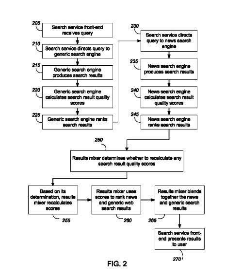
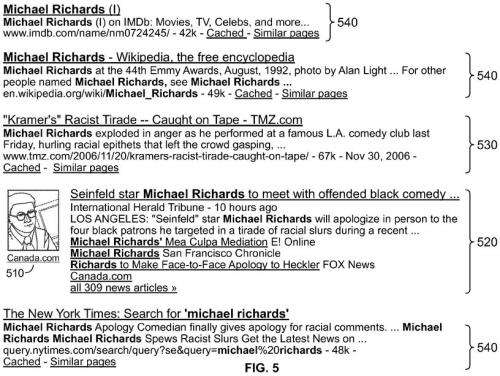
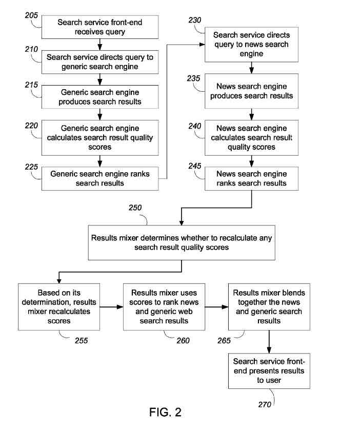

[Tristan Colangelo](https://unsplash.com/@tcrawlers?utm_medium=referral&utm_campaign=photographer-credit&utm_content=creditBadge)

> Sura gave up on her debugging for the moment. ‘The word for all this is ‘mature programming environment.’ Basically, when hardware performance has been pushed to its final limit, and programmers have had several centuries to code, you reach a point where there is far more significant code than can be rationalized. The best you can do is understand the overall layering and know-how to search for the oddball tool that may come in handy ‘take the situation I have here’ She waved at the dependency chart she had been working on. ‘We are low on working fluid for the coffins. Like a million other things, there was none for sale on dear old Canberra. The obvious thing is to move the coffins near the aft hull and cool them by direct radiation. We don’t have the proper equipment to support this so late. I’ve been doing my share of archeology. It seems that five hundred years ago, a similar thing happened after an in-system war at Torma. They hacked together a temperature maintenance package that is precisely what we need.
>
> ‘Almost precisely’

~ Vernor Vinge, [A Deepness in the Sky](https://en.wikipedia.org/wiki/A_Deepness_in_the_Sky)

In a science fiction novel set far in the future, Vernor Vinge writes about how people might engage in software archaeology. I understand wantinge to do that, looking at some patents that hint about how technology is changing as are the processes behind search engines.

In the early days of Google, search results were filled with 10 blue links to pages that scored highly based on information retrieval scores and authority (PageRank) scores in response to a keyword-based query.

Google started adding other results under universal search and adding results to URLs that were responsive to queries, such as dictionary results, when those seemed to be a good response to a query.

Google also started developing vertical search engines that returned results that were based on News sources. Local business entity results, blog results, image search results, video results, and more. Then Google started including some of these vertical results into regular organic results. This was often referred to in SEO circles as vertical creep into Search results. Finally, Google started getting more organized about how those vertical results fit into regular search results, and they started referring to them as universal search results.

The earliest version of the [universal search](https://www.seobythesea.com/2019/01/universal-search-updated-at-google/) patent that I wrote about was granted in 2008.

Google has just been granted a continuation patent for universal search. This post is about how the patents covering universal search at Google have changed. This post is not intended as a lesson on how patents work, but knowing something about how continuation patents work can provide insights into the processes that people at Google are trying to protect when they have updated the universal search patent. This post is also not intended as an analysis of patents but rather a look at how search works and has changed in the last dozen years or so

A company pursues a patent to protect the process described within the patent. It isn’t unusual that the process protected by a patent might change somehow as it is implemented and put into use. What sometimes happens when that occurs is that the company that was originally assigned the initial patent might file another patent. One referred to as a continuation patent, which takes the original granted date of the first version of the patent as the start time for protection under the patent.

The continuation patents are usually very similar to the earlier versions of the patents, with the description sections often being very close to identical. The parts of the patents that change are the claims sections, which prosecute attorneys deciding whether to grant a patent look at and review to see if the patents are new, non-obvious, and useful and should be granted.

So, in looking at updated patents covering a specific process, ideally, it makes sense to look at how the claims have changed over time.

## The Original Universal Search Patent Application

Before the patent was granted, I wrote about it in the post [How Google Universal Search and Blended Results May Work](https://www.seobythesea.com/2008/06/how-google-universal-search-and-blended-results-may-work/) which was about the Universal Search Patent application published in 2008. But, unfortunately, that patent was granted, and the claims from the original filing of the patent were updated from the original application when it was granted in 2011 (Sometimes processes in original applications have to be amended for the patent to be granted, and the claims may change to match those).

## The First Universal Search Patent

In the [2011 granted version of Interleaving Search Results](http://patft.uspto.gov/netacgi/nph-Parser?Sect1=PTO1&Sect2=HITOFF&d=PALL&p=1&u=%2Fnetahtml%2FPTO%2Fsrchnum.htm&r=1&f=G&l=50&s1=8,086,600.PN.&OS=PN/8,086,600&RS=PN/8,086,600), the first six claims to the patent give us a flavor for what the patent covers:

> The invention claimed is:
>
> 1. A computer-implemented method, comprising: receiving a plurality of first search results in a first presentation format, the first search results received from a first search engine, the first search results identified for a search query directed to the first search engine, the first search results having an associated order indicative of respective first quality scores that are used to rank the first search results; receiving one or more second search results in a second presentation format different from the first presentation format, the second search results received from a second search engine, the second search results identified for the search query directed to the second search engine, wherein the first search engine searches a first corpus of first resources, wherein the second search engine searches a second corpus of second resources, and wherein the first search engine and the second search engines are distinct from each other; obtaining a respective first quality score for a plurality of the first search results, the respective first quality score determined in relation to the corpus of first resources and obtaining a respective second quality score for each of the one or more second search results, each respective second quality score determined in relation to the corpus of second resources; and inserting one or more of the second search results into the order including decreasing one or more of the respective first quality scores by reducing a contribution of a scoring feature unique to the first search results and distinct from scoring features of the second search results so that the inserted second search results occur within a number of top-ranked search results in the order.
>
> 2. The method of claim 1, wherein the plurality of first search results comprises an ordered list of search results. The plurality of first search results is several highest-quality search results provided by the first search engine identified as responsive to the search query.
>
> 3. The method of claim 1, further comprising: receiving a third search result, the third search result received from a third search engine, wherein the third search engine searches a corpus of third resources, and wherein the third search engine is distinct from the first search engine and the second search engine, and inserting the third search result into the order.
>
> 4. The method of claim 1, wherein: the first resources are generic web pages and the second resources are video resources.
>
> 5. The method of claim 1, wherein: the first resources are generic web pages and the second resources are news resources.
>
> 6. The method of claim 4, further comprising: receiving a third search result from the second search engine; and inserting the third search result at a position between two otherwise adjacent first search results in the order, the position not being adjacent to the inserted one or more second search results.

## The Second Universal Search Patent

We know that Google introduced Universal Search Results at a [Searchology presentation](https://searchengineland.com/google-searchology-day-recap-of-announcements-11230) in 2007 (a few months before the patent was filed originally). The patent has been updated since then, with a continuation patent titled [Interleaving Search Results granted in 2015](http://patft.uspto.gov/netacgi/nph-Parser?Sect1=PTO1&Sect2=HITOFF&d=PALL&p=1&u=%2Fnetahtml%2FPTO%2Fsrchnum.htm&r=1&f=G&l=50&s1=9,002,817.PN.&OS=PN/9,002,817&RS=PN/9,002,817), which has new claims, which insert the concept of historical click data into those. Here are the first five claims from that version of the patent:

> The invention claimed is:
>
> 1. A computer-implemented method comprising: receiving in a search engine system a query, the query comprising query text submitted by a user; searching a first collection of resources to obtain one or more first search results, wherein each of the one or more first search results has a respective first search result score; searching a second collection of web resources to obtain one or more second search results, wherein each of the one or more second search results has a respective second search result score, wherein the resources of the first collection of resources are different from the resources of the second collection of web resources; determining from historical user click data that resources from the first collection of resources are more likely to be selected by users than resources from other collections of data when presented by the search engine in a response to the query text; generating enhanced first search result scores for the first search results as a consequence of the determining, the enhanced first search result scores being greater than the respective first search result scores for the first search results; generating a presentation order of first search results and second search results in order of the enhanced first search result scores and the second search result scores; generating a presentation of highest-ranked first search results and second search results in the presentation order; and providing the presentation in a response to the query.
>
> 2. The method of claim 1, wherein the historical click data represents resource collections of search results selected by users after submitting the query.
>
> 3. The method of claim 1, wherein determining from historical user click data that resources from the first collection of resources are more likely to be selected by users than resources from other collections of data when presented by the search engine in response to the query text comprises: obtaining one or more user characteristics of the user, and determining that users having the one or more user characteristics are more likely to select resources from the first collection of resources than resources from other collections of data.
>
> 4. The method of claim 1, wherein generating the presentation of highest-ranked first search results and second search results in the presentation order, comprises generating the presentation so that at least one first search result occurs within many highest-ranked second search results.
>
> 5. The method of claim 1, wherein generating the presentation of highest-ranked first search results and second search results in the presentation order comprises: generating each of the second search results in a web search results presentation format; and; generating each of the first search results in a different presentation format

## The Updated Universal Search Patent

The newest version of [Interleaving Search Results](https://patentscope.wipo.int/search/en/detail.jsf?docId=EP235560734) is still a pending patent application at this point, published on January 2, 2019

(EN) Interleaving Search Results
Publication Number: 3422216
Publication Date: February 1, 2019
Applicants: GOOGLE LLC
Inventors: Bailey David R, Effrat Jonathan J, Singhal Amit

Abstract:

(EN) A method comprising receiving a plurality of first search results that satisfy a search query directed to a first search engine, each of the plurality of first search results having a respective first score, receiving a second search result from a second search engine, the second search result having a second score, wherein the search query is not directed to the second search engine, wherein at least one of the first and second scores are based on characteristics of queries or results of queries learned from user click data; and determining from the second score whether to present the second search result and if so, presenting the first search results in an order according to their respective scores, and presenting the second search result at a position relative to the order, the position is determined using the first scores and the second score

> 1. A method comprising:
>
> receiving a plurality of first search results that satisfy a search query directed to a first search engine, each of the plurality of first search results having a respective first score;
>
> receiving a second search result from a second search engine, the second search result having a second score, wherein the search query is not directed to the second search engine;
>  wherein at least one of the first and second scores is based on characteristics of queries or results of queries learned from user click data; and
>
> determining from the second score whether to present the second search result and if so:
>
> presenting the first search results in an order according to their respective scores, and
>
> The second search results at a position relative to the order. The position is determined using the first and second scores.
>
> 2. The method of claim 1, wherein receiving a second search result from a second search engine, comprises:
>
> receiving a plurality of second search results, each second search result having a respective second score, each second search results from a respective second search engine, wherein the search query is not directed to the respective second search engines; and
>
> Determining from the respective second scores whether to present respective ones of the second search results.
>
> 3. The method of claim 1, wherein presenting the second search result at a position relative to the order, comprises inserting the second search result at a position between two otherwise adjacent first search results.
>
> 4. The method of any preceding claim, wherein the first and second search result scores are based on multiple distinct scoring features, the multiple distinct scoring features including at least one unique scoring feature of the first search engine distinct from the scoring features of the second search engine.
>
> 5. The method of any preceding claim, wherein the characteristics of queries or results of queries learned from user click data comprise a relationship between one of the first corpus of first resources and the second corpus of second resources and a particular search query.

## Changes to Universal Search Versions

If you look at them, you will see David Bailey’s name on those patents. In addition, he wrote a guest post at Search Engine land about Universal Search that provides a lot of insight into how it works. The title of the post refers to that: [An Insider’s View Of Google Universal Search](https://searchengineland.com/an-insiders-view-of-google-universal-search-12059) It’s worth reading through his analysis of Universal search carefully before trying to compare the claims from one version of the patent to another.

The second version of the claims refers to historical click data, and the newest version changes that to “user click data” but doesn’t provide any insights into why that change in the claims was made. We’ve heard spokespeople from Google tell us that they don’t utilize user click data to rank content, which gets a little confusing if they are taken at their word.

Another difference in the latest claims is that it refers to multiple distinct scoring features. Each type of search blended into results has some unique scoring feature that sets it apart from the results inserted onto the search results page from a search engine before it. We know that different search types are ranked based on different signals, such as freshness being important for news results and links often for Web results. So results shown in universal search may all be relevant for a query searched for but have some element that considers some unique features that add diversity to what we see in SERPs.

This diversity in universal search results, returning results based on different algorithms and different ranking methods, provides a richness to results that we otherwise wouldn’t get without the universal search.
