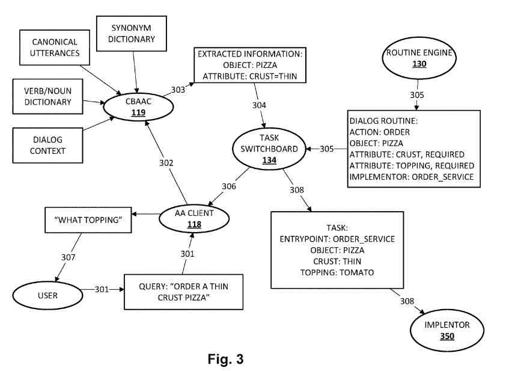

## A History of User Programmable Automated Assistant Patents

Google was granted a patent this week specifically about user-programmable automated assistants. It’s one of a number of patents about how Google is building that functionality into devices it is creating. There are a few more that have recently been granted which I haven’t written about yet.

I have written a few posts about some others, and it makes sense to share a number of those as I start this post, so that you can take a look at those if you would like.

November 27, 2019 – [Google Automated Assistant Search Results](https://gofishdigital.com/blog/automated-assistant-search-results/)
December 19, 2019 – [The Google Assistant and Context-Based Natural Language Processing](https://gofishdigital.com/blog/context-based-natural-language-processing/)
March 2, 2020 – [How an Automated Assistant May Respond to Queries from Children](https://gofishdigital.com/blog/automated-assistant-may-respond-to-children/)
May 5, 2021 – [Natural Language Query Responses](https://www.seobythesea.com/2021/05/natural-language-query-responses/)
December 17, 2021 – [Google Mum Update](https://gofishdigital.com/blog/google-mum-update/)
January 26, 2022 – [Human to Computer Dialog at Google](https://www.seobythesea.com/2022/01/human-to-computer-dialog-at-google/)
February 2, 2022 – [Unsolicited Content in Human to Computer Dialog](https://www.seobythesea.com/2022/02/unsolicited-content/)

Most of these patents from “human-to-computer dialogs” when talking about natural language processing and programs are referred to as “automated assistants.”

They also call them a number of other names such as:

- “Chatbots”
- “Interactive personal assistants”
- “Intelligent personal assistants”
- “Personal voice assistants”
- “Conversational agents”
- Etc.

This new patent tells us that humans may provide commands, queries, and requests (“queries”) while using free form natural language which includes vocal utterances converted into text and then processed and typed free form natural language input.

Automated assistants perform a variety of tasks, while they respond to a number of predetermined canonical commands (which the tasks are mapped to) These tasks include:

- Ordering items (e.g., food, products, services, etc.)
- Playing media (e.g., music, videos)
- Modifying a shopping list
- Performing home control (e.g., control a thermostat, control lights, etc.)
- Answering questions
- Booking tickets
- So forth

This reminds me of what I wrote about the first Siri patent and how it was going to be an intelligent assistant, in the post from January 19, 2018 – [Apple’s Siri Patent Application](https://www.seobythesea.com/2012/01/apples-siri-patent-application/). It could be really helpful to have an assistant that could help do all of those things.

## Natural Language Processing and A User-Programmable Automated Assistant

Like most patents, this one starts by identifying a problem that it tries to solve. It sets out this problem in this way:

> While natural language analysis and semantic processing enable users to issue slight variations of the canonical commands, these variations may only stray so far before natural language analysis and semantic processing are unable to determine which task to perform.

It adds some additional points:

1. **Task-oriented dialog management** – in spite of many advances in natural language and semantic analysis, remains relatively rigid
2. **Canonical Commands** – Users often are unaware of or forget canonical commands, and may be unable to invoke automated assistants to perform many tasks of which they are capable
3. **Adding new tasks** – requires third-party developers to add new canonical commands, and it typically takes time and resources for automated assistants to learn acceptable variations of those canonical commands

## Solving Problems Using Dialogs with A User-Programmable Automated Assistant

Okay. it sounds like the patent inventors have been watching buddy movies, with robot sidekicks, but this could work.

This patent tells us about techniques for allowing users to employ voice-based human-to-computer dialog to program automated assistants with customized routines, or “dialog routines,” that can later be invoked to accomplish a task.

Automated assistants can learn new dialog routines by providing free-form natural language input that includes a command to perform a task.

If automated assistants are unable to interpret the command, they may solicit clarification from the user about the command.

Automated assistants may prompt users to identify slots required to be filled with values in order to fulfill the task.

The user may identify the slots proactively, without prompting from the automated assistant.

The user may provide, at the request of the automated assistant or proactively, an enumerated list of possible values to fill the slots.

The automated assistant may then store a dialog routine that includes a mapping between the command and the task, and which accepts, as input, values to fill the slots.

The user may later invoke the dialog routine using free-form natural language input that includes the command or some syntactic/semantic variation thereof.

The automated assistant may take various actions once the dialog routine is invoked and slots of the dialog routine are filled by the user with values.

The automated assistant may transmit data indicative of at least the user-provided slots, the slots themselves, and data indicative of the command/task, to a remote computing system.

Transmission may cause the remote computing system to output natural language output or other data indicative of the values/slots/command/task, to another person.

This natural language output may be provided to the other person in various ways, which may not require the other person to install or configure its own third-party software agent to handle the request such as via an email, text message, or automated phone call. That other person may then fulfill the task.

## Examples of User-Programmable Automated Assistant Tasks Envisioned by the Patent

**User: “I want a pizza” AA: “I don’t know how to order a pizza” User: “to order a pizza, you need to know the type of crust and a list of toppings” AA: “what are the possible pizza crust types?” User: “thin crust or thick crust” AA: “what are the possible toppings?” User: “here are the possible values” AA: “okay, ready to order a pizza?” User: “yes, get me a thin crust pizza with a tomato topping”**

The command in this scenario is “I want a pizza,” and the task is ordering a pizza. The user-defined slots required include a type of crust and a list of toppings.

The task of ordering the pizza may be accomplished by providing natural language output, e.g., via an email, text message, automated phone call, etc., to a pizza store (which the user may specify or which may be selected automatically, based on distance, ratings, price, known user preferences.

An employee of the pizza store may receive, via the output of computers, such as a computer terminal in the store, the employee’s phone, a speaker in the store, the natural language output, which may say something like “(I) would like to order a (crust_style) pizza with (topping 1, topping 2, . . . ).”

The pizza shop employee may confirm the user’s request, such as by pressing “1” or by saying “OK,” “I accept,” etc.

Once that confirmation is received, the requesting user’s automated assistant may provide confirmatory output, such as “your pizza is on the way.”

The natural language output provided at the pizza store may also convey other information, such as payment information, the user’s address.

This other information may be taken from the requesting user while creating the dialog routine or determined automatically, such as being based on the user’s profile.

The patent tells us that at some point a software agent may interact with an automated assistant to take and receive orders. Is this the future of services such as Doordash?

## Advantages of this Automated Assistant Approach

Many patents include a section where they identify the advantages of using the process described in the patent to solve the problems that they solve, and this one is no different.

1. **Task-based dialog management** uses canonical commands created and mapped to predefined tasks manually. This requires third-party developers to create these mappings and inform users of them. It also requires users to learn the canonical commands and remember them for later use. Users with limited abilities to provide input to accomplish tasks, such as users with physical disabilities and users that are engaged in other tasks (such as driving), may have trouble causing automated assistants to perform tasks.
2. **When users invoke a task with an uninterpretable command**, more computing resources are required to disambiguate the user’s request or otherwise seek clarification. By letting users to create their own dialog routines that are invoked using custom commands, the users are more likely to remember the commands and be able to successfully and more quickly accomplish tasks via automated assistants. This could preserve computing resources that might be needed for disambiguation or clarification.
3. **User-created dialog routines** may be shared with other users, enabling automated assistants to be more responsive to “long tail” commands from individual users that might be used by others.

This User-Programmable Automated Assistant Patent is at:

[User-programmable automated assistant](https://patft.uspto.gov/netacgi/nph-Parser?Sect1=PTO1&Sect2=HITOFF&d=PALL&p=1&u=%2Fnetahtml%2FPTO%2Fsrchnum.htm&r=1&f=G&l=50&s1=11,238,862.PN.&OS=PN/11,238,862&RS=PN/11,238,862)
Inventors: Mihai Danila and Albry Smither
Assignee: Google LLC
US Patent: 1,238,862
Granted: February 1, 2022
Filed: August 23, 2019

Abstract

> Techniques described herein relate to allowing users to employ voice-based human-to-computer dialog to program automated assistants with customized routines, or “dialog routines,” that can later be invoked to accomplish tasks.
>
> In various implementations, a first free form natural language input–that identifies a command to be mapped to a task and slots required to be filled with values to fulfill the task–may be received from a user.
>
> A dialog routine may be stored that includes a mapping between the command and the task, and which accepts, as input, values to fill the slots.
>
> Subsequent free form natural language input may be received from the user to
>
> (i) invoke the dialog routine based on the mapping, and
>
> (ii) to identify values to fill the slots. Data indicative of at least the values may be transmitted to a remote computer for the fulfillment of the task.

## User-Programmable Automated Assistant in Action

I did find myself curious about how and if Google was experimenting with this process, so I searched and found a Verge article: [Google Assistant can now help order takeout from restaurants online](https://www.theverge.com/2021/4/14/22382754/google-duplex-web-assistant-online-food-orders-android). As the article tells us:

> To use the new feature, you have to search for whatever restaurant you’d like to order from in the Google app, then select the “Order Online” button on the restaurant’s information card. After making your food selections, you can tag in Google Assistant to complete the order using your stored contact and payment information from Google Pay and Chrome Autofill. Assistant then confirms you’re ready to pay, and the order is placed.

The article describes the Automated Assistant using Google Duplex to make realistic sounding calls to businesses.

When I think of Google offering the use of Goog411 as a free phone-based business directory for years so that they could collect voice information in exchange, this use of the Automated Assistant to place part or all of a food order fits into what Google has done for free for years. Google is working on issues surrounding a user-programmable automated assistant filling orders for people.

This is outside of search directly, but it is tied to doing online searches for food, and having an automated assistant complete an order.

There are many other recent patents about Automated Assistants, and I will likely be writing about them too. It is interesting seeing how Google is developing the use of automated assistants even now. I suspect that there will be a lot more to come.
