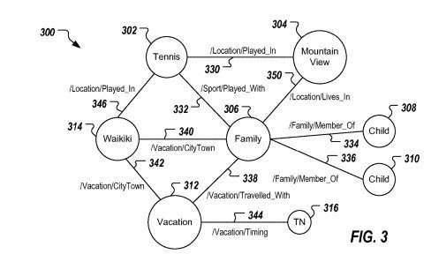

A recently granted patent from Google covers supporting querying and predictions.

It does this by focusing on user-specific knowledge graphs.

Those User Specific Knowledge Graphs can be specific to particular users.

Google can use those graphs to respond to one or more queries submitted by the user and/or to show data relevant to the user.

I thought of another patent I wrote about when I saw this patent in the post [Answering Questions Using Knowledge Graphs](https://gofishdigital.com/answering-questions-using-knowledge-graphs/). In that one, Google may search on a question someone asks by building a knowledge graph from search results to find the answer to their question.

*So Google doesn’t just have one knowledge graph but may use many knowledge graphs.*

New ones for questions that may be asked or for different people asking those questions.

This User-Specific Knowledge Graph patent tells us that innovative aspects of the process behind it include:

1. Receiving user-specific content
2. The user-specific content can be associated with a user computer services
3. User-specific content is processed with one or more parsers to identify one or more entities relationships between those entities
4. A parser being specific to a schema, and the one or more entities and relationships between entities being identified based on the schema
5. This processes provides user-specific knowledge graphs
6. A user-specific knowledge graph being specific to the user, which includes nodes and edges between nodes to define relationships between entities based on the schema
7. The process includes storing user-specific knowledge graphs

Optional Features involving providing user-specific knowledge graphs may also include:

- Determining that a node representing an entity or entities and an edge representing a relationship associated with the entity are absent from a user-specific knowledge graph
- Adding the node and the edge to the user-specific knowledge graph
- The edge connecting the node to another node of the user-specific knowledge graph

*(That Universal Knowledge Graph sounds interesting.)*

Information from sources like the following may be used to create User-Specific Knowledge Graphs:

- A user’s social network
- Social actions or activities
- Profession
- A user’s preferences
- A user’s current location

This is so that content that could be more relevant to the user is used in those knowledge graphs.

We are also told that “a user’s identity may be treated so that no personally identifiable information can be determined for the user” and that “a user’s geographic location may be generalized so that a particular location of a user cannot be determined.”

## The User-specific Knowledge Graph Patent

This patent can be found at:

[Structured user graph to support querying and predictions](http://patft.uspto.gov/netacgi/nph-Parser?Sect1=PTO1&Sect2=HITOFF&d=PALL&p=1&u=%2Fnetahtml%2FPTO%2Fsrchnum.htm&r=1&f=G&l=50&s1=10,482,139.PN.&OS=PN/10,482,139&RS=PN/10,482,139)
Inventors: Pranav Khaitan and Shobha Diwakar
Assignee: Google LLC
US Patent: 10,482,139
Granted: November 19, 2019
Filed: November 5, 2013

Abstract

> Methods, systems, and apparatus, including computer programs encoded on a computer storage medium, for receiving user-specific content, the user-specific content being associated with a user of one or more computer-implemented services, processing the user-specific content using one or more parsers to identify one or more entities and one or more relationships between entities, a parser being specific to a schema, and the one or more entities and the one or more relationships between entities being identified based on the schema, providing one or more user-specific knowledge graphs, a user-specific knowledge graph being specific to the user and including nodes and edges between nodes to define relationships between entities based on the schema, and storing the one or more user-specific knowledge graphs.

## What Content is in User-Specific Knowledge Graphs?

Types of services that user-specific knowledge graph information is from can include:

- A search service
- An electronic mail service
- A chat service
- A document sharing service
- A calendar sharing service
- A photo sharing service
- A video sharing service
- Blogging service
- A micro-blogging service
- A social networking service
- A location (location-aware) service
- A check-in service
- A ratings and review service

## A User-Specific Knowledge Graph System

This patent describes a search system that includes a user-specific knowledge graph system as part of that searching system, either directly connected to or connected to the search system over a network.

The search system may interact with the user-specific knowledge graph system to create a user-specific knowledge graph.

That user-specific knowledge graph system may provide one or more user-specific knowledge graphs stored in a data store.

Each user-specific knowledge graph is specific to a user of one or more computer-implemented services, e.g., search services provided by the search system.

The search system may interact with the user-specific knowledge graph system to provide one or more user-specific search results in response to a search query.

## Structured User Graphs For Querying and Predictions

A user-specific knowledge graph is created based on content associated with the user.

These user-specific knowledge graphs include several nodes and edges between nodes.

A node represents an entity, and an edge represents a relationship between entities.

Nodes and/or entities of a user-specific knowledge graph can be provided based on the content associated with a respective user. Therefore, the user-specific knowledge graph is specific.

## User-Specific Knowledge Graphs and Schemas

The user-specific knowledge graphs can be created based on one or more schemas (examples follow). A schema describes how data is structured in the user-specific knowledge graph.

A schema defines a structure for information provided in the graph.

A schema structures data based on domains, types, and properties.

A domain includes one or more types that share a namespace.

A namespace is provided as a directory of uniquely named objects, where each object in the namespace has a unique name or identifier.

For example, a type denotes an “is a” relationship about a topic and is used to collect properties.

A topic can represent an entity, such as a person, place, or thing.

Each of these topics can have one or more types associated with them.

A property can be associated with a topic and defines a “has a” relationship between the topic and the value.

In some examples, the value of the property can include another topic.

A user-specific knowledge graph can be created based on content associated with a respective user.

One or more parsers may process that content to populate the user-specific structured graph.

A parser may be specific to a particular schema.

## Confidence or Weights in Connections

Weights that are assigned between nodes indicate a relative strength in the relationship between nodes.

The weights can be determined based on the content associated with the user, which underlies the user-specific knowledge graph.

That content can provide a single instance of a relationship between nodes or multiple instances of a relationship between nodes.

So, there can be a minimum value and a maximum value.

Weights can also be dynamic:

- Varying over time based on content associated with the user
- Based on content associated with the user at a first time
- Based on content or a lack of content associated with the user at a second time
- The content at the first time can indicate a relationship between nodes
- Weights can decay over time

## Multiple User Specific Knowledge Graphs

More than one user-specific knowledge graph can be provided for a particular user.

Each user-specific knowledge graph may be specific to a particular schema.

Generally, a user-specific knowledge graph includes knowledge about a specific user in a structured manner. (It represents a portion of the user’s world through content associated with the user through one or more services.)

Knowledge captured in the user-specific knowledge graph can include things such as:

- Activities
- Films
- Food
- Social connections, e.g., real-world and/or virtual
- Education
- General likes
- General dislikes

## User-Specific Knowledge Graph Versus User-Specific Social Graph

–

A social graph contains information about people to whom someone might be connected. A user-specific Knowledge graph also overs knowledge about those connections, such as shared activities between people who might be connected in a knowledge graph.

## Examples of Queries and User-Specific Knowledge Graphs

These are examples from the patent. Note that searches, emails, social network posts may all work together to build a user-specific Knowledge Graph as seen in the combined messages/actions below, taken together, which may cause the weights on edges between nodes to become stronger, and nodes and edges to be added to that knowledge graph.

**Example search query: [playing tennis with my kids in mountain view] to a search service**

Search results: which may provide information about playing tennis with kids in Mountain View, Calif.

Nodes can be provided, with one representing the entity “Tennis,” one representing “Mountain View,” one representing “Family,” and a couple more each representing “Child.”

An edge can be provided that represents a “/Location/Play_In” relationship between the nodes, another edge may represent a “/Sport/Played_With” relationship between the nodes, and other edges may represent “/Family/Member_Of” relationships between the node and the nodes.

Weights may be generated for each of the edges to represent different values as well.

**A Person may post the example post “We had a great time playing tennis with our kids today!” in a social networking service associated with geo-location data indicating Mountain View, Calif.**

Nodes may be identified representing tennis, Mountain View, family and children, and edges between those nodes.

Weights may be generated between those edges.

**Someone may receive an electronic message from a hotel, which says, “Confirming your hotel reservation in Waikiki, Hi. from Oct. 15, 2014, through Oct. 20, 2014. We’re looking forward to making your family’s vacation enjoyable!”**

Nodes can be added to the user-specific Knowledge graph, where those nodes represent the entities “Vacation” and “Waikiki.”

Edges can be created in the user-specific knowledge graph in response to that email that represents a “/Vacation/Travelled_With” relationship between the nodes, one that represents a “/Vacation/CityTown” relationship between the nodes, and another edge that represents a “/Vacation/CityTown” relationship between the nodes.

Timing nodes may also be associated with the other nodes, such as a timing node representing October 2014 or a node representing a date range of Oct. 15, 2014, through Oct. 20, 2014.

**The user can submit the example search query [kids tennis lessons in waikiki] to a search service.**

Nodes may be created in the user-specific knowledge graph representing tennis, Waikiki, family, and children and respective edges between at least some of the nodes.

That example search query may reinforce the relevance of the various entities and the relationships between the entities to the particular user.

That reinforcement may cause the respective weights associated with the edges to be increased.

**The user can receive an email from a tennis club, which can include “Confirming tennis lessons at The Club of Tennis, Waikiki, Hi.”**

Nodes represent tennis and Waikiki and the edges between them.

That email reinforces the relevance of the entities and the relationships between the entities to the particular user.

The weights between the entities could be increased, and a node could be added to represent the entity “The Club of Tennis,” which could then be connected to one or more other nodes.

## User-Specific Knowledge Graphs Takeaways

This reminds me of personalized search but tells us that it is looking at more than just our search history – It includes data from sources such as emails that we might send or receive or posts that we might make to social networks. This knowledge graph may contain information about the social connections we have, but it also contains knowledge information about those connections. The patent tells us that personally identifiable information (including location information) will be protected, as well.

And it tells us that User-specific knowledge graph information could be joined together to build a universal knowledge graph, which means that Google is building knowledge graphs to answer specific questions and for specific users that could potentially be joined together, to enable them to avoid the limitations of a knowledge graph based upon human-edited sources like Wikipedia.

Added 11/26/2019: A recent whitepaper from Google covers much of the same territory as this patent, even though this patent was filed originally back in 2013. It’s worth reading that white paper when you read about this patent because they are similar in many ways. The paper is [Personal Knowledge Graphs: A Research Agenda](https://krisztianbalog.com/files/ictir2019-pkg.pdf) by Krisztian Balog and Tom Kenter.

Added 09/27/21 – I came across a patent that describes how mobile devices such as phones may create user-specific knowledge graphs to use to rewrite queries on those devices, to better use data from those devices. I wrote about that in the post [Rewritten Queries and User-Specific Knowledge Graphs](https://www.seobythesea.com/2021/09/rewritten-queries-and-user-specific-knowledge-graphs/)

Last updated 09/27/2021
