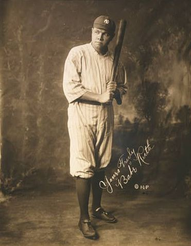
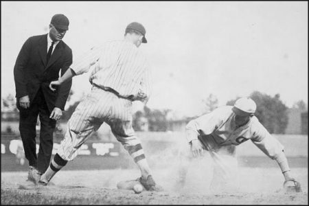
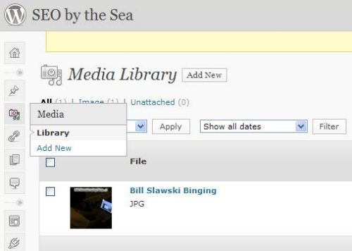
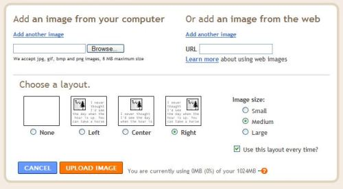
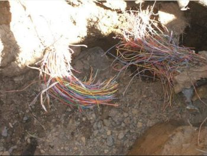
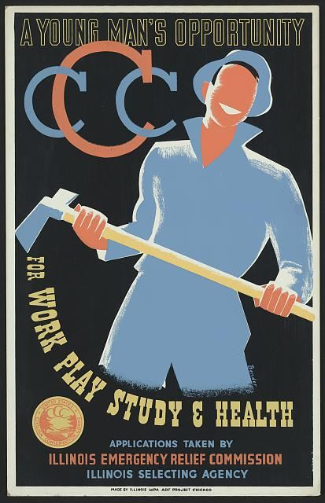
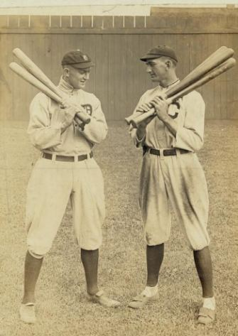

## Blog Images Make Posts More Readable

I often write blog posts with large walls of text, rarely adding images to the words that I post to these pages, and I think that’s a mistake. A meaningful image can draw the eye, capture the imagination, and often explain more in a single glance than hours of reading and reflection; there is value to good blog images.

Imagine if Babe Ruth kept a blog during his days of home runs and hotdogs, shattering hitting records and showing a larger than life personality. Babe Ruth was one of the greatest pitchers of his time, and then one of the greatest hitters, and when someone excels at a sport, they’re often referred to as “the Babe Ruth of __________.”

Baseball can be broken down into moments of drama, to individual confrontations, such as a pitcher and batter facing off against each other. The pitcher striving to push or sneak or cajole a ball past the hitter, and the batter attempting to impose his will with the bat on the ball. Ruth was an incredible talent, and a single look at his eyes can give you a sense of how he intimidated the strikeout artists of his era. Blogging about Ruth deserves blog images that capture his expressions

If Babe Ruth had a blog, you’d want to see pictures. Images of the stadiums he conquered, the outfield bleachers with fans chasing down his home runs, the players who shared his exploits, and the players who were victims of his hits.

I often write about patents, and sometimes those are accompanied by images that help explain and define what’s described in those documents. Those images often look somewhat mechanical, like this:

Rather than capturing more drama like this play at second base:

Choosing blog images for posts can be challenging, and it can sometimes be easier to have an image in mind as you’re writing, than trying to add one as an afterthought. You don’t have to include pictures in your posts, but the effort can be worth the time.

## Adding Blog Images to Posts

Most blogging software includes a way to upload images to your post from your computer. WordPress has a media library that you can use to add images to your posts:

I usually like to use an FTP program to upload images to my server, and then link directly to those images from my posts, but the media library is fairly easy to use in WordPress.

Blogger has a button that you can press to add an image to a blog post that leads to this screen:

## The Dangers of Hotlinking

Note that Blogger gives you the option of “Adding an image from the Web.” I’d like to add a word of caution about doing that.

If you link to a picture on another site, that practice is known as Hotlinking.

The image usually will show up in your post, but it could disappear if the server that hosts it goes down for one reason or another.

Or the owner of the picture might not be happy that you’re using the picture and using their server’s bandwidth by linking directly to the picture, and they may either remove the picture from their server or give it a new name so that it no longer appears on your page.

They may even replace the image with another one, possibly with a new image that might be embarrassing for one reason or another. I’m not going to show an example of one of those :)

Besides, and just as important, chances are that many of the pictures you see on the web are protected by copyright, and should only be used with permission or by license. If you don’t want a potential legal battle on your hands, you should be careful about using images that you find on the Web.

## Public Domain and Creative Commons

If you have a camera, or if you’re good at drawing, you may want to use your images with your blog posts. I’m not a great photographer, but I do take a good picture every so often.

Chances are that you can also find images to use that are in the public domain. Public domain images are pictures that aren’t protected by copyright for one reason or another. One reason is that the copyright of those images may have expired.

There are [public domain galleries](https://en.wikipedia.org/wiki/Wikipedia:Public_domain_image_resources) on the Web where you can download images, and then use them on your website. If you have an old book that’s out of copyright, and it contains illustrations, you can scan those and use them on your site.

Another reason why an image might be in the public domain is that the picture was created by a government worker during the normal course of work for the government. Not all images on government websites are in the public domain because the government might have paid for the use of some of those images, but if a picture was created by a government employee and used for government purposes, then there’s a good chance that it is in the public domain.

A good example is the posters that were created under the Work Projects Administration by people working for the US Government. Those can be found at the US Library of Congress [Prints & Photographs Online Catalog](http://www.loc.gov/pictures/)

Many people have published images on the Web under a Creative Commons license which you may be able to use on your web pages, depending upon how you are using them, and if you provide credit and possibly a link back to the creator of the image. I’ve used creative commons images in presentations that I’ve given as well.

There are millions of pictures at [Flickr](http://www.flickr.com/creativecommons/) that have been published under a Creative Commons License. Note that there are many different Creative Common’s licenses. Read the license attached to any images that you might want to use first before you use it. Some allow for commercial use of images, while others only allow non-commercial uses of their images. Some allow you to create new images based upon the original image, while others don’t. Most require that the person who created the image be given credit (or attribution) for the image.

**In Closing**

Engaging and meaningful blog images can enhance your posts, and turn good posts into great ones. I’m going to be trying to use more images in my blog posts, to help break down some of the walls of text that I usually post.

Shoeless Joe Jackson and Ty Cobb understood the meaning of having more than one bat at hand to get hits.

Adding blog images to your posts may not turn you into the “Babe Ruth of Blogging”, but they might help you attract more readers.
