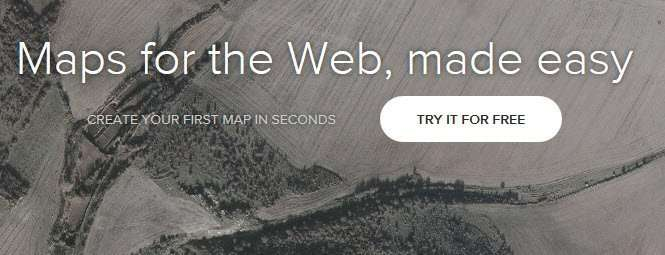
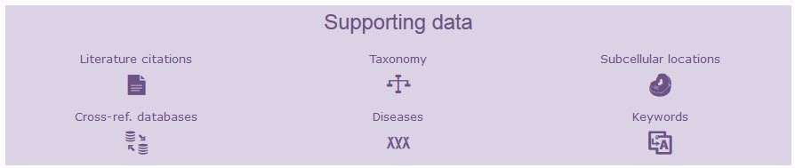
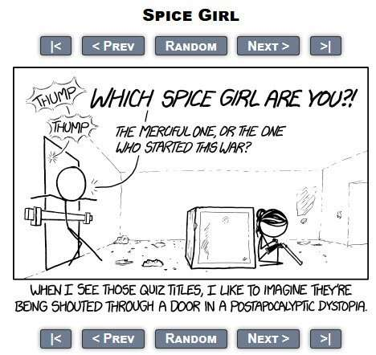
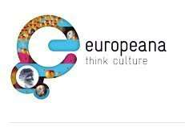

Below is a creative commons Image from Flickr. In the Caption to the photo is the kind of attribution that a Creative Commons Attribution License calls for when using an image like this from Flickr:

_[Don McCullough](https://www.flickr.com/photos/69214385@N04/) [Some Rights Reserved](https://creativecommons.org/licenses/by/2.0/) [Sunset and silhouette](https://www.flickr.com/photos/69214385@N04/7469641132/in/photolist-co4S55-oNyX5A-b6wkkP-qgRCgS-qPLPM7-pkuBtH-fvRpHL-a8coaB-pT1rUJ-ekD322-oJtZMr-bmDibm-dKrq6B-e7FTNi-kR9oZt-B3TY2-ci8XH-nCa6Z7-aXZVd-ekj7C4-d74jF5-o638km-cd6XyC-o1rhA-e8X5k-H7epv-9qgjB2-9B5TMq-bRZ5Lc-cdv8eh-g4zyk-Nt89M-o7y22h-a5cyoe-vdG93-fQo2ZP-prBiiP-7HPud-4hoPVQ-a8QWpw-e9X3r-r2ok9k-nzX7sg-a723LZ-pjTpuF-9a4hWJ-kwUZd-9KeCSN-kz7K1H-nuGnAs)_

When you choose to use a photo or data available under a Creative Commons’ License, you’re giving other people information about their rights to use your copyrighted materials. This means that you should understand [what the different licenses mean](https://creativecommons.org/licenses/)

Notice that the information on these sites provides Open Data available through licenses that allow people to create something new or useful

## Important Terms

**Attribution** – This means to publicly give credit to the person or people who created a work, to identify them, and to identify the work itself.

**Share-Alike** – Requires that copies or adaptions of a work be released under the same licensing terms as the original

**Derivatives** – A work-based originally upon a different source, and is potentially imitative of that original source.

**Noncommercial** – A licensing requirement defining whether or not content being licensed can be used in a commercial or non-commercial manner.

## Creative Commons License Types

Creative Commons is not a replacement for [Copyright](https://www.copyright.gov/), but rather defines a number of licensing agreements under which a copyrighted work can be released to the world. Someone who might use the material covered under one of these licenses isn’t required to actually sign a release stating that they will abide by the terms of the license, but for them to use the copyrighted materials released under one of these licenses, they should follow its terms as described in the license.

Here are the licenses available on the Creative Commons site and some examples of where they are used.

## **Human-Readable Summary of License:**[Attribution](https://creativecommons.org/licenses/by/4.0/)

CC BY
Example:CartoDB – Enables easy creation of Web-based maps.

_From the home page of Carto DB_

**License Terms:** “You let others copy, distribute, display, and perform your copyrighted work – and derivative works based upon it – but only if they give you credit.”

## **Human-Readable Summary of License:**[Attribution-ShareAlike](https://creativecommons.org/licenses/by-sa/4.0/)

CC BY-SA
Example:Freedom Defined – Helps in the creation of buttons and Logos for to identify free cultural works and licenses

[Free Cultural Works Logo](https://www.seobythesea.com/wp-content/definition-of-free-cultural-works.jpg)**License Terms:** “You allow others to distribute derivative works only under a license identical to the license that governs your work.”

## **Human-Readable Summary of License:**[Attribution-NoDerivs](https://creativecommons.org/licenses/by/4.0/)

CC BY-ND
Example:[UniProt](https://www.uniprot.org/) – Aimed at being a “comprehensive, high-quality and freely accessible resource of protein sequence and functional information.”

_[Uniprot](https://www.uniprot.org/)_

**License Terms:** “You let others copy, distribute, display, and perform only verbatim copies of your work, not derivative works based upon it”

## **Human-Readable Summary of License:**[Attribution-NonCommercial](https://creativecommons.org/licenses/by-nc/4.0/)

CC BY-NC
Example:[xkcd.com](https://xkcd.com/) – Comics focusing on Technology freely sharable on the Web.

_[xkcd](https://xkcd.com/)_

**License Terms:** “You let others copy, distribute, display, and perform your work – and derivative works based upon it – but for noncommercial purposes only”

## **Human-Readable Summary of License:**[Attribution-NonCommercial-ShareAlike](https://creativecommons.org/licenses/by-nc-sa/4.0/)

CC BY-NC-SA
Example:[MITOpenCourseware](https://ocw.mit.edu/terms/) – Information about courses offered at MIT.

_[MIT Open Courseware](https://ocw.mit.edu/terms/)_

**License Terms:** “This license lets others remix, tweak, and build upon your work non-commercially, as long as they credit you and license their new creations under the identical terms.”

## **Human-Readable Summary of License:**[Attribution-NonCommercial-NoDerivs](https://creativecommons.org/licenses/by-nc-nd/4.0/)

CC BY-NC-ND
Example:Into the Fire – A film free to share and present in non-commercial settings.

_Into the Fire_

**License Terms:** “This license is the most restrictive of our six main licenses, only allowing others to download your works and share them with others as long as they credit you, but they can’t change them in any way or use them commercially.”

## **Human-Readable Summary of License:**[Public Domain Dedication (CC0)](https://creativecommons.org/publicdomain/zero/1.0/)

Example:[Europeanaz](https://www.europeana.eu/en) – Featuring photos, places, and items from Europe.

_[Europeana](https://www.europeana.eu/en)_

**License Terms:** “You, the copyright holder, waive your interest in your work and place the work as completely as possible in the public domain so others may freely exploit and use the work without restriction under copyright or database law.”

## Creative Commons Examples

Creative Commons images can be searched for at [Flickr](https://www.flickr.com/creativecommons/), [Wikimedia Commons](https://commons.wikimedia.org/wiki/Main_Page).

If you would like to contribute an image to the Wikimedia Commons project, you can do so [here](https://commons.wikimedia.org/wiki/Commons:Welcome)

## How to Attribute Creative Commons Photos:

1. Find an image you’d like to use from a source like Flickr, like the image at the top of this post.

2. Copy important information about the image for use in your attribution; name of image, name of image rights holder, link to image, link to License, link to type of license used (note that I included all of that information in the caption for the image).
