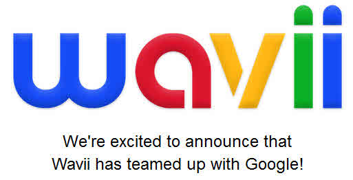
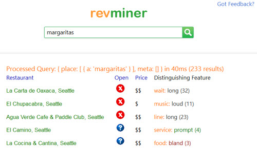

Google acquired the company [Wavii](https://techcrunch.com/2013/04/23/google-buys-wavii-for-north-of-30-million/) for a little more than $ 30 Million in April. There was some speculation that Wavii was an effort to match Yahoo’s purchase of Summly, which summarizes news from the Web.

A Wavii app did do just that – [acquired and summarized news](https://bits.blogs.nytimes.com/2012/04/13/wavii-a-facebook-for-topics/?_php=true&_type=blogs&_r=1) from the Web. When Wavii [emerged from stealth mode](https://www.geekwire.com/2012/wavii-finally-emerges-stealth-mode-specialized-news-aggregator/), it was touted as a personalized news aggregator based upon topics rather than keywords. The app closed down with Google’s acquisition of the company, and instead of providing news aggregation services, it appears that the technology will help fuel Google Now, Google’s Knowledge Base, and Google Glass, according to the TechCrunch article linked above.

So what is that technology?

Oren Etzioni hinted at Wavii being so much more in an article he originally published at Nature in 2011 in *Nature* when he wrote about the limitations (pdf) of Google, Bing, and Wolphram Alpha, and the future of search. What does the future of search mean? This video provides a short introduction:

I love the comparisons to Google and Google’s knowledge graph, in the video and the statement:

> Our goal is to build the next generation of search engines.

I checked to see which patents Wavii held at the time of the Google acquisition, and it appears that one describing Open Information Extraction on the Web (pdf) was assigned to Wavii

The granted patent, and a follow up patent application are:

[Open information extraction from the Web](http://patft.uspto.gov/netacgi/nph-Parser?Sect1=PTO1&Sect2=HITOFF&d=PALL&p=1&u=%2Fnetahtml%2FPTO%2Fsrchnum.htm&r=1&f=G&l=50&s1=7877343.PN.&OS=PN/7877343&RS=PN/7877343) (granted original version)
[Open information extraction from the Web](http://appft.uspto.gov/netacgi/nph-Parser?Sect1=PTO1&Sect2=HITOFF&d=PG01&p=1&u=%2Fnetahtml%2FPTO%2Fsrchnum.html&r=1&f=G&l=50&s1=%2220110191276%22.PGNR.&OS=DN/20110191276&RS=DN/20110191276) (follow up continuation patent application, with new claims section)

Invented by Michael J. Cafarella, Michele Banko, and Oren Etzioni
Assigned to: University of Washington through its Center for Commercialization
United States Patent 7,877,343
Granted January 25, 2011

Abstract

> To implement open information extraction, a new extraction paradigm has been developed in which a system makes a single data-driven pass over a corpus of text, extracting a large set of relational tuples without requiring any human input. Using training data, a Self-Supervised Learner employs a parser and heuristics to determine criteria that will be used by an extraction classifier (or another ranking model) for evaluating the trustworthiness of candidate tuples that have been extracted from the corpus of text, by applying heuristics to the corpus of text.
>
> The classifier retains tuples with a sufficiently high probability of being trustworthy. A redundancy-based assessor assigns a probability to each retained tuple to indicate a likelihood that the retained tuple is an actual instance of a relationship between a plurality of objects comprising the retained tuple. The retained tuples comprise an extraction graph that can be queried for information.

Rather than breaking down the patent filings in detail, I’m going to leave you to the following resources to get more depth on how this Open Information Extraction system might work.

First is the video: [Open Information Extraction at Web Scale](http://videolectures.net/ijcai2011_etzioni_webscale/)
(It’s a long one, but definitely worth watching)

These papers and pages also provide more details:

- [Open Information Extraction](https://openie.allenai.org/)
- [Open Information Extraction: the Second Generation](http://turing.cs.washington.edu/papers/etzioni-ijcai2011.pdf) (pdf) by Oren Etzioni, Anthony Fader, Janara Christensen, Stephen Soderland, and Mausam Ollie
- [Open Information Extraction Software](http://knowitall.github.io/ollie/)
- [Open Language Learning for Information Extraction](https://homes.cs.washington.edu/~mausam/papers/emnlp12a.pdf) (pdf), by Mausam, Michael Schmitz, Robert Bart, Stephen Soderland, and Oren Etzioni

**Take Aways**

Wavii isn’t bringing a news aggregator app to Google like the one they were offering before the acquisition. Instead, the Open Information Extraction approach that they are bringing to the search engine is aimed at reading through text on the Web, without predefined templates or supervision.

The extraction approach identifies nouns and how they might be related to each other by the verbs that create a relationship between them, and rates the quality of those relationships. A “classifier” determines how trustworthy each relationship might be, and retains only the trustworthy relationships.

These terms within these relationships (each considered a “tuple”) are stored in an inverted index that can be used to respond to queries. Here’s an example of relationships that might be identified during a crawl of the web that could be part of this index::

(, acquired, ) (, graduated from, ) (, is author of, ) (, is based in, ) (, studied, ) (, studied at, ) (, was developed by, ) (, was formed in, ) (, was founded by, ) (, worked with, )

An example of this open information extraction using a limited amount of data is [Revminer](https://jeffhuang.com/) which can be used to search for information about restaurants in Seattle.

There is a lot of potential for a system like the one acquired with Wavii to improve Google’s knowledge base and Google Now, with predictive queries responded to based upon context. Open Information Extraction is still a work in progress, but it may be a big part of the future of search.
