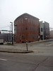
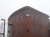
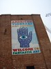
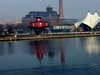
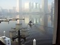
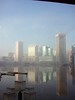
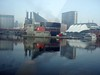

Thursday morning, I set out through the foggiest day I recall seeing in this area, down Interstate 95 through Delaware and into Maryland to meet with Earlpearl, who occasionally comments here, and posts frequently at SEO Refugee, often on topics that deal with local search.

We had decided to meet in Baltimore, at the [American Visionary Art Museum](http://www.avam.org/). I had heard of the Museum from friends but had never been there before. It appears to have been an inspired and fortunate choice.

  

I couldn’t take pictures inside the museum buildings themselves, but the exhibitions were pretty wild, with works from artists like [Ted Gordon](http://web.archive.org/web/20070823001103/http://galleries.absolutearts.com:80/cgi-bin/galleries/show?what=artists&id=1254&login=blacksheep), [Vollis Simpson](https://www.smm.org/sln/vollis/), and many others.

Perhaps my favorite part of the Museum was the Jim Rouse Center for Visionary Thought, where I learned about the Baltimore folk art of [screen painting](http://web.archive.org/web/20041105172221/http://mvcameron.com/history.htm), and a little about [Jim Rouse](http://web.archive.org/web/20130529083335/http://www.pbs.org:80/newshour/bb/remember/rouse_4-10.html), whose work on developing the Harbor Place in Baltimore is probably responsible for a good portion of the vision behind the renovation and development that could be seen across the water from where the Museum is located.

   

Earlpearl and I had a great discussion about local search, the development of cities, Jim Rouse, and the visionary art from the Museum. The mission statement of the American Visionary Art Museum is:

> Visionary art as defined for the American Visionary Art Museum refers to art produced by self-taught individuals, usually without formal training, whose works arise from an innate personal vision that revels foremost in the creative act itself.

In many ways, that reminded me so much of my early forays on the web, attempting to build and create some personal and commercial sites. I still have no formal training in the arts, and I don’t consider myself a designer, but I’m not afraid to spend a few hours with image creation software trying to make something that will convey information and emotions in a meaningful manner.

The web has given many people that opportunity, which is one of the things that I like most about working online, with people who want to create and share their visions with others.
