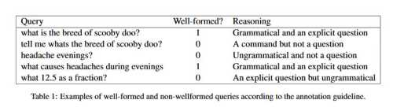
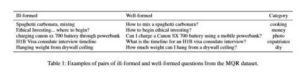

## A Well-Formed Query Helps a Search Engine Understand User Intent

To start this post, I wanted to include a couple of whitepapers with authors from Google. The authors of the first paper are inventors of a patent application from April 28, 2020. It is good seeing a white paper from the inventors of a recent patent published by Google. The papers can help you learn how Google is trying to rewrite queries into “Well-Formed Natural Language Questions.

August 28, 2018 – [Identifying Well-formed Natural Language Questions](https://arxiv.org/pdf/1808.09419.pdf)

The abstract for that paper:

> Understanding search queries is a hard problem as it involves dealing with “word salad” text ubiquitously issued by users. But, if a query resembles a well-formed question, a natural language processing pipeline can perform a more accurate interpretation, thus reducing downstream compounding errors.
>
> Hence, identifying whether a query is well-formed can enhance query understanding. Here, we introduce a new task of identifying a well-formed natural language question. We construct and release a dataset of 25,100 publicly available questions classified into well-formed and non-wellformed categories and report an accuracy of 70.7% on the test set.
>
> We also show that our classifier can be used to improve the performance of neural sequence-to-sequence models for generating questions for reading comprehension.

## Just What is a Well-Formed Query?

The paper provides examples of well-formed queries and ill-formed queries:

November 21, 2019 – [How to Ask Better Questions? A Large-Scale Multi-Domain Dataset for Rewriting Ill-Formed Questions](https://arxiv.org/pdf/1911.09247.pdf)

The abstract for that paper:

> We present a large-scale dataset for the task of rewriting an ill-formed natural language question to a well-formed one. Our multi-domain question rewriting (MQR) dataset works using human contributed Stack Exchange question edit histories.
>
> The dataset contains 427,719 question pairs which come from 303 domains. Besides, we provide human annotations for a subset of the dataset as a quality estimate. When moving from ill-formed to well-formed questions, the question quality improves by an average of 45 points across three aspects.
>
> We train sequence-to-sequence neural models on the constructed dataset and improve 13.2%in BLEU-4 over baseline methods built from other data resources. We release the MQR dataset to encourage research on the problem of question rewriting.

The patent application I am writing about is from January 18, 2019. That puts it around halfway between those two whitepapers. Both of them can help get a good sense of the topic; if you want to learn about featured snippets, people also ask questions and queries that Google tries to respond to. The Second Whitepaper refers to the first one and tells us how it is trying to improve upon it:

> Faruqui and Das (2018) introduced the task of identifying well-formed natural language questions. In this paper, we take a step further to investigate methods to rewrite ill-formed questions into well-formed ones without changing their semantics. We create a multi-domain question rewriting dataset (MQR) from human contributed StackExchange question edit histories.

## Rewriting Ill-Formed Search Queries into Well-Formed Queries

This patent is also about rewriting search queries.

It tells us, “Rules-based rewrites of search queries work in query processing components of search systems.”

Sometimes this happens by removing certain stop-words from queries, such as “the,” “a,” etc.

## After Rewriting a Query

After a query is rewritten, it may be “submitted to the search system and search results returned that are responsive to the rewritten query.”

The patent also tells us about “people also search for X” queries. This is the first patent I have seen Google mentioned this feature in.

These similar queries recommend queries related to a submitted query. Those are suggestions headed: “people also search for X.”

These “similar queries to a given query are often determined by navigational clustering.”

For the query “funny cat pictures,” a similar query of “funny cat pictures with captions” may work because searchers often submit that similar query following submission of the query “funny cat pictures.”

## Determining if a Query is a Well Formed Query

The patent tells us about a process that can determine if a natural language search query is well-formed. If not, use a trained canonicalization model to create a well-formed variant of that natural language search query.

First, we have a definition of “Well-formedness” We know that it is “a sign of how well a word, a phrase, and/or another additional linguistic element (s) conform to the grammar rules of a particular language.”

These are three steps to tell whether something is a well-formed query. It is:

- Grammatically correct
- Does not contain spelling errors
- Asks an explicit question

The first paper from the authors of this patent tells us the following about queries:

> The lack of regularity in the structure of queries makes it difficult to train models that can optimally process the query to extract information that can help understand the user intent behind the query.

That translates to the most important takeaway for this post:

**A Well-Formed Query can allow a search engine to understand the user intent behind the query**

The patent gives us an example:

“What are directions to Hypothetical Café?” is an example of a well-formed version of the natural language query “Hypothetical Café directions.”

## How the Classification Model Works

The purpose behind the patent is to determine if a query is well-formed using a trained classification model and/or a well-formed variant. If that well-formed version can work using a trained canonicalization model.

It can create that model by using features of the search query as input to the classification model and deciding whether the search query is well-formed.

Those features of the search query can include, for example:

- Character(s)
- Word(s)
- Part(s) of speech
- Entities included in the search query
- And/or other linguistic representation(s) of the search query (such as word n-grams, character bag of words, etc.)

And the patent tells us more about the nature of the classification model:

> The classification model is a machine learning model, such as a neural network model that contains one or more layers such as one or more feed-forward layers, softmax layer(s), and/or additional neural network layers. For example, the classification model can include several feed-forward layers utilized to generate feed-forward output. The resulting feed-forward output can work with a softmax layer(s) to generate a measure (e.g., a probability) that indicates whether the search query is well-formed.

## A Canonicalization Model

If the Classification model decides the search query is not well-formed, the query goes to a trained canonicalization model to generate a well-formed version of the search query.

The search query may have some features extracted from the search query and/or more input processed using the canonicalization model to generate a well-formed version that correlates with the search query.

The canonicalization model may be a neural network model. The patent provides more details on the nature of the neural network used.

The neural network can or show a well-formed query version of the original query.

We are also told that besides identifying a well-formed query, it may also determine “one or more related queries for a given search query.”

A related query may work with the related query submitted by users following the submission of the given search query.

The query canonicalization system can also determine if the related query is well-formed. If it isn’t, then it can determine a well-formed variant of the related query.

For example, in response to the submission of the given search query, a selectable version of the well-formed variant can go with search results for the given query and, if selected, the well-formed variant (or the related query itself in some implementations) can be a search query. Results for the well-formed variant (or the related query) were then presented.

Again, the idea of “intent” surfaces in the patent about related queries (people also search for queries)

## Show a Well-Formed Variant of a Related Query instead of the Related Query Itself

The value of showing a well-formed variant of a related query instead of the related query itself lets a searcher understand the intent of the related query more easily.

The patent tells us that showing this example has a lot of value by stating:

> Such efficient understanding enables the user to quickly submit the well-formed variant to quickly discover more information (i.e., the result(s) for the related query or well-formed variant) in performing a task and/or enables the user to only submit such query when the intent indicates likely relevant additional information in performing the task.

We have an example of a related well-formed query in the patent:

> As one example, the system can determine the phrase “hypothetical router configuration” relates to the query “reset hypothetical router” based on historical data indicating the two queries are proximate (in time and/or order) to one another by a large number of users of a search system.
>
> In some such implementations, the query canonicalization system can determine the related query “reset hypothetical router” is not a well-formed query and can determine a well-formed variant of the related query, such as: “how to reset the hypothetical router.”
>
> The well-formed variant “how to reset hypothetical router” can then be in a database as a related query for “hypothetical router configuration”—and can optionally supplant any related query association between “reset hypothetical router” and “hypothetical router configuration.”

## A Well-Formed Related Query Might Be A Link to Search Results

The patent tells us that sometimes a well-formed related query might be a link to search results.

Again, one of the features of a well-formed query is that it is grammatical, is an explicit question, and contains no spelling errors.

The patent application is at:

[Canonicalizing Search Queries to Natural language Questions](http://appft.uspto.gov/netacgi/nph-Parser?Sect1=PTO1&Sect2=HITOFF&d=PG01&p=1&u=%2Fnetahtml%2FPTO%2Fsrchnum.html&r=1&f=G&l=50&s1=%2220200167379%22.PGNR.&OS=DN/20200167379&RS=DN/20200167379)
Inventors Manaal Faruqui and Dipanjan Das
Applicants Google LLC
Publication Number 20200167379
Filed: January 18, 2019
Publication Date May 28, 2020

Abstract

> Techniques can be for training and/or utilizing a query canonicalization system. In various implementations, a query canonicalization system can include a classification model and a canonicalization model. A classification model can determine if a search query is well-formed. Additionally, a canonicalization model can determine a well-formed variant of a search query in response to determining a search query that is not well-formed. In various implementations, a canonicalization model portion of a query canonicalization system can be a sequence to sequence model.

## Well-Formed Query Takeaways

I have summarized the patent, and if you want to learn more details, click through and read the detailed description. The two white papers I started the post with describing databases of well-formed questions that people as Google (including the inventors of this patent) have built and show the effort that Google has put into rewriting queries so that they are well-formed queries. This means that the search engine can better understand the intent behind them.

As we have seen from this patent, the analysis undertaken to find canonical queries is also used to surface “people also search for” queries, which may be set up for canonicalization and displayed in search results.

**A well-formed query is grammatically correct, contains no spelling mistakes, and asks an explicit question. It also makes it clear to the search engine what the intent behind the query may be.**
