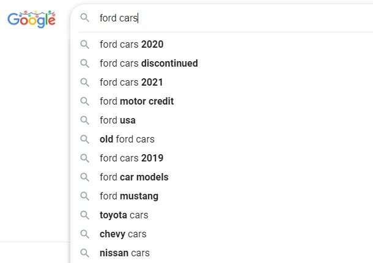
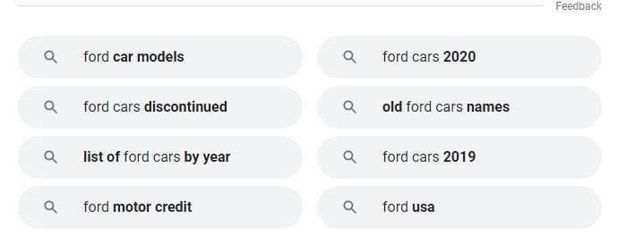

## LSI Keywords and What I Use Instead of Them?

One of the myths about SEO is that there is something called LSI Keywords. Supposedly you could add them to a page to make it rank higher for a specific term or phrase.

There are ways to find and generate these terms or phrases.

The truth is that LSI Keywords are a myth. According to Google patents, there are ways to find terms and phrases that you can add to a page to help it rank higher for words or phrases for which you are optimizing.

Those are not and have never been called LSI Keywords. The first gets described in Google’s many patents about phrase-based indexing (over 20 in all.). The second is domain terms described in Google’s context vectors patent.

## What are LSI Keywords in SEO

LSI is Short for Latent Semantic Indexing. It is a method of indexing devised by researchers at Bell Labs in the late 1980s. It indexes small static databases by understanding the connections between words in a document corpus. Those researchers patented the process in the late 1980s and provided an example of indexing eight books as a sample database using LSI. The inventors did not mention LSI Keywords, nor did they suggest LSI keywords to optimize a data set for a specific term or phrase. None of the inventors suggested LSI keywords, and those were not in the invention of LSI. I wrote a post in the past called: [Does Google Use Latent Semantic Indexing (LSI)?](https://www.seobythesea.com/2018/01/google-use-latent-semantic-indexing/). The answer is quite likely that they do not use LSI. It was invented and patented in 1988’s [Computer information retrieval using latent semantic structure](https://patft.uspto.gov/netacgi/nph-Parser?Sect1=PTO1&Sect2=HITOFF&d=PALL&p=1&u=%2Fnetahtml%2FPTO%2Fsrchnum.htm&r=1&f=G&l=50&s1=4,839,853.PN.&OS=PN/4,839,853&RS=PN/4,839,853).

Some SEO Toolmakers and some SEOs have written about LSI Keywords who offer those as ways of optimizing content for specific terms and phrases by adding those LSI Keywords to content. There is no proof that LSI Keywords can help optimize any content for particular words or phrases, and SEO tool makers point to sources such as the Wikipedia pages on LSI. The SEOs who suggest the use of LSI Keywords point to a wide range of sources that they claim are LSI keywords, but many of the generators of those sources do not call them “LSI Keywords,” nor do they claim that you can add those to text to better optimize that text for specific terms.

Here are some ways to provide LSI Keywords that do not give you terms or phrases that help you optimize for specific words.

Do not use these methods to find additional terms to add to a page to help that page rank higher for your chosen term. None of them have proved helpful to do that, none of them have had anything to do with LSI, and they developed no LSI Keywords in the generation of those terms.

**Google Autocomplete** – these are predictions based on autocomplete and possibly a searcher’s previous search history – not intended to help optimize text for specific terms.

**Bolded Terms in SERPs** – When Google returns search results for a query, Google will show searchers proof that the search results are related to the query used them, and Google will do this by bolding terms in the results for those queries. That reassures searchers that results from a search are related and do not provide anything such as “LSI Keywords” to an SEO. Search engines were built for searchers, not SEOs, and bolding helps searchers.

Many **keyword planner tools** help SEOs identify keywords to optimize content. Many of these are helpful and are worth using. They do not tell you how to create additional keywords that you add to your content to help that content rank more highly for a specific term or phrase.

**Query Refinements at the bottoms of search results**. Google sometimes offers a set of query refinements at the end of search results that suggest other things that a searcher can search for in addition to the original query terms selected. These query refinements were not get added to a page about the initial query to help the content be added to it to rank higher for that query. Many patents about query refinements did not mention the use of LSI and were never to get used in that manner. Again, there is no proof that these phrases should be used that way.

## Where are LSI Keywords From?

While LSI is a patented technology from Bell Labs, the phrase “LSI Keywords” does not appear in that patent, nor is it the subject of any other patents at the USPTO.

The SEO Tools that sell LSI Keywords do not explain how LSI Keywords help a page be optimized for specific terms or do not include any case studies showing how they work. One does tell us that LSI Keywords are more effective than keyword Density, which has been an SEO Myth for years (there is not and has never been a magical percentage of keyword usage for different niches.)

After looking through most of Google’s patents and papers, there are no papers that describe the effectiveness of LSI Keywords. There are papers on Semantic Topic Models, which have nothing to do with LSI Keywords and much more to do with one of my suggestions for an actual substitution for LSI keywords that may work.

## Action Items To Follow In Place of LSI Keywords

If you want to optimize a page for a specific term, there are ways of finding words that improve how your page gets indexed and ranks better for terms that you may have optimized. I say this based on studying patents from Google and adding such terms on pages that brought them more targeted traffic.

**Phrase-Based indexing** means adding complete phrases on pages that rank highly for a specific word or term and frequently co-occur on those pages. An example is a page that ranks for the phrase, “President of the United States,” which may have frequently co-occurred complete phrases such as “oval office,” “secretary of state,” “rose garden,” and others that taken together predict what that page is about. The [phrase-based indexing patents](https://www.seobythesea.com/2006/02/move-over-pagerank-googles-looking-at-phrases/) got started at Google in 2004, and there are over 20 related patents on the subject, which means that Google has spent a lot of effort on phrase-based indexing. I wrote about them many times, including a post at: [Are You Using Google Phrase-Based Indexing?](https://gofishdigital.com/blog/are-you-using-google-phrase-based-indexing/)

Another Google patent describes **domain terms** on pages that use context vectors to understand terms better than pages may rank for. I wrote about those in [Google Patents Context Vectors to Improve Search](https://www.seobythesea.com/2016/10/google-patents-context-vectors-improve-search/). The post points out that many terms have more than one meaning and use sources such as knowledge bases, like Wikipedia, to find domain terms to understand better which meaning of a term was intended.

One of the examples from the patent os for the word “horse. To an equestrian, a “horse” is an animal. To a carpenter, a horse is a tool. To a gymnast, a horse is a vault of exercise equipment. If you include domain terms such as “saddle,” “stirrups,” and “thoroughbreds” on that page, those words help a search engine understand that the page is about animals or horses that equestrians might write about.

Adding complete phrases that co-occur on pages, which are indexed in a phrase-based inverted index of the web. Or adding domain terms which Google has also indexed to help define the meanings of terms that have more than one meaning, is a way of adding additional phrases that can help a page rank higher in search results without using LSI Keywords.

There is no use of Latent Semantic indexing. These are methods that Google devised and knew about, and they have not been made up by SEO tool makers or SEOs who are growing myths about SEO. They are worth trying out and exploring in the SEO that you do.
