Search engines have evolved tremendously since they first started appearing on the Web more than a decade ago.

I thought it might be fun to take a look back at some of the popular search engines of yesterday and spent a little time at the [Internet Archive](https://archive.org/) traveling back to the earlier days of search.

I remember visiting these pages when I put my first site up on the Web and decided to share some screenshots. The dates after each search engines’ name are when the pages were captured by the Internet Archive.

**AltaVista**
October 22, 1996

The sister of a friend used to work at DEC, the company where AltaVista began, and one day she sent him an email with a link to the search engine they had launched the week before. He forwarded the email to me, and I found myself using Altavista for most of my searches for the next year or two.

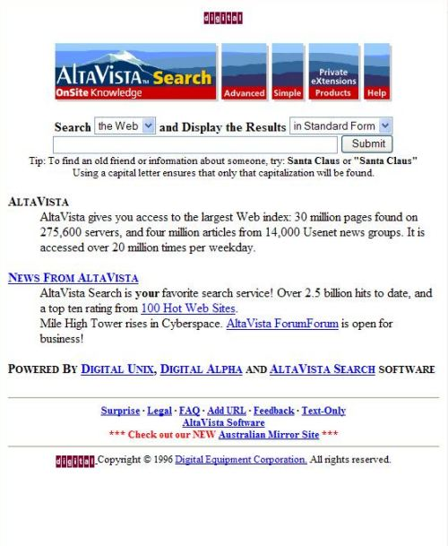

**Ask Jeeves**
December 19, 1996

I remember trying out Ask Jeeves in the early days, but never really got into the hang of searching in question form. I missed out on beta testing for Ask Jeeves but got a kick out of seeing the very early days of Ask.

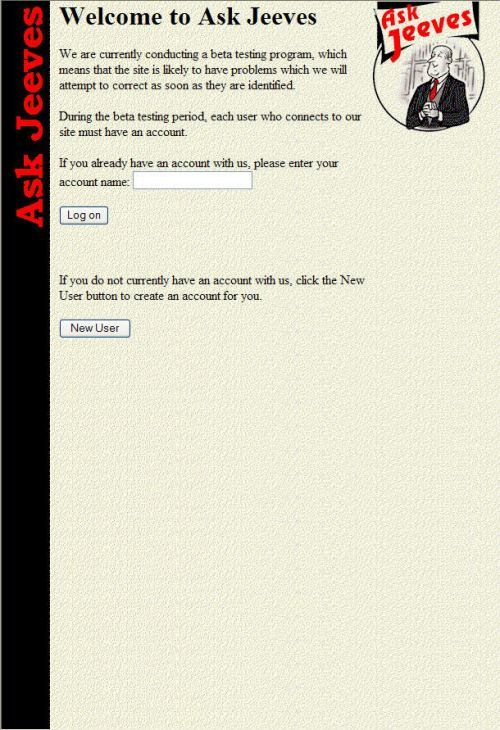

**Excite**
October 25, 1996

I never used Excite that much either, and looking back, it’s interesting to see the focus upon reviews, news, and local features like the weather.
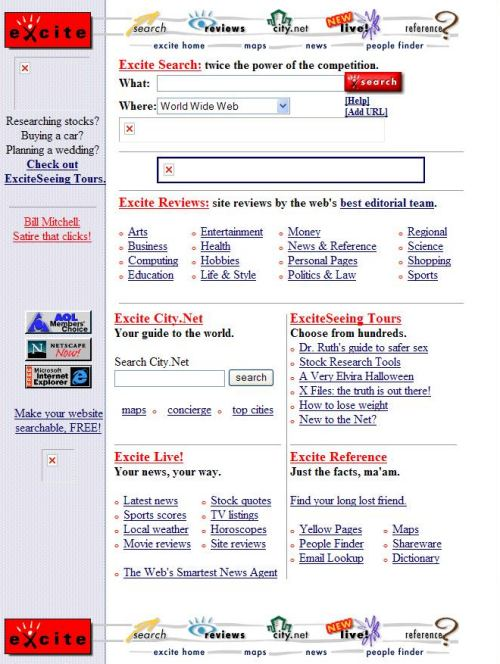

**Google**
November 11, 1998

From the very early days, Google seemed to show results that were a lot more relevant than most of the other search engines. I started finding myself getting more disappointed in the pages I found at AltaVista and turning more frequently to Google.

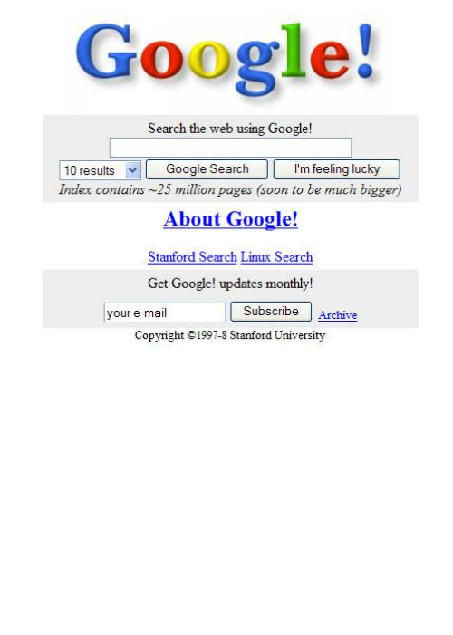

**Hotbot**
December 12, 1997

HotBot’s bright colors always stood out, but I never found myself visiting regularly.

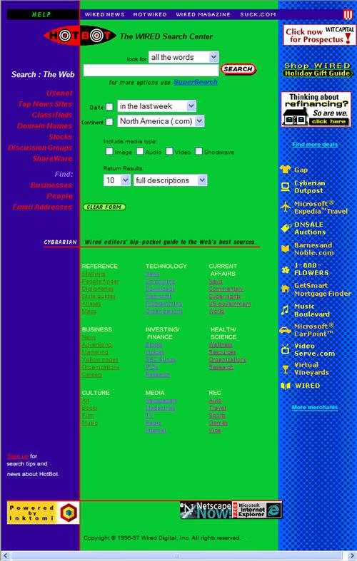

**Infoseek**
January 3, 1997

I’m not sure if I ever used Infoseek for any of my searches back in 1997, but I’ve looked at a number of the patents that Google acquired from Infoseek, and they had some interesting technology and ideas back then.

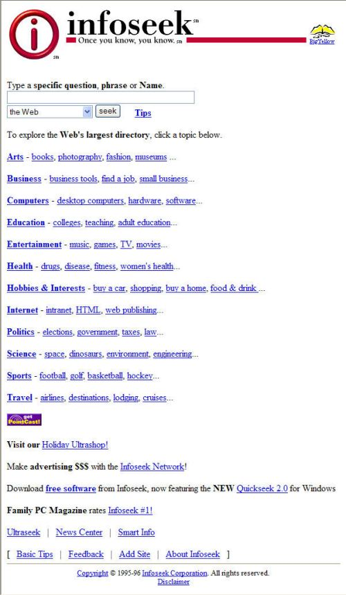

**LookSmart**
December 22, 1996

Hover over one of the main categories at LookSmart, and a submenu would appear, and then a sub-submenu, and then another. For some reason, the site always reminded me of Russian Nesting Dolls with all of those menus inside of menus.

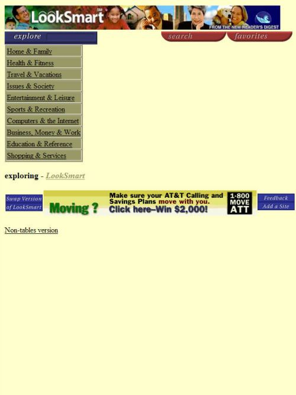

**Lycos**
October 22, 1996

I don’t remember searching at Lycos too often, though I would sometimes type in a query now and then.

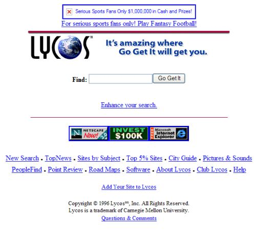

**MSN**
October 25, 1996

I can’t say that I ever used the MSN search feature, but I thought it would be interesting to include this page given Microsoft’s efforts towards building a search presence with the launch of Bing, and the take over of Yahoo’s search – especially with Yahoo being the “featured search of the day,” on this page.

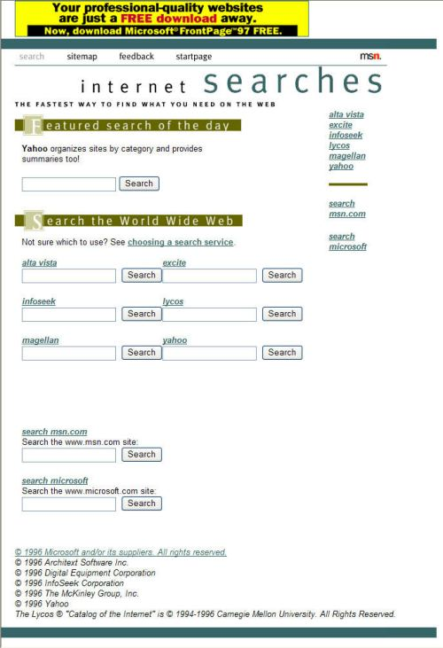

**Northern Light**
December 10, 1997

I enjoyed the way that Northern Light classified results and presented them in different categories, and for a couple of years I would often follow a search at either AltaVista or Google with a search at Northern Light to find pages that I might have missed at one of the other search engines.

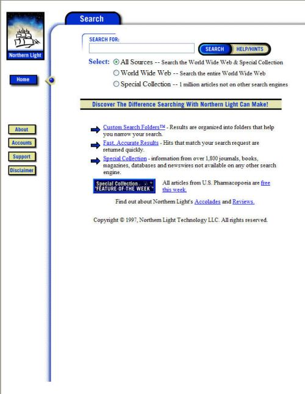

**Webcrawler**
December 19, 1996

I remember adding pages to WebCrawler, but not spending a lot of time searching there.

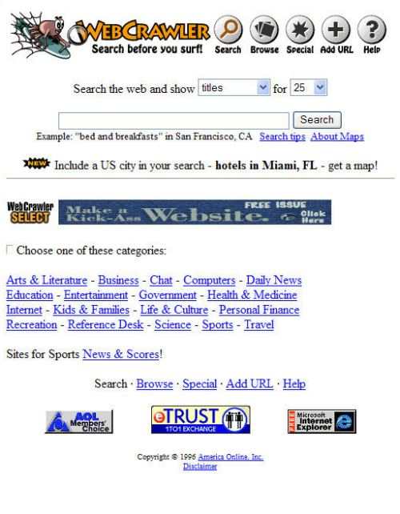

**Yahoo**
October 17, 1996

The search box at the top of Yahoo’s page might be a little misleading. It wasn’t there to search the Web, but rather to explore Yahoo’s directory. The Yahoo Directory was a great place to discover new pages on the Web in different categories.

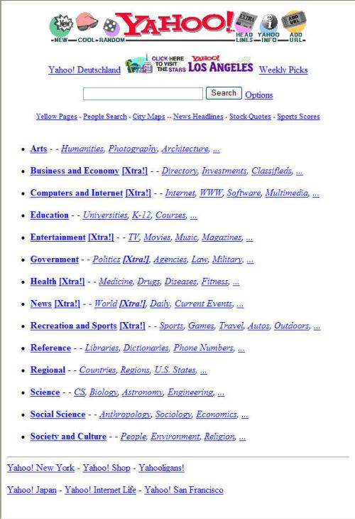

Search engines have changed significantly from those days, with personalized search as well as images and videos and news and blogs and tweets and other specialized search results blended amongst web pages. The Web has changed considerably as well.

I’m wondering what they might be like a dozen years from now.
