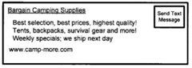
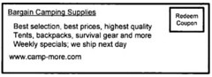
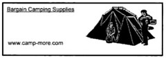
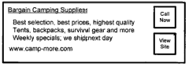

A new Google patent application on serving advertisements on mobile phones provides a glimpse of what those ads might look like, and what kinds of features might be included with them.

It might be possible to send a text message to advertisers.

Or download a coupon to use towards a purchase.

Images of products could be shown in the ads.

A call button or a link to the seller’s web site could also be part of the ad.

Those images are just illustrative of some of the ways that mobile advertising might look and function. The patent application provides more details:

[Dispatch system to remote devices](http://appft1.uspto.gov/netacgi/nph-Parser?Sect1=PTO1&Sect2=HITOFF&d=PG01&p=1&u=%2Fnetahtml%2FPTO%2Fsrchnum.html&r=1&f=G&l=50&s1=%2220070022442%22.PGNR.&OS=DN/20070022442&RS=DN/20070022442)
Invented by Elad Gil, Shumeet Baluja, Maryam Kamvar, Cedric Beust
US Patent Application 20070022442
Published January 25, 2007
Filed July 21, 2005

Abstract

> A method and system for presenting promotional content to a user of a communication device involves receiving information from a communication device, where the information relates to the communication device, and identifying a result relating to the information that is capable of being presented in a plurality of formats on the communication device, and dynamically selecting a format for the result from among the plurality of formats, and presenting the result in the selected format for display by the communication device.
