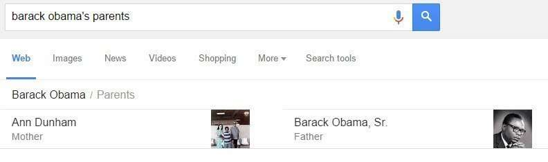
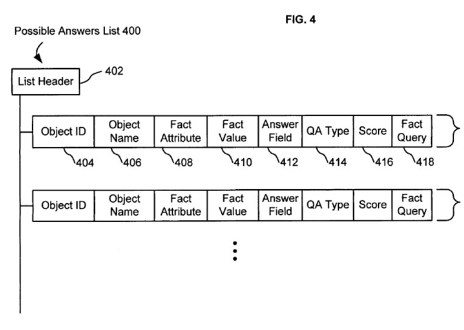
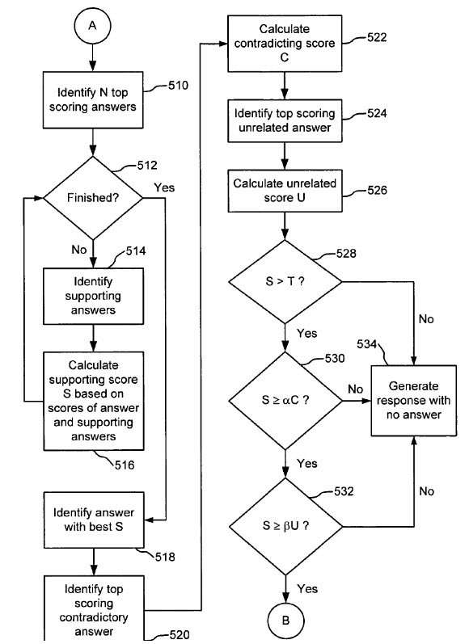

## Featured Snippets in Addition to 10 Blue Links

The Web is filled with factual information, and Search on the web has been going through changes to try to take advantage of all of the data found there. Mainstream search engines, such as Google, Bing, and Yahoo, traditionally haven’t given us simple and short featured snippets to our queries; instead of showing us a list of Web pages (often historically referred to as 10 blue links) where that data might be found; and then forcing us to sort through that list to find an answer.

Google introduced featured snippets to questions at the Google Blog in April 2005, in [Just the Facts, Fast](https://googleblog.blogspot.com/2005/04/just-facts-fast.html). These featured snippets appear above the 10 blue links leading to pages about the query.

That may have been in response to Tim Berners-Lee writing about the Semantic Web back in 2001, where he alerted us to the possibilities that freeing data otherwise locked into documents might bring to us. By search engines finding ways to crawl the web collecting information about objects and data associated with them, we begin approaching the possibilities he mentioned. And we get featured snippets that we otherwise couldn’t find as easily.

Some of the reasons for featured snippets may have been in response to competitors like Microsoft working on projects involving things such as an [Object-level Vertical Search](https://www.powershow.com/view/2206fc-NDQxM/ObjectLevel_Vertical_Search_powerpoint_ppt_presentation) (pdf).

By indexing pages only, search engines have been missing out on opportunities to collect data about different objects found on the Web and to treat the Web as a big database that could potentially be queried to enable people to ask questions about that data. More recently, we’ve been seeing search engines collecting data about facts related to different entities or objects on the Web.

Of course, some percentage of searches on the Web is for people to make purchases, or download software, or find producers of products or goods or people offering services, so a search for web documents is likely to still be needed. But, we are seeing Google and Bing provide knowledge-base type search results in response to many queries, and question answering seems to be a big part of that. This metamorphosis of search and search engines is taking place before our eyes, and it’s a little challenging in how it can potentially impact sites offering products and services and information on the Web.

A Google patent filed at the US Patent and Trademark Office in March of 2005, shortly before that “Just the Facts” Google blog post, was written when initial work was taking place on a Google Knowledge Graph, and it describes how Google first documented how they would reply to questions, with featured snippets responding to some queries.

We’ve been seeing featured snippets increasingly at Google over the past few years, but this patent seems to be one of the first dealing with how Google might come up with answers to show searchers.

The patent tells us of issues that search engines have had in trying to provide quick answers to factual questions, such as being concerned about answers from a single source – like from a particular encyclopedia, which could limit answers to questions. Such a source might not be updated frequently enough to answer questions based upon popular culture, or any questions about products, services, retail and wholesale businesses. It tells us that expanding such information might lead to information that is from untrustworthy or unreliable sources.

A resource such as Google’s knowledge graph was seen as a path to a solution for such a problem, referred to in that time as a fact repository.

The patent tells us that it would respond to factual queries by:

- Searching a fact repository to identify one or more possible answers to the factual query
- Determining for at least a subset of the possible answers a respective score
- Identifying a first answer to the possible answers with the best score
- Generating a response including the first answer if the best score satisfies the first condition and satisfies a second condition concerning the score of a second answer of the possible answers

The patent is:

[Selecting the best answer to a fact query from among a set of potential answers](http://patft.uspto.gov/netacgi/nph-Parser?Sect1=PTO1&Sect2=HITOFF&d=PALL&p=1&u=%2Fnetahtml%2FPTO%2Fsrchnum.htm&r=1&f=G&l=50&s1=7,953,720.PN.&OS=PN/7,953,720&RS=PN/7,953,720)
Invented by: Douglas L. T. Rohde, Thomas W. Ritchford
Assignee: Google Inc.
US Patent 7,953,720
Granted May 31, 2011
Filed: March 31, 2005

Abstract

> A method and system for selecting the best answer to a factual query. Possible answers to a factual query are identified. The possible answers are scored and the best scoring possible answers are compared to other possible answers to determine how well they are supported. The most supported answer is chosen to be presented to the user.

## A Query Engine and Snippets

When a search engine attempts to respond to queries with factual information, it may try to gather that information from a wide range of sources, which can mean that there is the possibility of multiple possible answers. A “query engine” within the search engine may try to identify answers and decide upon the best answer from the possible answers it has to show to a searcher, or it could decide that none of the answers should be shown to a searcher.

In addition to answers, the query engine may also show a list of sources of the answer, including portions of text from each source. Those portions of text are called snippets and they may include both terms of the factual query and terms of the answer. Sources may be shown to give the searcher the basis for the answer and may aid help the searcher to evaluate how trustworthy the answer might be.

This query engine might provide search results that are filled with documents, in addition to featured snippets for factual queries.

Answers to factual queries may be found in the fact repository, which may store facts associated with different objects. Those facts are stored in the shape of attribute-value pairs. Each of those facts includes a list of source documents that include the fact within their contents, and are where that fact was extracted from on the Web.

Every object in the fact repository has a unique identifier or a Fact ID. These facts not only have attribute-value pairs associated with them and Object IDs but also may be connected to other facts within the fact repository:

> Each fact includes an attribute and a value. For example, facts included in an object representing George Washington may include facts having attributes of “date of birth” and “date of death,” and the values of these facts would be the actual date of birth and date of death, respectively. A fact may include a link to another object, which is the object identifier, such as the object ID of another object within the fact repository. The link allows objects to have facts whose values are other objects. For example, for an object “United States,” there may be a fact with the attribute “president” whose value is “George W. Bush,” with “George W. Bush” being another object in the fact repository.

## Weighting the Facts

The fact repository uses metrics to indicate the quality of the facts it contains. These can include a confidence level and an importance level.

The confidence level indicates the is a likelihood that a fact is correct.

The importance level indicates the relevance of a fact to the object, compared to the other facts for the same object, or how vital a fact is to “an understanding of the entity or concept represented by the object.”

Each of these facts includes a list of sources from where fact came from and may be identified by a Uniform Resource Locator (URL), or Web address.

## Name Facts and Property Facts

Objects in the repository (entities) as the patent tells us, can have different types of facts associated with them, such as name facts and property facts. Name facts provide a name for an entity or a concept represented by an object. They could be a string of text. Objects may have more than one name. Property Facts tell us something about an entity of the concept represented by that entity. For example, the word “Spain” is a name for the country of Spain, and the fact that it is a country is a property of Spain. Objects can have zero, one, or more property facts associated with them.

Other types of facts may be associated with an object, that may tell us about a type or category associated with them, such as a person, place, actor, movie, etc.

## Fact Repository

The patent focuses upon how data is collected about different entities, within a fact repository. So, if someone asks, “what is the capital of California,” The fact repository could be searched and the City of Sacramento could be returned as an answer.

The patent provides information about how a fact repository may is organized, with attribute-value pairs associated with objects displayed. This is a peek into what will become Google’s Knowledge Graph, called a graph because many of the entities, or objects, or concepts within it, are connected.

## Finding Featured Snippets

We are told that answer to a factual query is the fact in the fact repository identified as the best response to the factual query. After a factual query is received, the query engine will work to processes the query, identify possible answers, choose the best of those answers, and generate a response including the answer.

Processing a query may involve parsing the query to generate a question from it or to try out different Question and Answer types upon it that may be responded to, such as “What is the Capital of Poland,” which could match up with a factual answer of, “Warsaw.”

The patent provides more details about the processing of queries and the selection of answers. It also shows us how helpful it is for Google to have collected a lot of information about objects and facts related to them.

This does seem to be the start of Google’s Knowledge Graph, and the knowledge panels that Google now shows for many search results.

Some posts I’ve written about patents involving question answering:

- 7/19/2007 – [Search Engines Crawling FAQs to Learn How to Answer Questions?](https://www.seobythesea.com/2007/07/search-engines-crawling-faqs-to-learn-how-to-answer-questions/)
- 9/21/2014 – [Google May Use Question Answering to Populate the Knowledge Graph](https://www.seobythesea.com/2014/09/missing-incorrect-data-knowledge-graph/)
- 10/12/2014 – [How Google May Use Entity References to Answer Questions](https://www.seobythesea.com/2014/10/google-fact-questions-entity-references-unstructured-data/)
- 12/30/2014 – [Featured Snippets – Taken from Authority Websites](https://www.seobythesea.com/2014/12/direct-answers-taken-authority-websites/)
- 12/31/2014 – [Featured Snippets – Using Query Intent Templates to Identify Answers](https://www.seobythesea.com/2014/12/direct-answers-using-query-intent-templates-identify-answers/)
- 2/11/2015 – [How Google was Corroborating Facts for Featured Snippets](https://www.seobythesea.com/2015/02/google-corroborating-facts-direct-answers/)
- 7/12/2015 – [How Google May Answer Questions in Queries with Rich Content Results](https://www.seobythesea.com/2015/07/how-google-may-answer-questions-in-queries-with-rich-content-results/)
- 9/9/2015 – [When Google Started Showing Featured Snippets](https://www.seobythesea.com/2015/09/when-google-started-answering-factual-queries/)
- 11/30/2016 – [Answering Featured Snippets Timely, Using Sentence Compression on News](https://www.seobythesea.com/2016/11/featured-snippets-sentence-compression/)
- 6/19/2017 – [Google Extracts Facts from the Web to Provide Fact Answers](https://www.seobythesea.com/2017/06/fact-answers/)
- 7/11/2019 – [How Google May Handle Question Answering when Facts are Missing](https://www.seobythesea.com/2019/07/how-google-may-handle-question-answering-when-facts-are-missing/)

Last Updated June 26, 2019.
