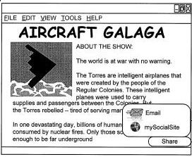

An announcement on the Official Google Blog yesterday, [+1’s: the right recommendations right when you want them—in your search results](https://googleblog.blogspot.com/2011/03/1s-right-recommendations-right-when-you.html), described a new social element that you can add to Google Search results. You can share recommendations about sites that you see when you search in Google by clicking upon a little box with a “+1” inside of it that appears next to each result. The Google blog post tells us that this voting system will soon be available to people who have Google Profiles and who are logged into their Google Accounts. If you want to see it in action before that, you need to go to the [Google Experimental Search](https://web.archive.org/web/20080315192054/http://www.google.com/experimental/index.html) pages and sign up to participate in this “experiment.”

A video about Google +1 is interesting for a couple of reasons. One of them is that it explains how Google +1 works, and another is that it mentions that this kind of voting might be available outside of Google search results on other websites sometime soon in the future:

The video shows +1 buttons on other websites, and tells us that we may be able to click a +1 button on those pages. When you click on a plus button, a mention of that will appear in a +1 tab on your Google profile, and people that you are “connected to” can see whether you’ve plussed something. Will the +1 button look like the +1 button when it appears on Web pages? Will Google add more features?

I ask because a new patent application published today from Google describes a Google Share Button that the search engine might offer to enable visitors to share pages with others via their own chosen methods of sharing.

You’ve probably seen many different share buttons on sites across the Web. One of the things that makes this share button different is that instead of being configured by the owner of the site, the person using the share button can set it up so that it only provides choices that they select. So, if you decide to use this share button, you can set it up so that your choices of sharing are through Gmail, Twitter, Delicious, or add it to your calendar, for example.

The patent application is:

[Dynamic Action Links for Web Content Sharing](http://appft.uspto.gov/netacgi/nph-Parser?Sect1=PTO1&Sect2=HITOFF&d=PG01&p=1&u=%2Fnetahtml%2FPTO%2Fsrchnum.html&r=1&f=G&l=50&s1=%2220110078232%22.PGNR.&OS=DN/20110078232&RS=DN/20110078232)
Invented by George van den Driessche
Assigned to Google
US Patent Application 20110078232
Published March 31, 2011
Filed: September 30, 2009

Abstract

> Action links for a web document may be dynamically generated by a third party. In one implementation, a method may include receiving a request from a client device relating to a document being processed by the client device, the request including a request for content in which the content defines action links that are to be inserted into the document. Action links may be determined for the document based on preferences of a user and content may be generated that describes the determined action links.

Will Google’s +1 button on websites function exactly like the button they announced yesterday, or will it include additional features, like the ability to share pages in other ways as well?

I guess we need to wait to find out.

*Added 4:52* Maybe we already have. See [OMG Someone Just Found An Embeddable Google +1 Button – And It Works!](https://techcrunch.com/2011/03/31/omg-someone-just-found-an-embeddable-google-1-button-%E2%80%93-and-it-works/). That embeddable +1 button does look just like the one in search results, without any sharing features.

Maybe Google will also offer a share button as well. Considering the number of blogs they have at blogspot, and many recent upgrades to Blogger, a feature like that which people could include on their blogs might not be a bad idea.

*added 5:43* It looks like Google has disabled the embeddable +1 button found in the wild. They do have a page where you can sign up to be [informed](https://services.google.com/fb/forms/plusonesignup/) of when the +1 button will be available for websites.
