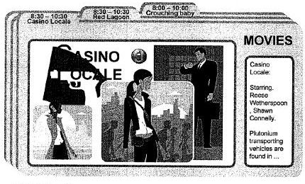
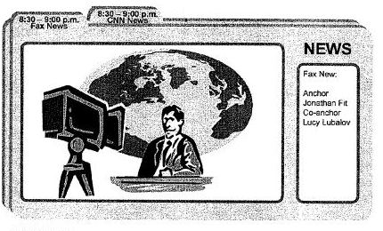
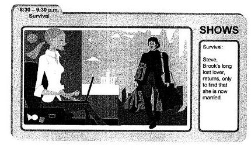
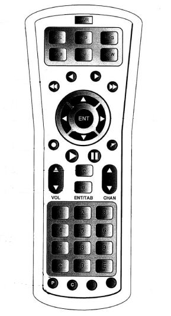

There’s been some recent news about the possibility of Google working with the Dish Network to bring searches for television programming and YouTube videos to TVs, reported at places like the Wall Street Journal. The WSJ article tells us that besides actual tests of a Google settop box that allows searching for TV programming, that Google has “been talking to a range of other television-service providers and hardware makers, prodding them to use its Android-based technologies to offer a broader range of programming, a more personal experience and ads.”

If Google were to start providing a program guide for televsion and web videos, what would it look like? My suspicion is that it would be more like something we tend to see on the Web than many of the television program guides offered by cable services. And it might bring us tabbed windows on our TVs, like in the following images:

Imagine turning on your television and using your remote control to go to a program guide that allows you to open up different channels in tabs, like on a Web browser.

The tabs might display some information about the shows associated with each, and may make it easy for you to flip between multiple television channels.

That’s the topic of a patent filing from Google, published last July, that may hint at a move by Google onto television screens, and possibly providing multimedia content on other kinds of screens as well, such as the one on your phone. It describes an interface that could be used with broadcast programs, video on demand services, and a program guide which provides information about television programs.

The tabbed TV windows above are from the Google’s patent application.

[Tabbed Windows for Viewing Multimedia Programs](http://appft.uspto.gov/netacgi/nph-Parser?Sect1=PTO2&Sect2=HITOFF&u=%2Fnetahtml%2FPTO%2Fsearch-adv.html&r=1&p=1&f=G&l=50&d=PG01&S1=20090144648.PGNR.&OS=dn/20090144648&RS=DN/20090144648)
Invented by Shirin Oskooi
Assigned to Google
US Patent Application 20090144648
Published June 4, 2009
Filed: December 4, 2007

Abstract

> A device may, in response to a command, generate a first tabbed window that frames a viewing area on a display screen, present multimedia content in the viewing area, and expand the viewing area that contains the multimedia content to cover the display screen after presenting the multimedia content for a particular amount of time.

The WSJ article tells us some more about the test that Google is running with some Dish Network users, that “Viewers in the Google test, these people said, can search by typing queries, using a keyboard rather than a remote control.” The Google patent filing shows off a remote control rather than a keyboard, but the document tells us that it could just as easily use a keyboard or a mouse or some other kind of wireless device,

Here’s a view of the remote control displayed in the patent filing.

Will we see tabs on TV in the future, like those on our browsers? It’s a possibility.
