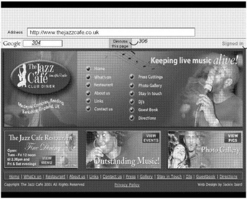
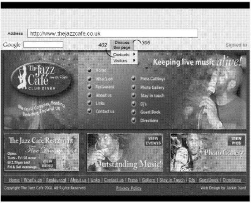
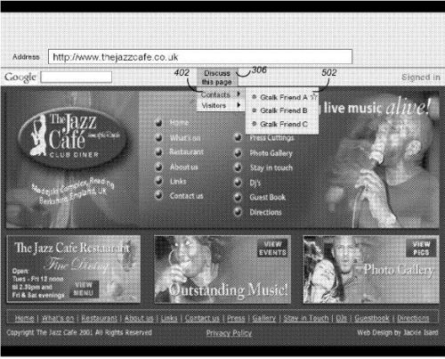
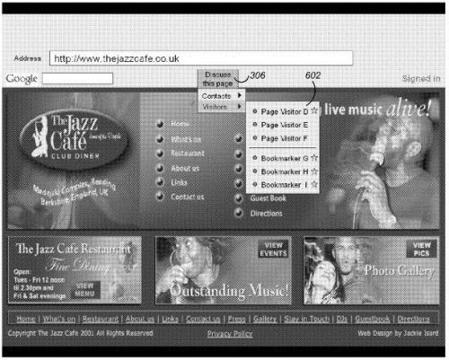

Google is starting to show how social it might become with the introduction of Google + this week. I’ve signed up for an invite, and watched the demos, but I’m not going to weigh in on it until I have the chance to try it out (2011-6-30 – added: I missed my invite inadvertantly. Testing Google + now.)

Instead, let’s take a quick look at a Google Patent application that came out this week that shows another possible social tool from Google. This one allows you to start conversations with people who visit a web page, or have bookmarked the page, or contact people you already know while you’re on the page so that you can discuss it together. See a news story on a news paper site that you want to discuss with a friend, or even someone else who might be visiting that page. The process behind this patent filing enables you to do that.

Within your toolbar browser would be an instant messenging client attached to a “discuss this page” button, like in the screenshot from the patent filing below:

If you click upon that button, you see a menu that enables you to either talk to people who are already contacts or visitors to the page:

You are able to choose amongst people who may aleady be contacts:

Alternatively, you would be able to see who else is visiting the page or has bookmarked the page who might have the toolbar installed, and choose amongst those people:

Both you and the other visitor have to give permission to be contacted by one another for a communication to start. Note in the image above that there are also “bookmark” menu items. In addition to starting a conversation with someone who is presently visiting a page, this system would allow you to initiate a conversation with someone who has bookmarked the page that you are on.

The patent application is:

[Initiating Communications with Web page visitors and Known Contacts](http://appft.uspto.gov/netacgi/nph-Parser?Sect1=PTO1&Sect2=HITOFF&d=PG01&p=1&u=%2Fnetahtml%2FPTO%2Fsrchnum.html&r=1&f=G&l=50&s1=%2220110161835%22.PGNR.&OS=DN/20110161835&RS=DN/20110161835)
Invented by Joseph F. Karam
Assigned to Google
US Patent Application 20110161835
Published June 30, 2011
Filed: March 11, 2011

Abstract

> Methods and apparatus, including computer program products, implementing and using techniques for initiating communication between two users among several users while at least one of the two users is browsing a web page. User information is collected about each user among the several users. Page information is collected about what web page each user among the several users is browsing. A portion of the user information and page information for a first user and a second user is shared between the first user and the second user when a predetermined criterion is met, and request by the first user to initiate communication with the second user is processed.

Some additional details:

1. People using this system can set up status messages stating whether they are available for online interactions or want to be left alone.

2. You could save your conversations locally or remotely for future reference.

3. This application is built into the browser rather than existing as a separate application.

4. If one of your known contacts has previously bookmarked the page that you are on, there might be an indicator of that, such as a star next to their name.

5. When you’re on a page that might have a very large number of people browsing it at the same time, the list of other people browsing that you see might be filtered to contain a smaller and more manageable number. That filter might be based upon this such as:

- Geographical proximity to the user,
- How many times the other users have visited the same page,
- How long time the other users have spent browsing the page,
- Sub site proximity (i.e., when two users look at two different pages of the same multi-page article), and;
- Other similar criteria

Some of these choices may be configurable by the user of the system, such as the choice to show local users

6. Privacy issues are addressed in the patent filing, such as the ability to toggle on and off this system so that no one else can see you as you browse a page, the ability to select which pages others might see you upon when you’re browsing them, or being able to use your true name or an anonymous name or generic name like “User X.”

7. Some of the topics that the patent suggests that people can discuss when they communicate while browsing a page can include:

- Discussing or reviewing products, restaurants, hotels,
- Planning travel,
- Discussing articles,
- Sharing parenting advice,
- Studying foreign languages (e.g., reading a text in French and having a follow-up discussion between the teacher and the student), or
- Collaborating on various web-based projects.

**Conclusion**

I can see using this system with clients or people that I’m working with to discuss different aspects of specific web pages. It could be really useful to be on the same page at the same time without having to use a screen sharing program, for instance.

I could also see people who are members of a community site interacting with each other also.

People who own a site might click on the “Discuss this page” button to interact with their visitors as well.

This is the kind of application that makes Google and the Web more social without keeping them behind a walled garden, or limiting your interaction to people whom you already know.

Would you use it?
