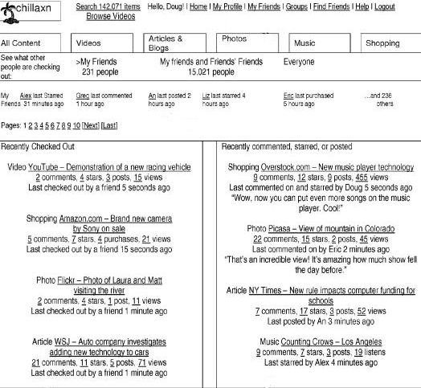

Last August, Google announced that they had purchased social network application creator Slide, in a post titled [Google and Slide: building a more social web](https://googleblog.blogspot.com/2010/08/google-and-slide-building-more-social.html). Since then, Slide appears to have been running independently of Google, to the point where they’ve [launched a Group Texting application](https://www.engadget.com/2011-03-26-slide-launches-disco-googles-group-texting-app-comes-to-iphone.html) named Disco.

While searching through patents granted this week, one of the titles grabbed my attention. [System for targeting third party content to users based on social networks](http://patft.uspto.gov/netacgi/nph-Parser?Sect1=PTO2&Sect2=HITOFF&u=%2Fnetahtml%2FPTO%2Fsearch-adv.htm&r=1&p=1&f=G&l=50&d=PTXT&S1=7,941,535.PN.&OS=pn/7,941,535&RS=PN/7,941,535) (US Patent 7,941,535) was granted on May 10, 2011 and originally filed back on May 7, 2008. It’s not assigned to Google, or even Slide, but one of the inventors named on the patent, Doug Sherrets, has been a Slide employee since 2007. His LinkedIn profile also discloses that he has been a Facebook Shareholder since 2005.

Co-inventor Alex Mittal appears to have attended The Wharton School around the same time as Doug Sherrets, according to his LinkedIn profile, and his profile lists him as a Co-Founder of a company named Chillaxn, and describes his role at the company on the profile as, “Led social software company that shot for the fences.”

The patent doesn’t mention Chillaxn, but the images from the patent include the Chillaxn name upon them. The images, and how they incorporate social information into a user interface are interesting.

The Chillaxn patent presents a sophisticated way of tracking information about first-level contacts in social networks, or friends, and second and higher level contacts, or friends of friends, and how they use the Web.

It allows for some anonymous sending of messages to others, as well as determining which messages to show based upon factors such as:

1. Response time to past messages
2. How the user receiving the message is connected to the user sending the message
3. A message topic, one or more message topics that garnered a response in the past
4. Many messages the recipient has received or sent
5. A number of messages the sender has received/sent, and
6. Internet usage data of possible recipients to identify users with topic area interest or expertise; and prioritizing at least a portion of the messages sent by users to other users based on the metric for determining the likelihood of user response

This social network would record and report upon web pages visited by its users, and determine which users belong to the same social networks to connect them.

It would display and sort links to those pages based upon factors such as:

1. The type of file to which the links point
2. The content of the file, or
3. The category to which the file belongs

The links could also be sorted chronologically or reverse chronologically, as well as by numbers of user views, user comments, and user activities such as purchases or user ratings. Profiles for friends or friends of friends might also be listed and linked to on other social networks (see the screenshots above for some examples).

A fairly wide range of other data types is described, which could be used to sort or filter how information is displayed. The patent provides a very detailed look at a social interface that definitely “shot for the fences.”

Chillaxn is no longer around, with Alex Mittal’s LinkedIn profile noting that he ended his role as a co-founder in May 2007.

Alexander Mittal has moved on to become a founder of what appear to be some interesting endeavors in Crederity and nanotechnology startup [Innova Dynamics](http://www.innovadynamics.com/).

Doug Sherrets joined Slide at the end of 2007.

The Chillaxn patent was granted in the names of its inventors, without an assignment to Chillaxn, or to any other company.

With Doug Sherrit’s connection to Google, it’s possible that some of the ideas from that patent might end up in an application from Slide or Google. With Alex Mittal’s recent success in starting companies, it might form the roots of a new social network company, based upon the roots of the old one.

A few weeks ago, I wrote about a Google patent that described a mobile-based social hub interface for viewing social messages in [A Hint of What Google’s Social Network Might Look Like?](https://www.seobythesea.com/2011/04/a-hint-of-what-googles-social-network-might-look-like/).

The screenshots from the Chillaxn patent show a slightly different, but also an interesting approach.

Will Chillaxn rise again? Will Google become Chillax’d?

Will, this social network approach, show up somewhere else, or will it remain a dream unrealized?
