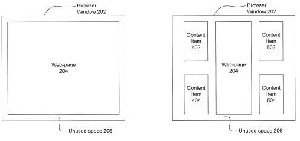

When you design a web page with fixed dimensions, set for a specific display resolution, sometimes visitors will arrive at your page with a higher web page resolution level. What this means is that there can be empty space showing in their browser window when viewing your page. There are other times when someone visits your page, and their browser window isn’t using their whole monitor display, and they might resize their browser to include a higher resolution level, which can then cause unused browser space to appear.

A Google patent application published this morning describes how Google might identify when such unused space exists, and include content within that space. The patent filing tells us that this content can include text, images, videos, animations, and other types of content that can be displayed in a browser.

**Advertisements? Search Features?**

While the patent filing provides a fair amount of detail on how they might determine when such white space exists, it doesn’t give us any examples of the kinds of content that might be displayed in that empty space, such as advertisements, search features like Google’s [Quick Scroll](https://www.seobythesea.com/2010/10/google-quick-scroll-good-or-evil/), news or informational content, related search information, social network information, or other content.

We’re also not told if the unused whitespace might be relevant to the content on the web page being visited, the person doing the visiting or something else entirely.

How would you feel about Google showing content in unused whitespace on a visitor’s browser if you own the site being visited? Would it make a difference if it was advertising that you might earn money with?

If you follow my link above about Google’s quick scroll feature, one of the things I mentioned that I didn’t like about it was that it covered over some of the content on the pages being visited. Displaying the quick scroll box in unused space appears to be a way of avoiding that problem. Would Google potentially display other search features in unused browser space?

Would the addition of content items like this cause webpages to load more slowly and impact the amount of bandwidth used by browsers and site owners? Are Google’s efforts to speed up the Web at least partially focused upon enabling them to add additional features like this to pages?

The patent is:

[Utilization of Browser Space](http://appft.uspto.gov/netacgi/nph-Parser?Sect1=PTO2&Sect2=HITOFF&u=%2Fnetahtml%2FPTO%2Fsearch-adv.html&r=1&p=1&f=G&l=50&d=PG01&S1=20110145730.PGNR.&OS=dn/20110145730&RS=DN/20110145730)
Invented by Xin Zhou
Assigned to Google
US Patent Application 20110145730
Published June 16, 2011
Filed March 19, 2010

Abstract

> Systems, methods, and computer program products for utilization of browser space are described herein. An embodiment includes determining unused browser space on a display and selectively rendering one or more content items in the determined space based on dimensions of the display. The embodiment further includes, determining dimensions of a window in which the browser is displayed, wherein the dimensions include a height and a width of the window.
>
> Furthermore, the embodiment includes selectively displaying the content items in the unused browser space based on the width of the browser window, item width of each of the content items, and a gap width between the content items. In this way, unused browser space on a display is effectively utilized by selectively rendering one or more content items in the unused browser space.

Would you consider allowing Google to show additional content items in unused browser space on your pages?
