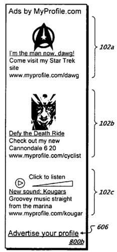
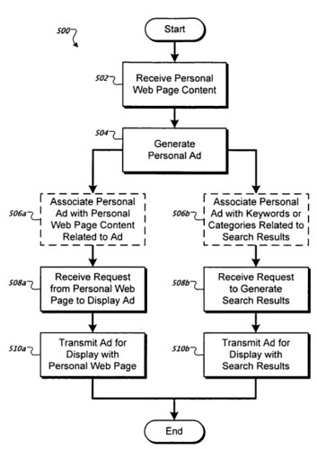
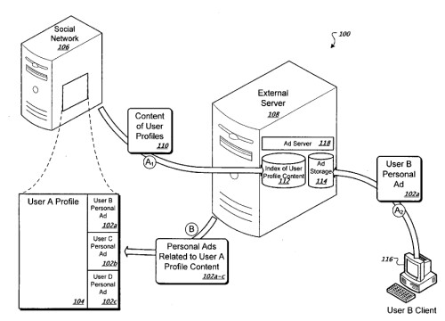

There’s a potentially huge untapped advertising market on the Web involving personal ads that point people to the profile pages of advertisers who might want a little more attention for their pages.

One that could point people to personal profiles from places like Orkut or MySpace, LinkedIn, or PlentyOfFish. How many of those social networks would work with Google, to allow members to advertise their profiles in Google ads?

A patent application from Google was published this past week that described personal ads like this. Will it likely be granted as a patent? I’m not sure, and I don’t know if it’s a point worth discussing.

Regardless of that, it is interesting to see Google addressing the idea, and creating a way that websites that allow members to create profiles to use Google’s services to enable their members to feature themselves and their pages in ads.

[Profile advertisements](http://appft1.uspto.gov/netacgi/nph-Parser?Sect1=PTO2&Sect2=HITOFF&u=%2Fnetahtml%2FPTO%2Fsearch-adv.html&r=1&p=1&f=G&l=50&d=PG01&S1=20080004959.PGNR.&OS=dn/20080004959&RS=DN/20080004959)
Invented by Tomasz J. Tunguz-Zawislak and Shannon P. Bauman
US Patent Application 20080004959
Published January 3, 2008
Filed: June 30, 2006

Abstract

> A computer-implemented method for managing personal advertisements for display with online profiles is disclosed. The method includes receiving multiple categories of content from a first online profile comprising information characterizing a first-person, generating an advertisement comprising advertising content that directs a user to a second online profile comprising information characterizing a second person, and transmitting the advertisement for display with the first online profile if the advertising content is related to at least a portion of the content from the first online profile.

The document goes into some detail on how this process might work. A screenshot of one of the high level processes involving how personal ads might work:

Will we see ads like these on MySpace or Orkut? Would people pay to advertise their profiles? I’m guessing that it’s a possibility.

The patent application tells us that it might be possible for someone to advertise their profile from one social networking site upon another social networking site, or to point to a personal page that isn’t on a social network, such as a Geocities page.

The intent behind this advertising process appears to be to give people a chance to promote sites that aren’t commercial, and don’t offer products or services for sale. I suspect that might be prone to abuse, but it would be interesting to see it in action.
