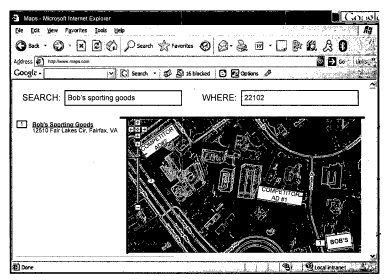

Painters from the Googleplex wouldn’t show up at your door with ladders and paintbrushes. These wouldn’t be physical ads. They would instead show up in Google Maps, like the following which points out “Bob’s Sporting Goods” and displays ads for Bob’s local competitors.

Ads in services like Google Earth and Microsoft Virtual Earth presently appear in the sidebar, and are often ignored. If they were placed in the “area of interest” on the map itself, would viewers pay more attention to them? A Google patent application explores that idea.

[Providing advertising in aerial imagery](http://appft1.uspto.gov/netacgi/nph-Parser?Sect1=PTO2&Sect2=HITOFF&u=%2Fnetahtml%2FPTO%2Fsearch-adv.html&r=1&p=1&f=G&l=50&d=PG01&S1=20070233375.PGNR.&OS=dn/20070233375&RS=DN/20070233375)
Invented by Ashutosh Garg and Mayur Datar
US Patent Application 20070233375
Published October 4, 2007
Filed: March 31, 2006

The way this could be done is that the search engine would:

- Receive a map request from a user,
- Retrieve a map in response to the request,
- Overlay at least one advertisement on the retrieved map, and;
- Provide the retrieved map with the overlaid advertisement to the user.

Advertisments might show up in the map image:

- On a rooftop of a building depicted in the retrieved map.
- On a top of at least one tree in the retrieved map.
- On a side of a building depicted in the retrieved map.
- On an open area in the retrieved map.
- In an area in the retrieved map that does not obscure a view of the retrieved map.
- In a predetermined location in the retrieved map.

Revenue may be shared for the advertisement with a group that owns the predetermined location.

The ad may be shown in a way that causes the ad or ads to appear or disappear from the map in response to actions performed by the user, by use of some type of overlay, like is presently used for satellite or street or hybrid views.

The ad may come from a repository of advertisements, based on a location depicted in the retrieved map. It could be chosen based on profile information associated with the user. The profile could contain information about a past search or purchase performed by the user.

Factors that might be considered in deciding which ads to show could be based upon:

- The locality depicted in the retrieved map,
- The place name in the query,
- Search term or terms in the map request,
- Users’ Tags from mapping services associated with mapped locations,
- Information associated with the user,
- Scaling of the retrieved map,
- Bid amount and past performance of ads

For serving different maps based upon the scale of the map, the types of advertisements that are selected may be different depending on whether a map of the entire United States or a map of a small town is retrieved.

A request for a map-based upon Zip Code might display ads for businesses located in or near the zip code.

A search for a map that uses the term “Pizza” and a zip code might trigger ads that show pizza establishments and/or other types of restaurants that are located in or near the zip code.

In one variation of implementing the process in this patent application, there may be the possibility of revenue sharing for the owners of property that the ads are shown upon:

> For example, in one implementation, people, businesses, and/or government organizations (referred to collectively as “groups”) may be allowed to auction their rooftop spaces, sides of their buildings, their open spaces (e.g., vacant lots, parks, school grounds, ball fields, etc.), or the like to advertising networks to allow the advertising networks to place targeted advertisements on these locations.
>
> These locations may be marked on the maps stored in the map repository. Thus, when sever 220 retrieves a map, server 220 may readily identify locations at which to place advertisements. In these implementations, the advertising network may share advertisement revenues with the groups auctioning off their virtual space in the aerial images.

I’m not sure that I would want Google to show ads on my rooftop, even virtual ones.
