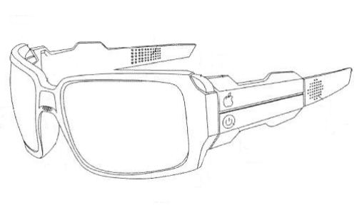
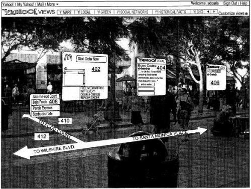

An interesting new patent filing from Yahoo raises a couple of interesting questions about the future of the company. It describes a wearable computing device that could be used in many ways and the patent application provides a number of examples that sound like something out of a science fiction novel I read a year or so ago.

Something else that’s interesting is the apple on sidearm of the virtual goggles above, which the patent filing identifies as a visual power indicator. It looks surprisingly like something you would see on the back of an Apple laptop or on the main navigation bar at [Apple.com](https://www.apple.com/). I don’t know if that has any significance at all, or if the creator of the image was having fun with the readers of the patent filing.

The pending patent application is:

[Reconfiguring Reality Using a Reality Overlay Device](http://appft.uspto.gov/netacgi/nph-Parser?Sect1=PTO2&Sect2=HITOFF&u=%2Fnetahtml%2FPTO%2Fsearch-adv.html&r=1&p=1&f=G&l=50&d=PG01&S1=20100103075.PGNR.&OS=dn/20100103075&RS=DN/20100103075)
Invented by Chris Kalaboukis, Stephan Douris, Marc Perry, Barry Crane
Assigned to Yahoo
US Patent Application 20100103075
Published April 29, 2010
Filed: October 24, 2008

Abstract

> Virtual entities are displayed alongside real world entities in a wearable reality overlay device worn by the user. Information related to an environment proximate to the wearable device is determined.
>
> For example, a position of the wearable device may be determined, a camera may capture an image of the environment, etc. Virtual entity image information representative of an entity desired to be virtually displayed is processed based on the determined information. An image of the entity is generated based on the processed image information as a non-transparent region of a lens of the wearable device, enabling the entity to appear to be present in the environment to the user.
>
> The image of the entity may conceal a real world entity that would otherwise be visible to the user through the wearable device. Other real world entities may be visible to the user through the wearable device.

The patent filing goes into a great amount of detail on how such a system could be set up, and is worth exploring if you want more details.

It also includes a good number of examples on ways that this wearable virtual reality device could be used:

- Simulations for pilot and other training
- Having lunch with virtual historical people
- Exploring virtual landscapes, such as the lunar surface
- Redesigning interior living spaces (virtually)
- Living in another era or an alternative city
- Wii type games, with simulated environments such as stadiums, bowling alleys, boxing rings, lacrosse fields, etc.
- Capture the flag game, with a virtual flag
- Real life Pac-man
- A virtual maze in an open field
- Soccer, with a virtual ball
- A Civil War strategy game with virtual period clothing and virtual period weapons
- Laser tag games without the laser guns
- A mystery game, with virtual people, avatars, cartoon characters, etc., to provide clues
- A virtual World Of Warcraft-type overlay
- Costume parties, with virtual costumes
- Coaching information sent to amateur and professional sports players
- Virtual concerts shown in a park or in your living room
- Advertising on real world objects during games

## Virtual Reality Advertising

The same kind of virtual reality device is described in a Yahoo patent filing published last year, [Virtual Billboards](http://appft.uspto.gov/netacgi/nph-Parser?Sect1=PTO1&Sect2=HITOFF&d=PG01&p=1&u=%2Fnetahtml%2FPTO%2Fsrchnum.html&r=1&f=G&l=50&s1=%2220090289956%22.PGNR.&OS=DN/20090289956&RS=DN/20090289956), which describes how advertising could be displayed to someone wearing goggles like the ones show above.

The virtual billboards might also be sent automatically to handheld internet enable devices when they are within a certain distance of the objects advertised. A screen shot from that patent filing shows what the virtual billboards might look like:

## Conclusion

The patent filing only begins to brush at the surface of possible uses for wearable computing devices like the one it describes. Imagine holding a virtual meeting in a virtual meeting room with participants from around the globe. Or choosing to see virtual advertisements after viewing a product or barcode. Or visiting a museum that has created interactive virtual presentations.

I don’t know how novel or unique this kind of augmented reality or wearable computing device might be, and I suspect that Yahoo’s invention may brush up against some opposition from others who may be working on similar devices, but what interests me about this patent is that Yahoo would be exploring this area at all.
