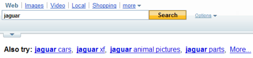

At Yahoo, if you’ve ever seen the words “Also Try” at the top or bottom of a set of search results, along with a list of selected queries, then you may have seen part of Yahoo’s internal relevance and variety checking process in action.

**Determining Relevance and Variety**

The process that provides those “also try” results also may be a way for the search engine to check up on how well they are doing – how relevant their results are, and how much variety they provide.

This relevance and variety process goes roughly (very roughly) like this:

**Looking for Related Terms in Query Logs**

Someone searches at Yahoo, and search results are returned. Each time someone searches like that, an entry is made in a query log.

Query logs at the search engine are looked at to find a number of the top related terms for a query. The actual amount of “top related queries” might be different for each query.

These “related terms” are queries that might have included the word or words from the original query within them, and may be considered as units – distinct phrases, terms or concepts recognized by the search engine. In my “Also try” image example above, we see “jaguar cars,” “jaguar xf,” “jaguar animal pictures,” and “jaguar parts.”

Those are terms that are “related” to the query “jaguar” under this process. The related terms in log files might only be looked at for a specific period of time, like the last week or two.

If you were to then take that “top” set of queries that contained the primary query term (jaguar) and see how many times each of the related query terms appeared relative to each other, you could get a “relative frequency.”

Example of relative frequency (roughly, out of 60 appearances of related terms):

***jaguar cars*** – 30 times (50 percent)
***jaguar xf*** – 15 times (25 percent)
***jaguar animal pictures*** – 10 times (17 percent)
***jaguar parts*** – 5 times (8 percent)

Yahoo might also look to see how often the top related terms were used during query sessions from individuals, to redefine their queries. For example, how often does someone searching for “jaguar” then go on to search for “jaguar cars” or “jaguar animal pictures”?

**Related Terms in Search Results**

If you search for “jaguar,” and were to look at the number of results for each of the top related terms in a top certain number of search results (let’s say the top 100), and then see which percentage of that number existed for each of the related terms, you would have the “relative frequency in relation to all terms in the set of terms” for each of the related terms.

Looking at the top 100 results (to keep the math simple), we might see how often the word “jaguar” and the other term or terms appeared on the same pages in those results. Let’s just quess at some numbers to show how this works:

***jaguar cars*** – 39 times (39 percent)
***jaguar xf*** – 24 times (24 percent)
***jaguar animal pictures*** – 15 times (15 percent)
***jaguar parts*** – 22 times (22 percent)

Under the patent application, this part of the process might look at the actual content found upon the pages pointed to in the search results, or it might limit itself to only counting results where those words appear in the page title and abstract for the each search result.

**Comparing Query Logs with Search Results**

If we match up the number of times that people searched for the top related terms for “jaguar” with the number of times that results for those related terms appear in search results for “jaguar”, we might be able to use those numbers to see how “relevant” the search results are for the primary query term “jaguar.”

***jaguar cars*** – 50 percent of queries, 39 percent of search results
***jaguar xf*** – 25 percent of queries, 24 percent of search results
***jaguar animal pictures*** – 17 percent of queries, 15 percent of search results
***jaguar parts*** – 8 percent of queries, 22 percent of search results

How well do the searches for the top related terms in query logs match up with appearances of those top related terms in search results for the primary search term or phrase?

If they match up well, then you might be able to say that the search engine is providing relevant results. If the frequencies of appearances (percentages) don’t match up well, then it’s possible that a search algorithm or two might need to be tweaked by a search engineer.

**Checking for Variety of Search Results**

This might be as simple as making sure that each of the top number of top related terms that appear within the queries also appear within the top number of search results at least once.

**The Patent Application**

[Automatic relevance and variety checking for web and vertical search engines](http://appft1.uspto.gov/netacgi/nph-Parser?Sect1=PTO2&Sect2=HITOFF&u=%2Fnetahtml%2FPTO%2Fsearch-adv.html&r=1&p=1&f=G&l=50&d=PG01&S1=20080010269.PGNR.&OS=dn/20080010269&RS=DN/20080010269)
Invented by Jignashu G. Parikh
US Patent Application 20080010269
Published January 10, 2008
Filed: July 5, 2006

Yahoo came out with another patent application a while back, [Using matrix representations of search engine operations to make inferences about documents in a search engine corpus](http://appft1.uspto.gov/netacgi/nph-Parser?Sect1=PTO2&Sect2=HITOFF&u=%2Fnetahtml%2FPTO%2Fsearch-adv.html&r=1&p=1&f=G&l=50&d=PG01&S1=20070094250.PGNR.&OS=dn/20070094250&RS=DN/20070094250), which explores [use query histories to improve search results](https://www.seobythesea.com/2007/04/yahoo-to-use-query-histories-to-improve-search-results/)

The inventor listed in that document published a paper that appears related, titled [Unity: relevance feedback using user query logs](https://dl.acm.org/doi/10.1145/1148170.1148319).

His co-author on that paper is listed as the inventor of this new patent application from Yahoo.
