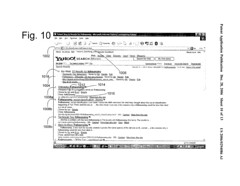
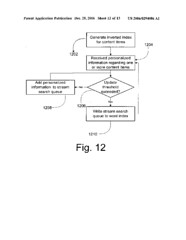

I’ve been writing about how [annotations and tags might appear in search results](https://www.seobythesea.com/2007/01/social-trustrank-and-user-annotations-as-anchor-text/) as described in some recent patent applications from Yahoo. If you click on the image to the right, you can get a better view of how that might look, if “My Web” and “Search History” features are turned on.

In that image, results are shown from the pages that the searcher has saved to the web, or that community members have saved, and may also show (though not in this screenshot) pages returned from a search of the inverted index from the web.

Chances are that a searcher is going to want to see the newer, and fresher saved results, rather than old ones. The flowchart to the left illustrates how newer results might be added, and older results pushed out of the search stream queue. This process displays real-time and personalized results, and the patent application that contains the claims describing how this could work is:

[Realtime indexing and search in large, rapidly changing document collections](http://appft.uspto.gov/netacgi/nph-Parser?Sect1=PTO2&Sect2=HITOFF&u=%2Fnetahtml%2FPTO%2Fsearch-adv.html&r=1&p=1&f=G&l=50&d=PG01&S1=20060294086.PGNR.&OS=dn/20060294086&RS=DN/20060294086)
Invented by Daniel E. Rose, Jianchang Mao, and Chad Walters
Assigned to Yahoo
US Patent Application 20060294086
Published December 28, 2006
Filed August 2, 2006

Abstract

> This invention is directed to systems and methods for searching content items indexed in real-time. The method In one version comprises generating an index of word location pairs that identify the location of one or more words in one or more content items available on a network. One or more additional content items are received over the network. The received content items are stored in a stream search queue, the stream search queue operative to allow for a stream search of the one or more additional content items.

We’re not given a lot of details in this patent application about the ranking of these personalized results, though it doesn’t appear that the newest annotations or bookmarks will be shown – instead, the most relevant ones would. At some point, older results would be flushed out of these personalized results upon reaching some threshold.
