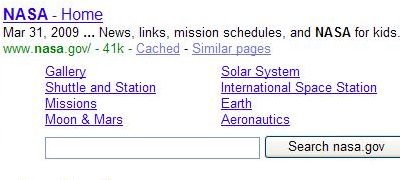

## Quicklinks Are An Extra Set of Links That May Appear to Your Site

If you search in Google, Yahoo, and Microsoft Live Search, you see extra sets of links to other pages on the same site under some of the first search results you see. Google refers to these as [site links](https://support.google.com/webmasters/answer/47334?hl=en) and Yahoo calls them quick links. Microsoft has published at least one whitepaper that describes the kind of pages that show up in their site links as [final destination pages](https://www.seobythesea.com/2008/02/microsoft-tracking-search-and-browsing-behavior-to-find-authoritative-pages/). The site links that all three search engines show look very similar to each other. Can you identify which site links go with which search engine in the images below (hover over them to see which is from which search engine)?

While these site links appear similar, I have had one question: how does each search engine decide which pages to show as site links?

A patent filing Google published in 2006 describes their [listings of internal site links](https://www.seobythesea.com/2006/12/googles-listings-of-internal-site-links-for-top-search-results/) and may give some insight into the links that Google decides to show. The Microsoft paper also gives us an idea of what criteria they consider in providing those links. What about Yahoo?

Yahoo has been providing a single line of quick links under some search results for a few years now, not limiting themselves to the top search result for those queries. Google has just recently started similarly showing single-line site links.

A new whitepaper from Yahoo goes into a great amount of depth concerning how they may choose the site links they show on their pages. In [Quicklink Selection for Navigational Query Results](http://wwwconference.org/www2009/proceedings/pdf/p391.pdf), Yahoo tells us about the sources of information that they look at when deciding upon which links to use, the mathematical process behind choosing quick links, and some possible changes to quicklinks that they might pursue in the future.

## Navigational Queries

One common thread behind the use of sitelinks by all three search engines is that the concept behind providing internal site links to pages on a site that shows up in search results is to improve the searching experience of people looking for information by providing links to pages within a site that searchers likely would want to find.

The types of queries that tend to trigger the appearance of sitelinks are [navigational queries](https://www.seobythesea.com/2008/03/redefining-navigational-queries-to-find-perfect-sites/) – searches where the searcher likely has an idea of the page or site that they want to find already but doesn’t remember the exact web address, or URL, for that page or finds it easier to type a query into a search box and click on a link. For example, if I want to go to the ESPN site, I’ll type “ESPN” into a search box instead of typing http://espn.go.com/ into my browser address bar.

If I do that in Google, I not only get a link to the homepage for ESPN, but also additional links for:

- College Basketball
- NBA
- NFL
- MLB
- The NHL
- Fantasy Games
- Scores
- Streak for the CASH
- More results

Oddly, Yahoo doesn’t provide quicklinks for that query, but Microsoft Live gives a set of site links that overlaps with Google’s somewhat.

## Source of Yahoo Quicklinks

The Yahoo paper tells us that they look at many sources to find good candidate pages for quicklinks:

- Query and click logs – navigational queries, how searchers reformulate their queries during query sessions, and which pages they click upon
- Toolbar and user trail data – looking at navigation patterns in the way that people browse a website
- Webgraph information from hyperlinks – ranking the webpages within site based upon how they are linked to from inside and outside of the site
- Information from social bookmarking websites – such as delicious.com and digg.com
- Sitemaps or server log information – provided by webmasters of a site

The paper also tells us that some issues are surrounding looking at this kind of information:

1. Recent News Articles – One a news site, the most clicked on the page might be from a recent news article, which will likely only be of interest for a short period of time and isn’t a “navigational” result.
2. Popular Products – On commerce sites, the most popular products might be listed, while less popular products are ignored.
3. Logout or shopping cart pages – These may also be clicked upon very frequently but don’t make good entrance links into a site.
4. Privacy Policy and Copyright Pages – While these tend to be linked often from every page of a site, they also aren’t good entrance pages into a site.

A good quicklink, as the paper tells us, is:

> …a combination of various attributes: how noticeable would be this webpage to the user’s navigational goal when displayed as quicklink, how much traffic passes through it, and what is the tangible benefit to the user (say, in terms of fewer clicks or lower latency).

One example that they provide is “store locator” pages in online shopping sites. Another is login pages to sites like Facebook and Myspace since anyone using those services has to log in to do something with those sites.

The ideal quicklink is one that a searcher will recognize as a shortcut to their navigational goal, saving them from having to navigate through the site listed to reach that page. Pages of a site are given a “noticeability” score to determine its value as a quicklink.

The paper discusses the organizational structures of websites, several mathematical approaches to deciding upon quicklinks, and studies comparing human judgment of which links should be quicklinks compared to decisions made by computer algorithms.

In the conclusion section, they also propose the possibility of standardizing quicklinks across certain kinds of sites. For example, all restaurant sites should have quicklinks for things like their menu page and their location.

## Quicklinks Conclusion

Google provides a way, in their [Webmaster Central Tools](https://www.google.com/webmasters/), for site owners who have site links to [block](https://support.google.com/webmasters/answer/47334?hl=en) some of the site links that are shown for their sites, and to provide feedback upon those site links. The Yahoo paper doesn’t discuss such direct interaction with site owners as an option, but perhaps it should. They do suggest that site owners might provide server log information that could be used by Yahoo but don’t provide more details in the paper on how.

I’ve seen some site owners get excited to see site links appear for their pages in search results, other site owners wondering how they can start having site links appear for their sites, and still other webmasters complaining that the site links that they’ve received for their sites cause potential visitors to miss out on parts of the site that they want those visitors to see.

How do you feel about site links?
