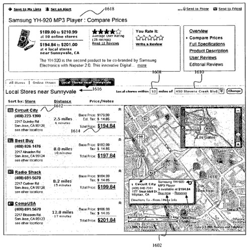
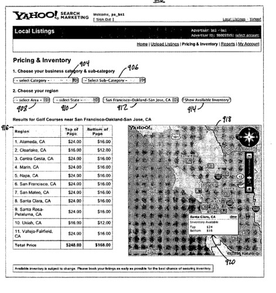
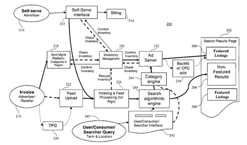

In local search, it may be possible to find locations of businesses to visit, and maps that help you travel to those places. Advertisements may be shown with the listed businesses.

A new patent application from Yahoo describes a way of allowing advertisers to integrate their inventory of available products at a specific physical location with their ad shown in Yahoo Local Search. The problem that they say this solves is that it can let consumers more easily decide which retail shops to visit to buy specific products. It may also allow shoppers to make a purchase of that product online, from the retail shop.

The patent document also notes that a system like this might assist advertisers decide where to purchase online advertisements by allowing them to see a competitor’s inventory, and by showing the advertiser’s a competitor’s locations.

Another image from the patent filing shows an advertiser interface shows one of the pricing and inventory screens in the Local Search Advertising:

This flowchart from the document provides a nice overview of how the different pieces of search and advertising fit together in this system:

This would be an interesting next step in online advertising using local search.
