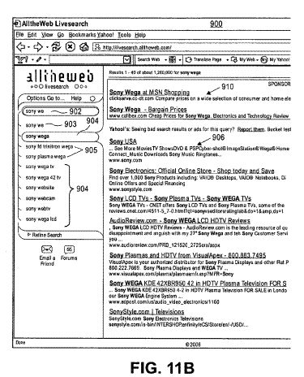

If you’ve tried out the [Livesearch Beta](https://search.yahoo.com/?ek=0) at Alltheweb, you’ve seen Yahoo experimenting with displaying alternative queries, topic categories, spelling corrections, and search results as you are typing, and even before you have finished entering your query terms.

How do they determine which results appear, and what factors might they use to choose which things to show searchers?

**Similar Google Efforts**

I’ve written in the past about some of Google’s efforts to [display predictive queries](https://www.seobythesea.com/2006/06/google-predicting-queries/), and to use [time-based factors](https://www.seobythesea.com/2006/11/a-role-for-time-and-query-quality-in-search-results/) in defining the quality of some results. I’ve also written about how Google may decide [when to show Onebox results](https://searchengineland.com/googles-onebox-patent-application-10325), and which databases they might use to show those.

It’s not surprising that Yahoo would be engaging in similar efforts. What might be interesting is finding a little more about how they are attempting to incorporate them into how their searches work.

**Yahoo Patent Applications on Query Prediction and Bias in Query Suggestions**

In addition to looking at the *Livesearch Beta*, there are a couple of newly published patent applications from Yahoo which explore predictive suggestions, including presenting results from databases other than Web searches.

Interestingly, one of the factors listed in biasing which results show during predictive queries is “potential revenue generation” for the search engine.

[Alternative search query prediction](http://appft1.uspto.gov/netacgi/nph-Parser?Sect1=PTO1&Sect2=HITOFF&d=PG01&p=1&u=%2Fnetahtml%2FPTO%2Fsrchnum.html&r=1&f=G&l=50&s1=%2220070050351%22.PGNR.&OS=DN/20070050351&RS=DN/20070050351)
Inventors: Kasperski; Richard; (Creston, CA) ; Borkovsky; Arkady; (Palo Alto, CA) ; Rabbat; Ralph R.; (Palo Alto, CA)
US Patent Application 20070050351
Published March 1, 2007
Filed: May 8, 2006

Abstract

> Providing an alternative search query to a predicted search query is disclosed herein. A search query is received from a client node. Prior to receiving an indication from the client node that the search query is completely formed, the following steps are performed:
>
> 1) a predicted search query is determined by predicting what the search query will be when completed; and
>
> 2) an alternative search query that differs from the predicted search query is determined based on the predicted search query.
>
> The alternative search query is provided to the client node. The alternative search query may be something that the user search query is unlikely to complete to. For example, in response to the user entering a search query of “brittany sp”, an alternative search query with a spelling suggestion of “britney spears” is determined and provided to the user.

[Biasing queries to determine suggested queries](http://appft1.uspto.gov/netacgi/nph-Parser?Sect1=PTO1&Sect2=HITOFF&d=PG01&p=1&u=%2Fnetahtml%2FPTO%2Fsrchnum.html&r=1&f=G&l=50&s1=%2220070050339%22.PGNR.&OS=DN/20070050339&RS=DN/20070050339)
Inventors: Kasperski; Richard; (British Columbia, CA) ; Maghoul; Farzin; (Hayward, CA)
US Patent Application 20070050339
Published March 1, 2007
Filed: May 8, 2006

Abstract

> Applying a bias when determining a suggested search query.
>
> Examples of biases that can be applied include, but are not limited to, temporal biases and monetization biases.
>
> Temporal biasing involves increasing a weight associated with a search query, based on a temporal attribute associated with the query. Search queries may also have associated with them a parameter such as frequency, count, etc. One of these parameters may serve as a weight.
>
> In order to determine suggested search queries, the temporal attribute is used to modify or bias the parameter (e.g., frequency parameter). Thus, the weight of the search query is modified to temporally bias the query. The suggested search queries are determined based on the biased parameter.

**Potential Suggestions and Results**

Types of possible suggestions and results displayed may include such things as:

a) Spelling correction suggestions,
b) Alternative query suggestions,
c) Links to frequently visited pages (based upon User’s search history),
d) Proactive searches (based upon partially completed queries),
e) Acronyms,
f) “Also try” types of alternate queries,
g) Stock Information,
h) Currency conversion,
i) Navigational results, such as might be helpful in an attempt to find a specific URL,
j) Maps, and;
k) Advertisments

**Bias Factors in Results**

Here are some potential factors that may bias which results appear as a query is being typed:

a) **Recency** – looking at two databases – a “recent database” and an “older database” to favor (or bias) more recent queries over older ones.

b) **Frequency** of query usage over time

c) **Revenue generation potential** – partial queries that appear to be shopping related may trigger ads and commercial results

> Further, the bias can be other than temporal, such as a monetization bias. For example, a search query is assigned a monetization attribute based on its association with revenue generation. As a particular example, a search query that is associated with shopping might be assigned a relatively high monetization attribute.

d) **Language** of the query and the language of the user

e) **Country** of origin of the search query can be used, with a bias given towards queries that have the same country of origin as the user.

f) **Ontology** – topics of a query might be gleaned from topics of queries and selections in immediate past searches.

**Conclusion**

I don’t know if these patent applications and the livesearch beta are indications of what Yahoo might become more like in the future, but both provide some potential insight into possibilities involving personalization and attempts to match the intent of searchers.

I was a little surprised to see a monetization bias as a possible part of deciding which query suggestions and results to display during the predictive query process, though the language in the patent applications about that bias isn’t detailed enough to give a clear idea of what them mean exactly with the use of that bias.
